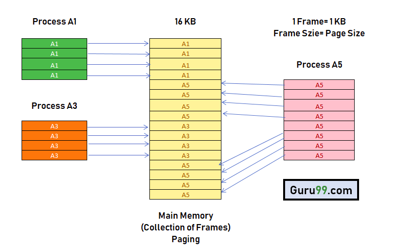
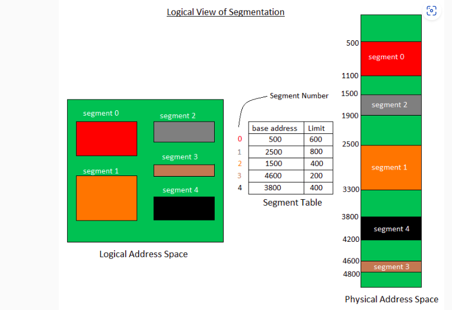

# Administrador de Memoria

## 3.1 Política y filosofía

**1.- ¿Cuál es la diferencia entre fragmentación interna y externa? Explica cómo cada una afecta el rendimiento de la memoria.**

La principal diferencia es el problema que origina cada uno ya que si se origina una fragmentacion indica que la memoria se utiliza de manera inificiente


#### Fragmentacion Interna
Se origina cuando se asigna mas memoria de la necesaria a una particion desperdiciando la memoria sobrante de esa particion esto trairia el problema es que este desperdicio se acumule dando como resultado que el rendimiento base baje porque no es posible asignar la misma cantidad de particiones.
#### Fragmentacion Externa
Se origina cuando hay sufiiente memoria teorica pero esta esta distribuida en pequeñas particiones no contiguas dando como resultado que aunque haya espacio suficiente para una particion grande esta no se peueda asignar provocando que el sistema no pueda utilizar el espacio eficientemente afectando el rendimiento

---
**2.- Investiga y explica las políticas de reemplazo de páginas en sistemas operativos. ¿Cuál consideras más eficiente y por qué?**


- Algoritmo FIFO (Firts Input Firts Output): 

    Es el algortimo de remplazo mas sencillo. Este algortimo asocia a cada pagina el instante en el que se trajo a memoria. Cuando hay que reemplazar una pagina, se elige la mas antigua. A pesar de ser el mas sencillo su rendimiento no siempre es bueno ademas este algortimo presenta una irregularidad denominada anomalia de Belady.
    
- Algoritmo Optimo OPT:

    Es un algoritmo que funciona de la siguiente forma cuando es necesario intercambiar una página, el sistema operativo intercambia la página cuyo próximo uso ocurrirá más lejos en el futuro. Por ejemplo, una página que no se utilizará durante los próximos 6 segundos se intercambiará por una página que se utilizará en los próximos 0,4 segundos. Este algoritmo no se puede implementar en un sistema operativo de propósito general porque es imposible calcular de manera confiable cuánto tiempo pasará antes de que se utilice una página. Este algoritmo puede ofrecer un rendimiento casi óptimo, pero no en la primera ejecución de un programa, y sólo si el patrón de referencia de memoria del programa es relativamente consistente cada vez que se ejecuta.


- Algoritmo LRU (Least Recencly Used):

    Es un algoritmo de reemplazo de páginas que se basa en el principio de que las páginas que han sido utilizadas recientemente tienen más probabilidades de ser utilizadas nuevamente. Aunque su rendimiento es casi óptimo, su implementación en la práctica puede ser costosa. Hay dos métodos principales de implementación:

    * Metodo de lista enlazada
    * Metodo basado en Hardware

    A pesar de su costo de implementación, LRU tiene una ventaja importante: su análisis estadístico demuestra que nunca generará más de N veces más fallos de página que el algoritmo óptimo (OPT), donde N es el número de páginas en el grupo de memoria gestionado. Sin embargo, su desempeño puede decaer bajo patrones comunes de acceso, como bucles sobre matrices grandes.


- Algortimo de Segunda Oportunidad:

    El algoritmo de reemplazo de páginas de segunda oportunidad es una mejora del algoritmo FIFO. Funciona de manera similar, utilizando una cola donde las páginas se almacenan en orden de llegada. Cuando se necesita reemplazar una página, se verifica el bit de referencia (R) de la página más antigua. Si el bit R es 0, la página no ha sido utilizada recientemente, por lo que se reemplaza inmediatamente. Si el bit R es 1, significa que la página ha sido utilizada recientemente. En este caso, el bit R se borra (se pone en 0) y la página se mueve al final de la cola, como si fuera una página nueva. Este proceso se repite hasta que se encuentra una página que pueda ser reemplazada. Si todas las páginas tienen el bit R en 1, el algoritmo funciona como FIFO puro, ya que todas las páginas se moverían al final de la cola antes de ser reemplazadas. De esta manera, el algoritmo da a las páginas utilizadas recientemente una "segunda oportunidad" para permanecer en la memoria, evitando su reemplazo prematuro.

- Algortimo de Reloj:

    El algoritmo de reloj es una versión más eficiente del algoritmo Second-Chance (segunda oportunidad) porque no requiere mover las páginas constantemente al final de la lista. En su lugar, mantiene una lista circular de páginas en memoria y utiliza un índice (manecilla) que apunta a la última página examinada. Cuando ocurre un fallo de página y no hay marcos vacíos, se inspecciona el bit de referencia (R) de la página a la que apunta la manecilla. Si el bit R es 0, la página se reemplaza por la nueva página, y la manecilla avanza a la siguiente posición. Si el bit R es 1, se borra el bit R y la manecilla avanza a la siguiente página, repitiendo el proceso hasta encontrar una página con R en 0.

    Este algoritmo es más eficiente que el de segunda oportunidad, ya que no mueve las páginas al final de la lista, sino que simplemente recorre la lista circular, similar a un reloj. La implementación es más directa, y la manecilla actúa como un iterador, asegurando que solo las páginas no referenciadas recientemente sean reemplazadas.

- Algortimo LFU (Last Frequently Used):

    Este algoritmo mantiene un contador del número de referencias que se han hecho para cada página. Se reemplaza la página con el menor recuento. La razón para esta selección es que una página que se usa activamente debe tener un alto número de referencias. Este algoritmo tiene problemas cuando una página se usa mucho en la fase inicial de un proceso, pero después ya no se utiliza. Como se usó bastantes veces, tiene un recuento alto y permanece en memoria aunque ya no se necesite. Una solución consiste en desplazar los recuentos un bit a la derecha a intervalos regulares, formando un recuento promedio de utilización que disminuye exponencialmente.

- Algoritmo NFU (Not Frequently Used): 

    El algoritmo NFU (Not Frequently Used) es un método de reemplazo de páginas que selecciona la página con menor frecuencia de uso acumulada para ser reemplazada. Cada página tiene asociado un contador, que inicialmente se establece en 0 y se incrementa en cada intervalo de tiempo si la página ha sido referenciada. Cuando es necesario reemplazar una página, se elige aquella con el contador más bajo.

    Este enfoque tiene el problema de que no considera cuándo se utilizaron las páginas, lo que puede llevar a priorizar páginas frecuentemente usadas en el pasado pero que ya no son relevantes en el presente.

- Algortimo MFU (Most Frequently Used):

    Selecciona para su reemplazo la página con el mayor número de referencias acumuladas. Este enfoque se basa en la idea de que una página que ha sido referenciada con mucha frecuencia probablemente ya no sea tan relevante para el sistema, en contraste con una página con pocas referencias, que puede estar comenzando a ser utilizada. MFU supone que las páginas más referenciadas ya cumplieron su utilidad y pueden ser reemplazadas.


- Algortimo NRU (Not Recently Used):

    Es un método que utiliza los bits de referencia (R) y modificación (M) presentes en las tablas de páginas para clasificar las páginas en memoria y determinar cuál reemplazar cuando ocurre un fallo de página. El bit R indica si una página ha sido referenciada recientemente, mientras que el bit M señala si ha sido modificada. Estos bits suelen ser configurados automáticamente por el hardware, aunque también pueden ser simulados por software. En este caso, el sistema operativo marca inicialmente las páginas como no presentes, lo que genera fallos de página al acceder a ellas. En respuesta, se activan los bits R y M según corresponda, y se ajustan los permisos de la página.
    
    El algoritmo NRU opera dividiendo las páginas en memoria en cuatro clases, basadas en los valores de los bits R y M:

    | Clase   | Referenciada (R)   | Modificada (M)   | Descripción                              |
    |:-------:|:------------------:|:----------------:|:----------------------------------------:|
    |   0     |        0           |       0          | No referenciada y no modificada          | 
    |   1     |        0           |       1          | No referenciada, pero modificada         |
    |   2     |        1           |       0          | Referenciada, pero no modificada         |
    |   3     |        1           |       1          | Referenciada y modificada                |
---

### - Tabla de Comparativa de los algoritmos

| **Algoritmo**             | **Ventajas**                                    | **Desventajas**                                    |
|---------------------------|-------------------------------------------------|----------------------------------------------------|
| **FIFO**                  | - Sencillo. <br> - Bajo coste de implementación. | - Baja eficiencia. <br> - Anomalía de Belady.      |
| **Óptimo (OPT)**          | - Rendimiento casi óptimo. <br> - Minima fallos. | - Imposible de implementar en SO de proposito general. <br> - Solo efectivo en patrones consistentes. |
| **LRU**                   | - Cercano al óptimo. <br> - Buen desempeño en estadísticas. | - Costoso de implementar. <br> - Decrece con acceso a matrices grandes. |
| **Segunda Oportunidad**   | - Mejora FIFO. <br> - Menor complejidad que LRU. | - Menos eficiente que LRU. <br> - Genera fallos si las referencias no son secuenciales. |
| **Reloj (Clock)**         | - Más eficiente que Segunda Oportunidad. <br> - No requiere mover páginas. | - Menos eficiente que LRU en algunos casos. <br> - Manejo costoso de bits de referencia. |
| **LFU**                   | - Mantiene páginas poco referenciadas. <br> - Bueno para uso a largo plazo. | - No se adapta a patrones cambiantes. <br> - Páginas desactualizadas pueden no ser reemplazadas. |
| **NFU**                   | - Más simple que LFU. <br> - Contadores sencillos. | - No considera el tiempo de acceso. <br> - Puede priorizar páginas no útiles. |
| **MFU**                   | - Reemplaza las más referenciadas. <br> - Útil en procesos de uso inicial alto. | - Supone que las más referenciadas no son útiles. <br> - Puede eliminar páginas útiles. |
| **NRU**                   | - Fácil de implementar en hardware. <br> - Usa clasificación de páginas. | - No tan eficiente como LRU en algunos patrones. <br> - El uso de clases puede no ser ideal. |


#### ¿Cual considero el mas optimo?
En mi opinion el algortimo mas eficiente y optimo seria el **OPT** porque veo mas eficiente poder determinar que pagina es mejor remplazar ya que esto siempre cambiaria la pagina que no se usara en un futuro aunque lamentablemente esto es muy dificil de inplementar al punto de que se considera imposible de implementar en SO de proposito general por la cualidad de ver hacia al futuro que este algoritmo usa pero de ser en un futuro posible seria el mas optimo.

## 3.2 Memoria real

**1.- Escribe un programa en C o Python que simule la administración de memoria mediante particiones fijas.**


```c

#include <stdio.h>
#include <stdbool.h>

#define tMem 10

bool Hayprocesos=true;
int tamañoP=0;

typedef struct proceso{
	int PID;
	int tamaño;
	}proceso;

	proceso memoria[tMem];

void asignarParticiones(){
	int sump = 0;
	int temp = 0;
	int c = -1;
	
	if(tamañoP>tMem){
		printf("Las particiones exceden el espacio del disco\n");
		return;
		}
	
	for(int i = 0 ;i<tamañoP; i++){
		c++;

		
		if (sump >= tMem) { 
            printf("Memoria full, no es posible asignar mas particiones\n");
            tamañoP = c;
            break;
        }
        
		do {
            printf("Tamaño de la partición %d (MB): ", (i + 1));
            scanf("%d", &temp);

            if (sump + temp > tMem) {
                printf("Error: La partición excede el tamaño total de memoria (%d MB).\n", tMem);
                printf("Espacio disponible restante: %d MB.\n", tMem - sump);
            } else {
				memoria[i].PID = -1;
                memoria[i].tamaño = temp;
                sump += temp; 
                break;
            }
		}while (true); 

		}
		printf("\n");
	}
	

bool memoriallena(){
	for(int i=0; i<tamañoP;i++){
		if(memoria[i].PID==-1){
			return false;
			}
		}
		return true;
	}
	
bool pidExiste(int pid) {
    for (int i = 0; i < tamañoP; i++) {
        if (memoria[i].PID == pid && pid>=0) {
            return true; 
        }
    }
    return false; 
}
	
void asignarEspacio(){
	int pid;
	int size;
	int rest;
	int bandera = 0;
	
	printf("Id de proceso: ");
	scanf("%d",&pid);
	
	if(pidExiste(pid)){
		printf("Este pid ya existe o no es valido");
		printf("\n");
		return;
		}
	
	printf("Tamaño del proceso(MB): ");
	scanf("%d",&size);
	
	
	
	for(int i = 0; i< tamañoP;i++){
		
		if(memoriallena()==true){
			printf("Memoria llena no hay mas particiones por asignar\n");
			printf("\n");
		return;
		}
		if(memoria[i].PID==-1 && memoria[i].tamaño>=size){
			memoria	[i].PID=pid;
			printf("\nProceso %d asignado a la partición %d\n", pid, i + 1);
			rest=(memoria[i].tamaño)-size;
			printf("Memoria desperdiciada: %d (MB)\n",rest);
			bandera=1;
			break;
		} 
	}
	if(bandera==0){
		printf("No hay particiones que puedan contoner el proceso\n");
		printf("\n");
		}
	printf("\n");
	}
			
	

void liberarEspacio(){
	int opc=0;
	bool bandera=false;
	printf("Seleciona el proceso a eliminar: ");
	scanf("%d",&opc);
	for(int i = 0;i < tamañoP; i++){
		if(opc==memoria[i].PID){
			memoria[i].PID=-1;
			printf("Proceso con PID %d eliminado de la partición %d.\n", opc, i + 1);
			bandera=true;
            break;
		
		}	
	}
	if (!bandera) {
        printf("No se encontró un proceso con PID %d.\n", opc);
    }
}
	
void mostrarMemoria(){
	bool p = true;
	for(int i = 0;i < tamañoP; i++){
		if(memoria[i].PID !=-1){
			printf("PID: %d NumeroParticion: %d TamañoParticion:(%dMB)\n",memoria[i].PID,i+1,memoria[i].tamaño);
			p=false;
			}else if(memoria[i].tamaño>0){
				printf("Particion: %d libre\n",i+1);

				}
			
		}
	

		if(p){
			printf("No hay procesos que mostrar\n");
			Hayprocesos=false;
			}
	}
	

int main()
{
	int opcion = 0;
	do{
		
		printf("------------- Menu -------------\n");
		printf("1.- Asignar particiones\n");
		printf("2.- Asignar Espacio de memoria\n");
		printf("3.- Liberar Espacio de memoria\n");
		printf("4.- Mostrar Espacios de memoria\n");
		printf("5.- Salir\n");
		printf("--------------------------------\n");
		scanf("%d",&opcion);
		switch(opcion){
			case 1:
			printf("Seleccione el Maximo de particion: ");
			scanf("%d",&tamañoP);
				asignarParticiones(tamañoP);
			
				break;
				
			case 2:
			asignarEspacio();
			
				break;
				
			case 3:
			mostrarMemoria();
			if(Hayprocesos){
				liberarEspacio();
				}
				break;
				
			case 4:
			mostrarMemoria();
				break;
				
			case 5:
				return 0;
				break;
				
			default:
			printf("Opcion invalida");
				
			
			}
		
	
	}
	while(true);
	
	return 0;
}

```

---

**2. Diseña un algoritmo para calcular qué procesos pueden ser asignados a un sistema con memoria real limitada utilizando el algoritmo de "primera cabida"**


### Inicio

    1.- Leer el Id del proceso

    2.- Leer el tamaño del proceso

    3.- Recorrer todas las particiones de memoria y verificar si la particion esta libre y tiene espacio para asignar ese proceso

    4.- Encuanto ecuentre una particion adecuada asignar el proceso a esa particion marcando la particion con el id del proceso

    6.- Si no se econtro alguna particion adecuada mostrar mesaje indicando que no hay espacio y terminar
  
### Fin

## 3.3 Organización de memoria virtual

**1.-Investiga y explica el concepto de "paginación" y "segmentación". ¿Cuáles son las ventajas y desventajas de cada técnica?**

#### Paginacion

La paginación es una técnica de gestión de memoria utilizada por los sistemas operativos para permitir que los procesos utilicen más memoria de la que físicamente está disponible en la memoria RAM. Esta técnica divide tanto la memoria principal como la memoria virtual en bloques de tamaño fijo llamados páginas y marcos de página, respectivamente. De esta forma, Los procesos son divididos en en paginas que no necesitan estar almacenadas de manera contigua en la memoria, lo que facilita el uso eficiente de la memoria física aunque no es visible para el programador.

Esta informacion es guardada en tablas de paginas que estan cargadas en memoria fisica que contiene el numero de pagina y su contenido que no es mas que el marco que corresponde a esa pagina es decir existe una asociaciones entre los números de página y los marcos de página y a su vez se maneja una lista de marcos libres

Esto basicamente hace que eliminamos la posibilidad de que haya fragmentacion externa el usar los marcos para almacenar cualquier pagina pero no excluye a la fragmentacion interna ya que puede pasar que no se llegue a ocupar el 100% de una pagina y como hay que recordar el tamaño de pagina es equivalente al del marco de pagina.




#### Segmentacion

La segmentacion es otra tecnica de gestion de memoria que se utiliza en los SO funciona de la siguiente forma en memoria se divide en segmentos de tamaños variables.Los segmentos son unidades logicas como:

* Codigo: Programa principal, funciones

* Datos: Variables globales

* Stack: Para retorno de las llamadas a funciones, paso de parametros y variables locales

Es por eso que decimos que que un programa es una coleccion de segmentos ademas el esquema de manejo de memoria que es visible para el programador esto significa que el programador puede identificar y trabajar directamente con las diferentes segmentos del programa. En la segmentación, cada segmento tiene su propio identificador conocido como base que contiene la direccion fisicas de los segmentos y límites donde se especifica el tamaño de ese segmento esto es guardado en una tabla de segmento que mapea de forma bi-dimensional direcciones fisicas. Y el sistema de segmentación mapea estos segmentos en la memoria física. Cabe recalcar que no existe una relación simple entre las direcciones lógicas y las direcciones físicas en la segmentación.




#### Ventajas y Desventajas

| **Técnica**    | **Ventajas**                                                                                          | **Desventajas**                                                                                         |
|-----------------|------------------------------------------------------------------------------------------------------|--------------------------------------------------------------------------------------------------------|
| **Paginación**  | - Elimina la fragmentación externa .<br>- Aprovecha bien la memoria.<br>- No necesita que los datos estén en posiciones seguidas en la memoria. | - Puede haber desperdicio de espacio dentro de las páginas.<br>- El sistema necesita usar recursos para traducir las direcciones y manejar tablas de páginas. |
| **Segmentación**| - Se adapta a la estructura del programa.<br>- Solo usa el espacio necesario.<br>- Bueno para programas grandes y organizados. | - Puede haber fragmentación externa (espacios pequeños e inutilizables).<br>- Es complicado manejar los cálculos y las tablas.<br>- No es tan eficiente con segmentos pequeños. |

<br>


---

**2.- Escribe un programa que simule una tabla de páginas para procesos con acceso aleatorio a memoria virtual.**

```C
#include <stdio.h>
#include <stdlib.h>
#include <time.h>
#include <math.h>
#include <stdbool.h>

/****************************************
 *         		Struct's                *
 ****************************************/
 
typedef struct TablePage{
	int indicePagina;
	int marcoAsignado;
	int cargada;
	
}TablePage;

typedef struct pagina{
	int numPagina;
	int size;
	
	
	}pagina;
	
typedef struct proceso{
	int PID;
	int cantidadPaginas;
	int size;
	TablePage *tablaPaginas;
	struct proceso *siguiente;
	
	}proceso;
	
typedef struct MarcoMem{
	int numeroMarco;
	int paginaAsignada;
	}MarcoMem;
	
/****************************************
 *        Variables Globales            *
 ****************************************/
 
#define SizeMemoryFisic 64 
#define SizePage 4

int totalMarcos = SizeMemoryFisic / SizePage;
int contProceso = 1;
MarcoMem memoriaFisica[SizeMemoryFisic/SizePage];

proceso *cabeza = NULL;


	
/****************************************
 *         		Funciones               *
 ****************************************/

	
void printfTablasProcesos(){
	
if(cabeza==NULL){
	printf("No hay procesos creados\n");
	return;
	}
	proceso *nuevo = cabeza;
	printf("----------------------------------------\n");
	while(nuevo != NULL){
		printf("| PID: %d | Tamaño Proceso: %d (KB) | Paginas: %d |\n\n",nuevo->PID, nuevo->size, nuevo->cantidadPaginas);
		for(int i = 0; i < nuevo->cantidadPaginas;i++){
		printf("| pagina %d | Marco asignado %d | Cargado %d |\n", nuevo->tablaPaginas[i].indicePagina, nuevo->tablaPaginas[i].marcoAsignado, nuevo->tablaPaginas[i].cargada);
		}
		printf("----------------------------------------\n");

		
	nuevo = nuevo->siguiente;
	}
	}
	
void printfMemFisica() {
    printf("Memoria Física:\n");
    for (int i = 0; i < totalMarcos; i++) {
        printf("| Marco %d | ", memoriaFisica[i].numeroMarco);
        if (memoriaFisica[i].paginaAsignada == -1) {
            printf("Libre\n");
        } else {
            int pidProceso = -1;
            for (proceso *temp = cabeza; temp != NULL; temp = temp->siguiente) {
                for (int j = 0; j < temp->cantidadPaginas; j++) {
                    if (temp->tablaPaginas[j].indicePagina == memoriaFisica[i].paginaAsignada) {
                        pidProceso = temp->PID;
                        break;
                    }
                }
                if (pidProceso != -1){
					break;
					} 
                ;  
            }

            if (pidProceso != -1) {
                printf("Asignado a Página %d, Proceso ID: %d\n", memoriaFisica[i].paginaAsignada, pidProceso);
            } else {
                printf("No se encontró proceso asignado.\n");
            }
        }
    }
    printf("\n");
}


int numeroPaginas(int * tam){
	int totpagina = 0;
	totpagina = (int)ceil((float)*tam / SizePage);
	
	return totpagina;
	}
	
void crearProceso(){
	//crear nuevo proceso y inicializar sus atributos
	int tam = 0;
	printf("Elige el tamaño del proceso (KB): ");
	scanf("%d",&tam);
	proceso *nuevoProceso = (proceso*)malloc(sizeof(proceso));
	nuevoProceso->PID=contProceso;
	nuevoProceso->size=tam;
	nuevoProceso->cantidadPaginas=numeroPaginas(&tam);
	nuevoProceso->tablaPaginas = (TablePage*)malloc(sizeof(TablePage) * nuevoProceso->cantidadPaginas);
	
	//inizializar la tabla de paginacion del proceso
	for(int i = 0; i<nuevoProceso->cantidadPaginas;i++){
		nuevoProceso->tablaPaginas[i].indicePagina = i;
		nuevoProceso->tablaPaginas[i].cargada = 0;
		nuevoProceso->tablaPaginas[i].marcoAsignado= -1;
		
		}
		nuevoProceso->siguiente=cabeza;
		cabeza = nuevoProceso;
		contProceso++;
	}
	
void asignarPaginas() {
    if (cabeza == NULL) {
        printf("No hay procesos creados.\n");
        return;
    }

    printf("Seleccione el proceso para asignar páginas:\n");

    proceso *temp = cabeza;
    while (temp != NULL) {
        printf("| ID: %d | Tamaño: %d KB | Páginas: %d |\n", temp->PID, temp->size, temp->cantidadPaginas);
        temp = temp->siguiente;
    }

    printf("Ingresa el ID del proceso: ");
    int idProceso;
    scanf("%d", &idProceso);

    proceso *temp2 = cabeza;
    while (temp2 != NULL) {
        if (temp2->PID == idProceso) {
            printf("Proceso encontrado: ID: %d\n", temp2->PID);

            for (int i = 0; i < temp2->cantidadPaginas; i++) {
                printf("| Página %d | Marco asignado: %d | Cargado: %d |\n", 
                        temp2->tablaPaginas[i].indicePagina, 
                        temp2->tablaPaginas[i].marcoAsignado, 
                        temp2->tablaPaginas[i].cargada);
            }

            int opc = 0;
            do {
                int pagselecion;
                printf("Selecciona el número de página a cargar en memoria: ");
                scanf("%d", &pagselecion);
                
                if (pagselecion < 0 || pagselecion >= temp2->cantidadPaginas) {
                    printf("Página inválida.\n");
                    return;
                }

                if (temp2->tablaPaginas[pagselecion].marcoAsignado != -1) {
                    printf("Página ya asignada a un marco.\n");
                    return;
                }

                printf("Marcos disponibles:\n");
                for (int i = 0; i < totalMarcos; i++) {
                    if (memoriaFisica[i].paginaAsignada == -1) {
                        printf("Marco %d (Libre)\n", i);
                    }
                }

                int marcoSeleccionado;
                printf("Ingresa el número de marco para asignar: ");
                scanf("%d", &marcoSeleccionado);

                if (marcoSeleccionado < 0 || marcoSeleccionado >= totalMarcos) {
                    printf("Marco inválido.\n");
                    return;
                }

                if (memoriaFisica[marcoSeleccionado].paginaAsignada != -1) {
                    printf("El marco %d ya está ocupado. Por favor selecciona otro marco.\n", marcoSeleccionado);
                    return;
                }

                memoriaFisica[marcoSeleccionado].paginaAsignada = temp2->tablaPaginas[pagselecion].indicePagina;
                temp2->tablaPaginas[pagselecion].marcoAsignado = marcoSeleccionado;
                temp2->tablaPaginas[pagselecion].cargada = 1;

                printf("Página %d asignada al marco %d.\n", pagselecion, marcoSeleccionado);

                printf("1.- Asignar otra página\n");
                printf("0.- Salir\n");
                scanf("%d", &opc);
            } while (opc != 0);

            return;
        }
        temp2 = temp2->siguiente;
    }

    printf("Proceso no encontrado.\n");
}

void eliminarPaginas() {
    if (cabeza == NULL) {
        printf("No hay procesos creados.\n");
        return;
    }

    printf("Seleccione el proceso del cual eliminar páginas:\n");
    proceso *temp = cabeza;
    while (temp != NULL) {
        printf("| PID: %d | Tamaño: %d KB | Páginas: %d |\n", temp->PID, temp->size, temp->cantidadPaginas);
        temp = temp->siguiente;
    }

    int idProceso;
    printf("Ingresa el ID del proceso: ");
    scanf("%d", &idProceso);

    proceso *temp2 = cabeza;
    while (temp2 != NULL) {
        if (temp2->PID == idProceso) {
            printf("Proceso encontrado: ID: %d\n", temp2->PID);

            for (int i = 0; i < temp2->cantidadPaginas; i++) {
                printf("| Página %d | Marco asignado: %d | Cargada: %d |\n", 
                        temp2->tablaPaginas[i].indicePagina, 
                        temp2->tablaPaginas[i].marcoAsignado, 
                        temp2->tablaPaginas[i].cargada);
            }

            int pagseleccion;
            printf("Selecciona el número de página a eliminar: ");
            scanf("%d", &pagseleccion);

            if (pagseleccion < 0 || pagseleccion >= temp2->cantidadPaginas) {
                printf("Página inválida.\n");
                return;
            }

            if (temp2->tablaPaginas[pagseleccion].marcoAsignado == -1) {
                printf("La página no tiene un marco asignado.\n");
                return;
            }

            int marcoLiberado = temp2->tablaPaginas[pagseleccion].marcoAsignado;
            memoriaFisica[marcoLiberado].paginaAsignada = -1;
            temp2->tablaPaginas[pagseleccion].marcoAsignado = -1;
            temp2->tablaPaginas[pagseleccion].cargada = 0;

            printf("Página %d liberada del marco %d.\n", pagseleccion, marcoLiberado);
            return;
        }
        temp2 = temp2->siguiente;
    }

    printf("Proceso no encontrado.\n");
}

int main()
{
	srand(time(NULL));
	//Inicializar Memoria Fisica
	
	for(int i = 0; i < totalMarcos ;i++){
			memoriaFisica[i].numeroMarco = i;
			memoriaFisica[i].paginaAsignada = -1;
		}
		
	int opc = 0;
	
	do{
		printf("------------- Menu -------------\n");
		printf("1.- Crear Proceso\n");
		printf("2.- Asignar Paginas\n");
		printf("3.- Liberar Paginas\n");
		printf("4.- Mostrar procesos\n");
		printf("5.- Mostrar Memoria Fisica\n");
		printf("6.- Salir\n");
		printf("--------------------------------\n");
		scanf("%d",&opc);
		switch(opc){
			case 1:
				crearProceso();
				break;
				
			case 2:
				asignarPaginas();
				break;
				
			case 3:
				eliminarPaginas();
				break;
				
			case 4:
				printfTablasProcesos();
				break;
				
			case 5:
				printfMemFisica();
				
				break;
			case 6:
				return 0;
				break;
				
			default:
			printf("Opcion invalida");
				
			}
			
	}while(true);
    
  return 0 ;
 }


```
    


