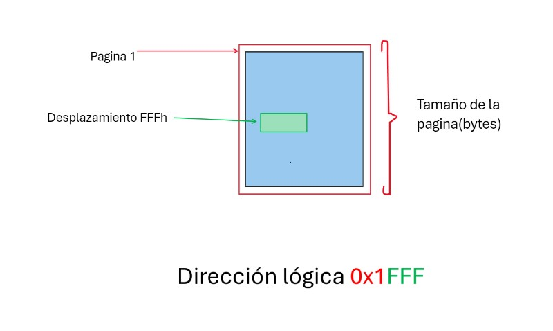
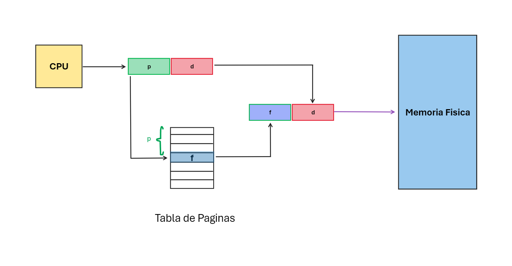
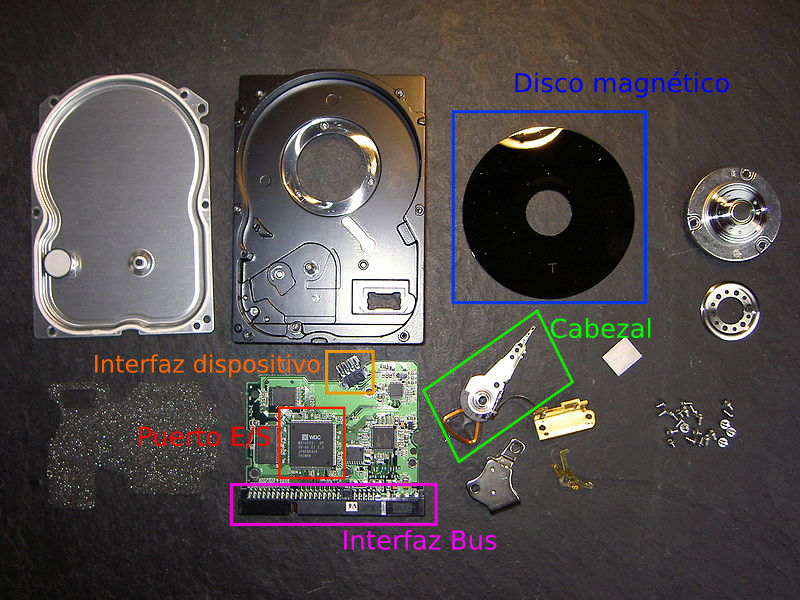
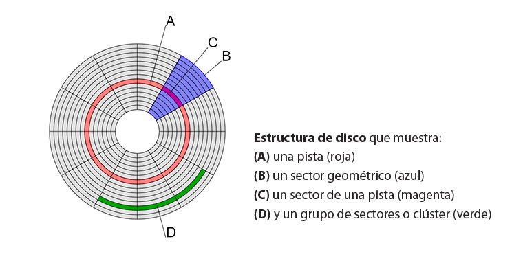
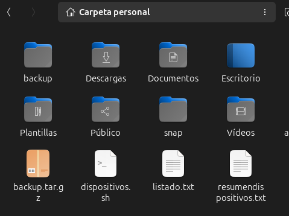
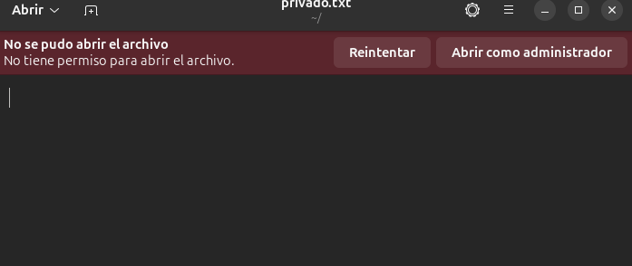
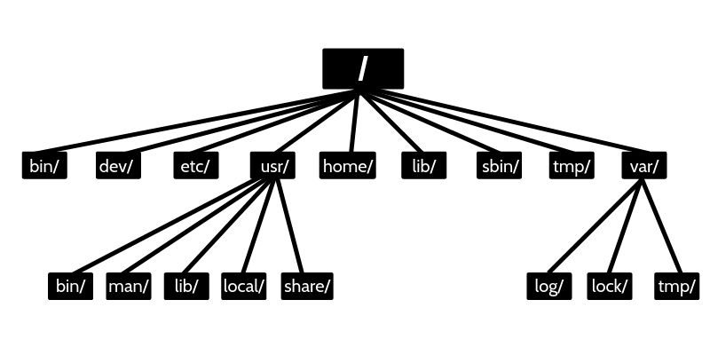
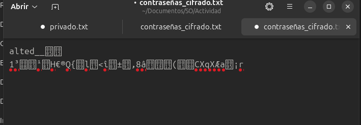

<div align="center">

# Sistemas Operativos   ISC

#### Docente: Jesus Eduardo Alacaraz Chavez

#### Alumno: López Martínez Antonio

#### Numero Control: 22121322

</div>

<!-- toc -->


# Administrador de Memoria

## 3.1 Política y filosofía

**1.- ¿Cuál es la diferencia entre fragmentación interna y externa? Explica cómo cada una afecta el rendimiento de la memoria.**

La principal diferencia es el problema que origina cada uno ya que si se origina una fragmentacion indica que la memoria se utiliza de manera inificiente


#### Fragmentacion Interna
Se origina cuando se asigna mas memoria de la necesaria a una particion desperdiciando la memoria sobrante de esa particion esto trairia el problema es que este desperdicio se acumule dando como resultado que el rendimiento base baje porque no es posible asignar la misma cantidad de particiones.
#### Fragmentacion Externa
Se origina cuando hay sufiiente memoria teorica pero esta esta distribuida en pequeñas particiones no contiguas dando como resultado que aunque haya espacio suficiente para una particion grande esta no se peueda asignar provocando que el sistema no pueda utilizar el espacio eficientemente afectando el rendimiento

---
**2.- Investiga y explica las políticas de reemplazo de páginas en sistemas operativos. ¿Cuál consideras más eficiente y por qué?**


- Algoritmo FIFO (Firts Input Firts Output): 

    Es el algortimo de remplazo mas sencillo. Este algortimo asocia a cada pagina el instante en el que se trajo a memoria. Cuando hay que reemplazar una pagina, se elige la mas antigua. A pesar de ser el mas sencillo su rendimiento no siempre es bueno ademas este algortimo presenta una irregularidad denominada anomalia de Belady.
    
- Algoritmo Optimo OPT:

    Es un algoritmo que funciona de la siguiente forma cuando es necesario intercambiar una página, el sistema operativo intercambia la página cuyo próximo uso ocurrirá más lejos en el futuro. Por ejemplo, una página que no se utilizará durante los próximos 6 segundos se intercambiará por una página que se utilizará en los próximos 0,4 segundos. Este algoritmo no se puede implementar en un sistema operativo de propósito general porque es imposible calcular de manera confiable cuánto tiempo pasará antes de que se utilice una página. Este algoritmo puede ofrecer un rendimiento casi óptimo, pero no en la primera ejecución de un programa, y sólo si el patrón de referencia de memoria del programa es relativamente consistente cada vez que se ejecuta.


- Algoritmo LRU (Least Recencly Used):

    Es un algoritmo de reemplazo de páginas que se basa en el principio de que las páginas que han sido utilizadas recientemente tienen más probabilidades de ser utilizadas nuevamente. Aunque su rendimiento es casi óptimo, su implementación en la práctica puede ser costosa. Hay dos métodos principales de implementación:

    * Metodo de lista enlazada
    * Metodo basado en Hardware

    A pesar de su costo de implementación, LRU tiene una ventaja importante: su análisis estadístico demuestra que nunca generará más de N veces más fallos de página que el algoritmo óptimo (OPT), donde N es el número de páginas en el grupo de memoria gestionado. Sin embargo, su desempeño puede decaer bajo patrones comunes de acceso, como bucles sobre matrices grandes.


- Algortimo de Segunda Oportunidad:

    El algoritmo de reemplazo de páginas de segunda oportunidad es una mejora del algoritmo FIFO. Funciona de manera similar, utilizando una cola donde las páginas se almacenan en orden de llegada. Cuando se necesita reemplazar una página, se verifica el bit de referencia (R) de la página más antigua. Si el bit R es 0, la página no ha sido utilizada recientemente, por lo que se reemplaza inmediatamente. Si el bit R es 1, significa que la página ha sido utilizada recientemente. En este caso, el bit R se borra (se pone en 0) y la página se mueve al final de la cola, como si fuera una página nueva. Este proceso se repite hasta que se encuentra una página que pueda ser reemplazada. Si todas las páginas tienen el bit R en 1, el algoritmo funciona como FIFO puro, ya que todas las páginas se moverían al final de la cola antes de ser reemplazadas. De esta manera, el algoritmo da a las páginas utilizadas recientemente una "segunda oportunidad" para permanecer en la memoria, evitando su reemplazo prematuro.

- Algortimo de Reloj:

    El algoritmo de reloj es una versión más eficiente del algoritmo Second-Chance (segunda oportunidad) porque no requiere mover las páginas constantemente al final de la lista. En su lugar, mantiene una lista circular de páginas en memoria y utiliza un índice (manecilla) que apunta a la última página examinada. Cuando ocurre un fallo de página y no hay marcos vacíos, se inspecciona el bit de referencia (R) de la página a la que apunta la manecilla. Si el bit R es 0, la página se reemplaza por la nueva página, y la manecilla avanza a la siguiente posición. Si el bit R es 1, se borra el bit R y la manecilla avanza a la siguiente página, repitiendo el proceso hasta encontrar una página con R en 0.

    Este algoritmo es más eficiente que el de segunda oportunidad, ya que no mueve las páginas al final de la lista, sino que simplemente recorre la lista circular, similar a un reloj. La implementación es más directa, y la manecilla actúa como un iterador, asegurando que solo las páginas no referenciadas recientemente sean reemplazadas.

- Algortimo LFU (Last Frequently Used):

    Este algoritmo mantiene un contador del número de referencias que se han hecho para cada página. Se reemplaza la página con el menor recuento. La razón para esta selección es que una página que se usa activamente debe tener un alto número de referencias. Este algoritmo tiene problemas cuando una página se usa mucho en la fase inicial de un proceso, pero después ya no se utiliza. Como se usó bastantes veces, tiene un recuento alto y permanece en memoria aunque ya no se necesite. Una solución consiste en desplazar los recuentos un bit a la derecha a intervalos regulares, formando un recuento promedio de utilización que disminuye exponencialmente.

- Algoritmo NFU (Not Frequently Used): 

    El algoritmo NFU (Not Frequently Used) es un método de reemplazo de páginas que selecciona la página con menor frecuencia de uso acumulada para ser reemplazada. Cada página tiene asociado un contador, que inicialmente se establece en 0 y se incrementa en cada intervalo de tiempo si la página ha sido referenciada. Cuando es necesario reemplazar una página, se elige aquella con el contador más bajo.

    Este enfoque tiene el problema de que no considera cuándo se utilizaron las páginas, lo que puede llevar a priorizar páginas frecuentemente usadas en el pasado pero que ya no son relevantes en el presente.

- Algortimo MFU (Most Frequently Used):

    Selecciona para su reemplazo la página con el mayor número de referencias acumuladas. Este enfoque se basa en la idea de que una página que ha sido referenciada con mucha frecuencia probablemente ya no sea tan relevante para el sistema, en contraste con una página con pocas referencias, que puede estar comenzando a ser utilizada. MFU supone que las páginas más referenciadas ya cumplieron su utilidad y pueden ser reemplazadas.


- Algortimo NRU (Not Recently Used):

    Es un método que utiliza los bits de referencia (R) y modificación (M) presentes en las tablas de páginas para clasificar las páginas en memoria y determinar cuál reemplazar cuando ocurre un fallo de página. El bit R indica si una página ha sido referenciada recientemente, mientras que el bit M señala si ha sido modificada. Estos bits suelen ser configurados automáticamente por el hardware, aunque también pueden ser simulados por software. En este caso, el sistema operativo marca inicialmente las páginas como no presentes, lo que genera fallos de página al acceder a ellas. En respuesta, se activan los bits R y M según corresponda, y se ajustan los permisos de la página.
    
    El algoritmo NRU opera dividiendo las páginas en memoria en cuatro clases, basadas en los valores de los bits R y M:

    | Clase   | Referenciada (R)   | Modificada (M)   | Descripción                              |
    |:-------:|:------------------:|:----------------:|:----------------------------------------:|
    |   0     |        0           |       0          | No referenciada y no modificada          | 
    |   1     |        0           |       1          | No referenciada, pero modificada         |
    |   2     |        1           |       0          | Referenciada, pero no modificada         |
    |   3     |        1           |       1          | Referenciada y modificada                |

- Algoritmo WSClock
    El algoritmo WSClock es una mejora sobre el algoritmo de reemplazo de páginas basado en el reloj, y se utiliza para gestionar la memoria de manera eficiente en sistemas con manejo de páginas, especialmente en sistemas con acceso a discos. Usa la manecilla para revisar las páginas en memoria, evaluando su acceso y estado de modificación. Si una página no se utiliza recientemente y es limpia, se reemplaza. Si está sucia, se planifica su escritura a disco. Además, se limita el número de escrituras a disco para evitar sobrecargar el sistema.
---

### - Tabla de Comparativa de los algoritmos

| **Algoritmo**             | **Ventajas**                                    | **Desventajas**                                    |
|---------------------------|-------------------------------------------------|----------------------------------------------------|
| **FIFO**                  | - Sencillo. <br> - Bajo coste de implementación. | - Baja eficiencia. <br> - Anomalía de Belady.      |
| **Óptimo (OPT)**          | - Rendimiento casi óptimo. <br> - Mínima cantidad de fallos. | - Imposible de implementar en SO de propósito general. <br> - Solo efectivo en patrones consistentes. |
| **LRU**                   | - Cercano al óptimo. <br> - Buen desempeño en estadísticas. | - Costoso de implementar. <br> - Decrece con acceso a matrices grandes. |
| **Segunda Oportunidad**   | - Mejora FIFO. <br> - Menor complejidad que LRU. | - Menos eficiente que LRU. <br> - Genera fallos si las referencias no son secuenciales. |
| **Reloj (Clock)**         | - Más eficiente que Segunda Oportunidad. <br> - No requiere mover páginas. | - Menos eficiente que LRU en algunos casos. <br> - Manejo costoso de bits de referencia. |
| **LFU**                   | - Mantiene páginas poco referenciadas. <br> - Bueno para uso a largo plazo. | - No se adapta a patrones cambiantes. <br> - Páginas desactualizadas pueden no ser reemplazadas. |
| **NFU**                   | - Más simple que LFU. <br> - Contadores sencillos. | - No considera el tiempo de acceso. <br> - Puede priorizar páginas no útiles. |
| **MFU**                   | - Reemplaza las más referenciadas. <br> - Útil en procesos de uso inicial alto. | - Supone que las más referenciadas no son útiles. <br> - Puede eliminar páginas útiles. |
| **NRU**                   | - Fácil de implementar en hardware. <br> - Usa clasificación de páginas. | - No tan eficiente como LRU en algunos patrones. <br> - El uso de clases puede no ser ideal. |
| **WSClock**               | - Simplicidad y buen rendimiento. <br> - Utiliza tanto el reloj como el conjunto de trabajo. <br> - Menor tráfico de disco. | - Menos eficiente que LRU en patrones con acceso irregular. <br> - Requiere una implementación de escritura a disco para páginas sucias. |


#### ¿Cual considero el mas optimo?
En mi opinion el algortimo mas eficiente y optimo seria el **OPT** porque veo mas eficiente poder determinar que pagina es mejor remplazar ya que esto siempre cambiaria la pagina que no se usara en un futuro aunque lamentablemente esto es muy dificil de inplementar al punto de que se considera imposible de implementar en SO de proposito general por la cualidad de ver hacia al futuro que este algoritmo usa pero de ser en un futuro posible seria el mas optimo.

## 3.2 Memoria real

**1.- Escribe un programa en C o Python que simule la administración de memoria mediante particiones fijas.**


```c

#include <stdio.h>
#include <stdbool.h>

#define tMem 10

bool Hayprocesos=true;
int tamañoP=0;

typedef struct proceso{
	int PID;
	int tamaño;
	}proceso;

	proceso memoria[tMem];

void asignarParticiones(){
	int sump = 0;
	int temp = 0;
	int c = -1;
	
	if(tamañoP>tMem){
		printf("Las particiones exceden el espacio del disco\n");
		return;
		}
	
	for(int i = 0 ;i<tamañoP; i++){
		c++;

		
		if (sump >= tMem) { 
            printf("Memoria full, no es posible asignar mas particiones\n");
            tamañoP = c;
            break;
        }
        
		do {
            printf("Tamaño de la partición %d (MB): ", (i + 1));
            scanf("%d", &temp);

            if (sump + temp > tMem) {
                printf("Error: La partición excede el tamaño total de memoria (%d MB).\n", tMem);
                printf("Espacio disponible restante: %d MB.\n", tMem - sump);
            } else {
				memoria[i].PID = -1;
                memoria[i].tamaño = temp;
                sump += temp; 
                break;
            }
		}while (true); 

		}
		printf("\n");
	}
	

bool memoriallena(){
	for(int i=0; i<tamañoP;i++){
		if(memoria[i].PID==-1){
			return false;
			}
		}
		return true;
	}
	
bool pidExiste(int pid) {
    for (int i = 0; i < tamañoP; i++) {
        if (memoria[i].PID == pid && pid>=0) {
            return true; 
        }
    }
    return false; 
}
	
void asignarEspacio(){
	int pid;
	int size;
	int rest;
	int bandera = 0;
	
	printf("Id de proceso: ");
	scanf("%d",&pid);
	
	if(pidExiste(pid)){
		printf("Este pid ya existe o no es valido");
		printf("\n");
		return;
		}
	
	printf("Tamaño del proceso(MB): ");
	scanf("%d",&size);
	
	
	
	for(int i = 0; i< tamañoP;i++){
		
		if(memoriallena()==true){
			printf("Memoria llena no hay mas particiones por asignar\n");
			printf("\n");
		return;
		}
		if(memoria[i].PID==-1 && memoria[i].tamaño>=size){
			memoria	[i].PID=pid;
			printf("\nProceso %d asignado a la partición %d\n", pid, i + 1);
			rest=(memoria[i].tamaño)-size;
			printf("Memoria desperdiciada: %d (MB)\n",rest);
			bandera=1;
			break;
		} 
	}
	if(bandera==0){
		printf("No hay particiones que puedan contoner el proceso\n");
		printf("\n");
		}
	printf("\n");
	}
			
	

void liberarEspacio(){
	int opc=0;
	bool bandera=false;
	printf("Seleciona el proceso a eliminar: ");
	scanf("%d",&opc);
	for(int i = 0;i < tamañoP; i++){
		if(opc==memoria[i].PID){
			memoria[i].PID=-1;
			printf("Proceso con PID %d eliminado de la partición %d.\n", opc, i + 1);
			bandera=true;
            break;
		
		}	
	}
	if (!bandera) {
        printf("No se encontró un proceso con PID %d.\n", opc);
    }
}
	
void mostrarMemoria(){
	bool p = true;
	for(int i = 0;i < tamañoP; i++){
		if(memoria[i].PID !=-1){
			printf("PID: %d NumeroParticion: %d TamañoParticion:(%dMB)\n",memoria[i].PID,i+1,memoria[i].tamaño);
			p=false;
			}else if(memoria[i].tamaño>0){
				printf("Particion: %d libre\n",i+1);

				}
			
		}
	

		if(p){
			printf("No hay procesos que mostrar\n");
			Hayprocesos=false;
			}
	}
	

int main()
{
	int opcion = 0;
	do{
		
		printf("------------- Menu -------------\n");
		printf("1.- Asignar particiones\n");
		printf("2.- Asignar Espacio de memoria\n");
		printf("3.- Liberar Espacio de memoria\n");
		printf("4.- Mostrar Espacios de memoria\n");
		printf("5.- Salir\n");
		printf("--------------------------------\n");
		scanf("%d",&opcion);
		switch(opcion){
			case 1:
			printf("Seleccione el Maximo de particion: ");
			scanf("%d",&tamañoP);
				asignarParticiones(tamañoP);
			
				break;
				
			case 2:
			asignarEspacio();
			
				break;
				
			case 3:
			mostrarMemoria();
			if(Hayprocesos){
				liberarEspacio();
				}
				break;
				
			case 4:
			mostrarMemoria();
				break;
				
			case 5:
				return 0;
				break;
				
			default:
			printf("Opcion invalida");
				
			
			}
		
	
	}
	while(true);
	
	return 0;
}

```

---

**2. Diseña un algoritmo para calcular qué procesos pueden ser asignados a un sistema con memoria real limitada utilizando el algoritmo de "primera cabida"**


### Inicio

    1.- Leer el Id del proceso

    2.- Leer el tamaño del proceso

    3.- Recorrer todas las particiones de memoria y verificar si la particion esta libre y tiene espacio para asignar ese proceso

    4.- Encuanto ecuentre una particion adecuada asignar el proceso a esa particion marcando la particion con el id del proceso

    6.- Si no se econtro alguna particion adecuada mostrar mesaje indicando que no hay espacio y terminar
  
### Fin

## 3.3 Organización de memoria virtual

**1.-Investiga y explica el concepto de "paginación" y "segmentación". ¿Cuáles son las ventajas y desventajas de cada técnica?**

#### Paginacion

La paginación es una técnica de gestión de memoria utilizada por los sistemas operativos para permitir que los procesos utilicen más memoria de la que físicamente está disponible en la memoria RAM. Esta técnica divide tanto la memoria principal como la memoria virtual en bloques de tamaño fijo llamados páginas y marcos de página, respectivamente. De esta forma, Los procesos son divididos en en paginas que no necesitan estar almacenadas de manera contigua en la memoria, lo que facilita el uso eficiente de la memoria física aunque no es visible para el programador.

Esta informacion es guardada en tablas de paginas que estan cargadas en memoria fisica que contiene el numero de pagina y su contenido que no es mas que el marco que corresponde a esa pagina es decir existe una asociaciones entre los números de página y los marcos de página y a su vez se maneja una lista de marcos libres

Esto basicamente hace que eliminamos la posibilidad de que haya fragmentacion externa el usar los marcos para almacenar cualquier pagina pero no excluye a la fragmentacion interna ya que puede pasar que no se llegue a ocupar el 100% de una pagina y como hay que recordar el tamaño de pagina es equivalente al del marco de pagina.


#### Segmentacion

La segmentacion es otra tecnica de gestion de memoria que se utiliza en los SO funciona de la siguiente forma en memoria se divide en segmentos de tamaños variables.Los segmentos son unidades logicas como:

* Codigo: Programa principal, funciones

* Datos: Variables globales

* Stack: Para retorno de las llamadas a funciones, paso de parametros y variables locales

Es por eso que decimos que que un programa es una coleccion de segmentos ademas el esquema de manejo de memoria que es visible para el programador esto significa que el programador puede identificar y trabajar directamente con las diferentes segmentos del programa. En la segmentación, cada segmento tiene su propio identificador conocido como base que contiene la direccion fisicas de los segmentos y límites donde se especifica el tamaño de ese segmento esto es guardado en una tabla de segmento que mapea de forma bi-dimensional direcciones fisicas. Y el sistema de segmentación mapea estos segmentos en la memoria física. Cabe recalcar que no existe una relación simple entre las direcciones lógicas y las direcciones físicas en la segmentación.


#### Ventajas y Desventajas

| **Técnica**    | **Ventajas**                                                                                          | **Desventajas**                                                                                         |
|-----------------|------------------------------------------------------------------------------------------------------|--------------------------------------------------------------------------------------------------------|
| **Paginación**  | - Elimina la fragmentación externa .<br>- Aprovecha bien la memoria.<br>- No necesita que los datos estén en posiciones seguidas en la memoria. | - Puede haber desperdicio de espacio dentro de las páginas.<br>- El sistema necesita usar recursos para traducir las direcciones y manejar tablas de páginas. |
| **Segmentación**| - Se adapta a la estructura del programa.<br>- Solo usa el espacio necesario.<br>- Bueno para programas grandes y organizados. | - Puede haber fragmentación externa (espacios pequeños e inutilizables).<br>- Es complicado manejar los cálculos y las tablas.<br>- No es tan eficiente con segmentos pequeños. |

<br>


---

**2.- Escribe un programa que simule una tabla de páginas para procesos con acceso aleatorio a memoria virtual.**

```C
#include <stdio.h>
#include <stdlib.h>
#include <time.h>
#include <math.h>
#include <stdbool.h>

/****************************************
 *         		Struct's                *
 ****************************************/
 
typedef struct TablePage{
	int indicePagina;
	int marcoAsignado;
	int cargada;
	
}TablePage;

typedef struct pagina{
	int numPagina;
	int size;
	
	
	}pagina;
	
typedef struct proceso{
	int PID;
	int cantidadPaginas;
	int size;
	TablePage *tablaPaginas;
	struct proceso *siguiente;
	
	}proceso;
	
typedef struct MarcoMem{
	int numeroMarco;
	int paginaAsignada;
	}MarcoMem;
	
/****************************************
 *        Variables Globales            *
 ****************************************/
 
#define SizeMemoryFisic 64 
#define SizePage 4

int totalMarcos = SizeMemoryFisic / SizePage;
int contProceso = 1;
MarcoMem memoriaFisica[SizeMemoryFisic/SizePage];

proceso *cabeza = NULL;


	
/****************************************
 *         		Funciones               *
 ****************************************/

	
void printfTablasProcesos(){
	
if(cabeza==NULL){
	printf("No hay procesos creados\n");
	return;
	}
	proceso *nuevo = cabeza;
	printf("----------------------------------------\n");
	while(nuevo != NULL){
		printf("| PID: %d | Tamaño Proceso: %d (KB) | Paginas: %d |\n\n",nuevo->PID, nuevo->size, nuevo->cantidadPaginas);
		for(int i = 0; i < nuevo->cantidadPaginas;i++){
		printf("| pagina %d | Marco asignado %d | Cargado %d |\n", nuevo->tablaPaginas[i].indicePagina, nuevo->tablaPaginas[i].marcoAsignado, nuevo->tablaPaginas[i].cargada);
		}
		printf("----------------------------------------\n");

		
	nuevo = nuevo->siguiente;
	}
	}
	
void printfMemFisica() {
    printf("Memoria Física:\n");
    for (int i = 0; i < totalMarcos; i++) {
        printf("| Marco %d | ", memoriaFisica[i].numeroMarco);
        if (memoriaFisica[i].paginaAsignada == -1) {
            printf("Libre\n");
        } else {
            int pidProceso = -1;
            for (proceso *temp = cabeza; temp != NULL; temp = temp->siguiente) {
                for (int j = 0; j < temp->cantidadPaginas; j++) {
                    if (temp->tablaPaginas[j].indicePagina == memoriaFisica[i].paginaAsignada) {
                        pidProceso = temp->PID;
                        break;
                    }
                }
                if (pidProceso != -1){
					break;
					} 
                ;  
            }

            if (pidProceso != -1) {
                printf("Asignado a Página %d, Proceso ID: %d\n", memoriaFisica[i].paginaAsignada, pidProceso);
            } else {
                printf("No se encontró proceso asignado.\n");
            }
        }
    }
    printf("\n");
}


int numeroPaginas(int * tam){
	int totpagina = 0;
	totpagina = (int)ceil((float)*tam / SizePage);
	
	return totpagina;
	}
	
void crearProceso(){
	//crear nuevo proceso y inicializar sus atributos
	int tam = 0;
	printf("Elige el tamaño del proceso (KB): ");
	scanf("%d",&tam);
	proceso *nuevoProceso = (proceso*)malloc(sizeof(proceso));
	nuevoProceso->PID=contProceso;
	nuevoProceso->size=tam;
	nuevoProceso->cantidadPaginas=numeroPaginas(&tam);
	nuevoProceso->tablaPaginas = (TablePage*)malloc(sizeof(TablePage) * nuevoProceso->cantidadPaginas);
	
	//inizializar la tabla de paginacion del proceso
	for(int i = 0; i<nuevoProceso->cantidadPaginas;i++){
		nuevoProceso->tablaPaginas[i].indicePagina = i;
		nuevoProceso->tablaPaginas[i].cargada = 0;
		nuevoProceso->tablaPaginas[i].marcoAsignado= -1;
		
		}
		nuevoProceso->siguiente=cabeza;
		cabeza = nuevoProceso;
		contProceso++;
	}
	
void asignarPaginas() {
    if (cabeza == NULL) {
        printf("No hay procesos creados.\n");
        return;
    }

    printf("Seleccione el proceso para asignar páginas:\n");

    proceso *temp = cabeza;
    while (temp != NULL) {
        printf("| ID: %d | Tamaño: %d KB | Páginas: %d |\n", temp->PID, temp->size, temp->cantidadPaginas);
        temp = temp->siguiente;
    }

    printf("Ingresa el ID del proceso: ");
    int idProceso;
    scanf("%d", &idProceso);

    proceso *temp2 = cabeza;
    while (temp2 != NULL) {
        if (temp2->PID == idProceso) {
            printf("Proceso encontrado: ID: %d\n", temp2->PID);

            for (int i = 0; i < temp2->cantidadPaginas; i++) {
                printf("| Página %d | Marco asignado: %d | Cargado: %d |\n", 
                        temp2->tablaPaginas[i].indicePagina, 
                        temp2->tablaPaginas[i].marcoAsignado, 
                        temp2->tablaPaginas[i].cargada);
            }

            int opc = 0;
            do {
                int pagselecion;
                printf("Selecciona el número de página a cargar en memoria: ");
                scanf("%d", &pagselecion);
                
                if (pagselecion < 0 || pagselecion >= temp2->cantidadPaginas) {
                    printf("Página inválida.\n");
                    return;
                }

                if (temp2->tablaPaginas[pagselecion].marcoAsignado != -1) {
                    printf("Página ya asignada a un marco.\n");
                    return;
                }

                printf("Marcos disponibles:\n");
                for (int i = 0; i < totalMarcos; i++) {
                    if (memoriaFisica[i].paginaAsignada == -1) {
                        printf("Marco %d (Libre)\n", i);
                    }
                }

                int marcoSeleccionado;
                printf("Ingresa el número de marco para asignar: ");
                scanf("%d", &marcoSeleccionado);

                if (marcoSeleccionado < 0 || marcoSeleccionado >= totalMarcos) {
                    printf("Marco inválido.\n");
                    return;
                }

                if (memoriaFisica[marcoSeleccionado].paginaAsignada != -1) {
                    printf("El marco %d ya está ocupado. Por favor selecciona otro marco.\n", marcoSeleccionado);
                    return;
                }

                memoriaFisica[marcoSeleccionado].paginaAsignada = temp2->tablaPaginas[pagselecion].indicePagina;
                temp2->tablaPaginas[pagselecion].marcoAsignado = marcoSeleccionado;
                temp2->tablaPaginas[pagselecion].cargada = 1;

                printf("Página %d asignada al marco %d.\n", pagselecion, marcoSeleccionado);

                printf("1.- Asignar otra página\n");
                printf("0.- Salir\n");
                scanf("%d", &opc);
            } while (opc != 0);

            return;
        }
        temp2 = temp2->siguiente;
    }

    printf("Proceso no encontrado.\n");
}

void eliminarPaginas() {
    if (cabeza == NULL) {
        printf("No hay procesos creados.\n");
        return;
    }

    printf("Seleccione el proceso del cual eliminar páginas:\n");
    proceso *temp = cabeza;
    while (temp != NULL) {
        printf("| PID: %d | Tamaño: %d KB | Páginas: %d |\n", temp->PID, temp->size, temp->cantidadPaginas);
        temp = temp->siguiente;
    }

    int idProceso;
    printf("Ingresa el ID del proceso: ");
    scanf("%d", &idProceso);

    proceso *temp2 = cabeza;
    while (temp2 != NULL) {
        if (temp2->PID == idProceso) {
            printf("Proceso encontrado: ID: %d\n", temp2->PID);

            for (int i = 0; i < temp2->cantidadPaginas; i++) {
                printf("| Página %d | Marco asignado: %d | Cargada: %d |\n", 
                        temp2->tablaPaginas[i].indicePagina, 
                        temp2->tablaPaginas[i].marcoAsignado, 
                        temp2->tablaPaginas[i].cargada);
            }

            int pagseleccion;
            printf("Selecciona el número de página a eliminar: ");
            scanf("%d", &pagseleccion);

            if (pagseleccion < 0 || pagseleccion >= temp2->cantidadPaginas) {
                printf("Página inválida.\n");
                return;
            }

            if (temp2->tablaPaginas[pagseleccion].marcoAsignado == -1) {
                printf("La página no tiene un marco asignado.\n");
                return;
            }

            int marcoLiberado = temp2->tablaPaginas[pagseleccion].marcoAsignado;
            memoriaFisica[marcoLiberado].paginaAsignada = -1;
            temp2->tablaPaginas[pagseleccion].marcoAsignado = -1;
            temp2->tablaPaginas[pagseleccion].cargada = 0;

            printf("Página %d liberada del marco %d.\n", pagseleccion, marcoLiberado);
            return;
        }
        temp2 = temp2->siguiente;
    }

    printf("Proceso no encontrado.\n");
}

int main()
{
	srand(time(NULL));
	//Inicializar Memoria Fisica
	
	for(int i = 0; i < totalMarcos ;i++){
			memoriaFisica[i].numeroMarco = i;
			memoriaFisica[i].paginaAsignada = -1;
		}
		
	int opc = 0;
	
	do{
		printf("------------- Menu -------------\n");
		printf("1.- Crear Proceso\n");
		printf("2.- Asignar Paginas\n");
		printf("3.- Liberar Paginas\n");
		printf("4.- Mostrar procesos\n");
		printf("5.- Mostrar Memoria Fisica\n");
		printf("6.- Salir\n");
		printf("--------------------------------\n");
		scanf("%d",&opc);
		switch(opc){
			case 1:
				crearProceso();
				break;
				
			case 2:
				asignarPaginas();
				break;
				
			case 3:
				eliminarPaginas();
				break;
				
			case 4:
				printfTablasProcesos();
				break;
				
			case 5:
				printfMemFisica();
				
				break;
			case 6:
				return 0;
				break;
				
			default:
			printf("Opcion invalida");
				
			}
			
	}while(true);
    
  return 0 ;
 }

```
    
## 3.4 Administración de memoria virtual

**1.-  Escribe un código que implemente el algoritmo de reemplazo de página "Least Recently Used" (LRU)**

```C
#include <stdio.h>
#include <stdlib.h>
#include <time.h>
#include <math.h>
#include <stdbool.h>

/****************************************
 *         		Struct's                *
 ****************************************/
 
typedef struct TablePage{
	int indicePagina;
	int marcoAsignado;
	int cargada;
	int ultimoUso;
	
}TablePage;

typedef struct pagina{
	int numPagina;
	int size;
	
	
	}pagina;
	
typedef struct proceso{
	int PID;
	int cantidadPaginas;
	int size;
	TablePage *tablaPaginas;
	struct proceso *siguiente;
	
	}proceso;
	
typedef struct MarcoMem{
	int numeroMarco;
	int paginaAsignada;
	int procesoId;
	}MarcoMem;
	
/****************************************
 *        Variables Globales            *
 ****************************************/
 
#define SizeMemoryFisic 8 
#define SizePage 4

int totalMarcos = SizeMemoryFisic / SizePage;
int contProceso = 1;
int contadorUso = 0;
MarcoMem memoriaFisica[SizeMemoryFisic/SizePage];

proceso *cabeza = NULL;
	
/****************************************
 *         		Funciones               *
 ****************************************/
 void LRU();
	
void printfTablasProcesos(){
	
if(cabeza==NULL){
	printf("No hay procesos creados\n");
	return;
	}
	proceso *nuevo = cabeza;
	printf("----------------------------------------\n");
	while(nuevo != NULL){
		printf("| PID: %d | Tamaño Proceso: %d (KB) | Paginas: %d |\n\n",nuevo->PID, nuevo->size, nuevo->cantidadPaginas);
		for(int i = 0; i < nuevo->cantidadPaginas;i++){
		printf("| pagina %d | Marco asignado %d | Cargado %d |\n", nuevo->tablaPaginas[i].indicePagina, nuevo->tablaPaginas[i].marcoAsignado, nuevo->tablaPaginas[i].cargada);
		}
		printf("----------------------------------------\n");

		
	nuevo = nuevo->siguiente;
	}
	}
	
void printfMemFisica() {
    printf("-- Memoria Fisica --\n");
        for (int i = 0; i < totalMarcos; i++) {
        if (memoriaFisica[i].paginaAsignada != -1) {
            int pidProceso = memoriaFisica[i].procesoId;
            proceso *aux = cabeza;
            while (aux != NULL && aux->PID != pidProceso) {
                aux = aux->siguiente;
            }

            if (aux != NULL) {
                for (int j = 0; j < aux->cantidadPaginas; j++) {
                    if (aux->tablaPaginas[j].marcoAsignado == i) {
                        printf("| Marco: %d | Página: %d | (Proceso ID: %d) | Último Uso: %d \n", 
                               i, aux->tablaPaginas[j].indicePagina, aux->PID, aux->tablaPaginas[j].ultimoUso);
                        break;
                    }
                }
            }
        } else {
            printf("Marco %d: Libre\n", i);
        }
    }
}

int numeroPaginas(int * tam){
	int totpagina = 0;
	totpagina = (int)ceil((float)*tam / SizePage);
	
	return totpagina;
	}
	
void crearProceso(){
	
	int tam = 0;
	printf("Elige el tamaño del proceso (KB): ");
	scanf("%d",&tam);
	proceso *nuevoProceso = (proceso*)malloc(sizeof(proceso));
	nuevoProceso->PID=contProceso;
	nuevoProceso->size=tam;
	nuevoProceso->cantidadPaginas=numeroPaginas(&tam);
	nuevoProceso->tablaPaginas = (TablePage*)malloc(sizeof(TablePage) * nuevoProceso->cantidadPaginas);
	
	for(int i = 0; i<nuevoProceso->cantidadPaginas;i++){
		nuevoProceso->tablaPaginas[i].indicePagina = i;
		nuevoProceso->tablaPaginas[i].cargada = 0;
		nuevoProceso->tablaPaginas[i].marcoAsignado= -1;
		
		}
		nuevoProceso->siguiente=cabeza;
		cabeza = nuevoProceso;
		contProceso++;
	}
	

void asignarPaginas() {
    if (cabeza == NULL) {
        printf("No hay procesos creados.\n");
        return;
    }

    printf("Seleccione el proceso para asignar páginas:\n");

    proceso *temp = cabeza;
    while (temp != NULL) {
        printf("| ID: %d | Tamaño: %d KB | Páginas: %d |\n", temp->PID, temp->size, temp->cantidadPaginas);
        temp = temp->siguiente;
    }

    printf("Ingresa el ID del proceso: ");
    int idProceso;
    scanf("%d", &idProceso);

    proceso *temp2 = cabeza;
    while (temp2 != NULL) {
        if (temp2->PID == idProceso) {

            int todasAsignadas = 1;
            for (int i = 0; i < temp2->cantidadPaginas; i++) {
                if (temp2->tablaPaginas[i].marcoAsignado == -1) {
                    todasAsignadas = 0;
                    break;
                }
            }

            

            for (int i = 0; i < temp2->cantidadPaginas; i++) {
                printf("| Página %d | Marco asignado: %d | Cargada: %d |\n", temp2->tablaPaginas[i].indicePagina, temp2->tablaPaginas[i].marcoAsignado, temp2->tablaPaginas[i].cargada);
            }

            int opc = 0;
            do {
                int pagseleccion;
                printf("Selecciona el número de página a cargar en memoria: ");
                scanf("%d", &pagseleccion);
                
                if (pagseleccion < 0 || pagseleccion >= temp2->cantidadPaginas) {
                    printf("Página inválida.\n");
                    return;
                }

                if (temp2->tablaPaginas[pagseleccion].marcoAsignado != -1) {
                    printf("Página ya asignada a un marco.(Nuevo Uso)\n");
                    temp2->tablaPaginas[pagseleccion].ultimoUso = contadorUso;
                    contadorUso++;
                    return;
                }

                int marcosLibres[totalMarcos];
                int numLibres = 0;
                for (int i = 0; i < totalMarcos; i++) {
                    if (memoriaFisica[i].paginaAsignada == -1) {
                        marcosLibres[numLibres++] = i;
                    }
                }

                if (numLibres == 0) {
                    LRU();
                }

                numLibres = 0;
                for (int i = 0; i < totalMarcos; i++) {
                    if (memoriaFisica[i].paginaAsignada == -1) {
                        marcosLibres[numLibres++] = i;
                    }
                }

                int marcoAleatorio = marcosLibres[rand() % numLibres];
                memoriaFisica[marcoAleatorio].paginaAsignada = temp2->tablaPaginas[pagseleccion].indicePagina;
                memoriaFisica[marcoAleatorio].procesoId = temp2->PID;
                temp2->tablaPaginas[pagseleccion].marcoAsignado = marcoAleatorio;
                temp2->tablaPaginas[pagseleccion].cargada = 1;
                temp2->tablaPaginas[pagseleccion].ultimoUso = contadorUso;
                contadorUso++;

                printf("Página %d asignada al marco %d.\n", pagseleccion, marcoAleatorio);
                todasAsignadas = 1;
                for (int i = 0; i < temp2->cantidadPaginas; i++) {
                    if (temp2->tablaPaginas[i].marcoAsignado == -1) {
                        todasAsignadas = 0;
                        break;
                    }
                }

                if (todasAsignadas) {
                    return;
                }

                printf("1.- Asignar otra página\n");
                printf("0.- Salir\n");
                scanf("%d", &opc);
            } while (opc != 0);

            return;
        }
        temp2 = temp2->siguiente;
    }

    printf("Proceso no encontrado.\n");
}


void LRU() {
    if (cabeza == NULL) {
        printf("No hay procesos creados.\n");
        return;
    }

    proceso *temp2 = cabeza;
    int delatepage = -1;
    int menorUso = contadorUso;
    proceso *Aux = NULL;

    while (temp2 != NULL) {
        for (int i = 0; i < temp2->cantidadPaginas; i++) {
            if (temp2->tablaPaginas[i].cargada && temp2->tablaPaginas[i].ultimoUso < menorUso) {
                menorUso = temp2->tablaPaginas[i].ultimoUso;
                delatepage = i;
                Aux = temp2;
            }
        }
        temp2 = temp2->siguiente;
    }

    if (delatepage == -1) {
        printf("No se encontró página cargada para eliminar.\n");
        return;
    }
    if(Aux!=NULL){
		int marcoLiberado = Aux->tablaPaginas[delatepage].marcoAsignado;
		memoriaFisica[marcoLiberado].paginaAsignada = -1;
		Aux->tablaPaginas[delatepage].marcoAsignado = -1;
		Aux->tablaPaginas[delatepage].cargada = 0;
		printf("Página %d eliminada del marco %d del proceso[%d].\n", delatepage, marcoLiberado,memoriaFisica[marcoLiberado].procesoId);
		printf("\n");
		memoriaFisica[marcoLiberado].procesoId = -1;

		}

    
}


int main()
{
	srand(time(NULL));
	//Inicializar Memoria Fisica
	
	for(int i = 0; i < totalMarcos ;i++){
			memoriaFisica[i].numeroMarco = i;
			memoriaFisica[i].paginaAsignada = -1;
		}
		
	int opc = 0;
	
	do{
		printf("------------- Menu -------------\n");
		printf("1.- Crear Proceso\n");
		printf("2.- Asignar Paginas\n");
		printf("3.- Mostrar procesos\n");
		printf("4.- Mostrar Memoria Fisica\n");
		printf("5.- Salir\n");
		printf("--------------------------------\n");
		scanf("%d",&opc);
		switch(opc){
			case 1:
				crearProceso();
				break;
				
			case 2:
				asignarPaginas();
				break;
				
			case 3:
				printfTablasProcesos();
				break;
				
			case 4:
				printfMemFisica();
				
				break;
			case 5:
				return 0;
				break;
				
			default:
			printf("Opcion invalida");
				
			}
			
	}while(true);
    
  return 0 ;
 }


```
---
**2.- Diseña un diagrama que represente el proceso de traducción de direcciones virtuales a físicas en un sistema con memoria virtual.**

Las direcciones identifican unívocamente una ubicación en la memoria. Tenemos dos tipos de direcciones que son la dirección lógica o virtual y la dirección física. La dirección lógica se utiliza como referencia para acceder a la dirección física.

- Direcciones logicas

* Las direcciones logicas se componen de:
    * Numero de pagina(p): Se usa como un indice en la tabla de paginas que contiene la direccion base de cada pagina en memoria fisica.

    * Desplazamiento(d): Combinado con la direccion base define la direccion fisica que se envia a la unidad de manejo de memoria (mmu).




Este ejemplo fue hecho usando de ejemplo la paginacion pero el procedimiento es exactamente igual con la segmentacion para traducir las direcciones logicas a fisicas lo unico que varia es que se debe verificar que el desplzamiento no exceda el tamaño del segmento referenciado en la direccion

* En paginación, las direcciones virtuales se dividen en dos partes: el número de página (que actúa como índice en la tabla de páginas) y el desplazamiento dentro de la página. La traducción se realiza buscando el número de página en la tabla de páginas y combinando el contenido de la tabla que contiene marcos de pagina juntandolo con el desplazamiento.

* En segmentación, las direcciones lógicas se dividen en dos partes: el número de segmento y el desplazamiento dentro del segmento. La diferencia principal es que en segmentación no hay un tamaño fijo para cada segmento, ya que el tamaño de los segmentos puede variar. Entonces, al traducir una dirección lógica a física, además de buscar la base del segmento en la tabla de segmentos, también debes verificar que el desplazamiento no exceda el tamaño del segmento referido en la dirección.

### Integracion

**1.- Analiza un sistema operativo moderno (por ejemplo, Linux o Windows) e identifica cómo administra la memoria virtual.**

Ubuntu es un sistema operativo basado en Linux, que gestiona la memoria virtual a través de paginación y el uso de un espacio de intercambio llamado swap o swapping pa los amigos. Las páginas son de 4 KB aunque es posible aumentarla a paginas grandes, y se utiliza la Unidad de Gestión de Memoria (MMU) pn resumen, Ubuntu administra la memoria virtual con paginación y swap para optimizar el uso de la memoria, pero el uso excesivo de swap puede reducir el rendimiento. La memoria se maneja de forma eficiente gracias a la MMU, pero es importante tener suficiente RAM para evitar un rendimiento lento debido al uso frecuente de swap.ara traducir las direcciones virtuales a físicas igual que windows. Cada proceso tiene su propio espacio de direcciones virtuales, y cuando necesita acceder a una dirección que no está en la memoria RAM, se produce el famoso fallo de pagina si la página no está en la RAM y pues como no esta el SO procede a cargarla desde el disco que comunmente se usa el swap, lo que puede hacer que el sistema se vuelva más lento ya que las velocidades del disco son mas lentas que la ram.

El sistema usa un archivo o partición de swap para almacenar páginas que no se usan activamente. Si la RAM se llena, Ubuntu mueve las páginas a swap, liberando memoria para otros procesos. Aunque el swap ayuda a evitar que el sistema se quede sin memoria, usarlo constantemente puede afectar el rendimiento.

Ubuntu también permite configurar el parámetro swappiness, que determina cuánta memoria debe ser movida al swap. Por ejemplo, un valor de swappiness de 60 significa que Ubuntu comenzará a usar el swap cuando la RAM esté al 60% de su capacidad.

---

**2.- Realiza una simulación en cualquier lenguaje de programación que emule el swapping de procesos en memoria virtual.**
```C

#include <stdio.h>
#include <stdbool.h>
#include <unistd.h>


#define MemoryRam 10
#define Swap 20


bool Hayprocesos=true;


typedef struct proceso{
	int PID;
	int tamaño;
	}proceso;

	proceso memoria[MemoryRam];
	proceso swap[Swap];
	
proceso memoria[MemoryRam] = {
    { -1, 5 }, { -1, 5 }, { -1, 5 }, { -1, 5 }, { -1, 5 }, 
    { -1, 5 }, { -1, 5 }, { -1, 5 }, { -1, 5 }, { -1, 5 }
};  
proceso swap[Swap] = {
    { -1, 10 }, { -1, 10 }, { -1, 10 }, { -1, 10 }, { -1, 10 },
    { -1, 10 }, { -1, 10 }, { -1, 10 }, { -1, 10 }, { -1, 10 },
    { -1, 10 }, { -1, 10 }, { -1, 10 }, { -1, 10 }, { -1, 10 },
    { -1, 10 }, { -1, 10 }, { -1, 10 }, { -1, 10 }, { -1, 10 }
};
	
	

bool memoriallena(){
	for(int i=0; i<MemoryRam;i++){
		if(memoria[i].PID==-1){
			return false;
			}
		}
		return true;
	}
	
bool pidExiste(int pid) {
    for (int i = 0; i < MemoryRam; i++) {
        if (memoria[i].PID == pid && pid>=0) {
            return true; 
        }
    }
    return false; 
}

void swapping(){
	for(int i = 0; i < MemoryRam; i++ ){
		if(memoria[i].PID !=-1){
			
			for(int j = 0; j < MemoryRam;j++){
				if(swap[j].PID == -1){
						swap[j] = memoria[i];
						memoria[i].PID = -1;
						printf("Proceso %d movido a Swap\n", swap[j].PID);
						return;
					}
				}
				printf("No hay espacio en Swap para el proceso %d\n", memoria[i].PID);
				return;
			
			}
		}
		printf("No hay procesos en ram para mover.\n");
	
	}

void asignarEspacio(){
	bool flag =false;
	int pid;
    int size;
    int rest;
    
	printf("Id de proceso: ");
    scanf("%d", &pid);

    if(pidExiste(pid)){
        printf("Este pid ya existe o no es valido");
        printf("\n");
        return;
    }

    printf("Tamaño del proceso(MB): ");
    scanf("%d", &size);

    for(int i = 0; i < MemoryRam; i++){
        if(memoriallena()){
            printf("Memoria llena\n"); 
            printf("Realizando swap...\n");
            //sleep(1);
            swapping();
        }
        if(memoria[i].PID ==-1 && memoria[i].tamaño >= size){
			memoria[i].PID = pid;
			printf("\nProceso %d asignado a la partición %d\n", pid, i + 1);
			rest = (memoria[i].tamaño) - size;
            printf("Memoria desperdiciada: %d (MB)\n", rest);
             flag = true;
             break;
			}
	}
	
	if(flag == 0){
        printf("No hay particiones que puedan contener el proceso\n");
        printf("\n");
    }
    printf("\n");
}
void liberarEspacio(){
	
	int opc = 0;
    bool bandera = false;
    printf("Selecciona el proceso a eliminar: ");
    scanf("%d", &opc);
    for(int i = 0; i < MemoryRam; i++){
        if(opc == memoria[i].PID){
            memoria[i].PID = -1;
            printf("Proceso con PID %d eliminado de la partición %d.\n", opc, i + 1);
            bandera = true;
            break;
        }
    }
    if (!bandera) {
        for (int i = 0; i < Swap; i++) {
            if (opc == swap[i].PID) {
                swap[i].PID = -1;
                printf("Proceso con PID %d eliminado de Swap.\n", opc);
                bandera = true;
                break;
            }
        }
    }

    if (!bandera) {
        printf("No se encontró un proceso con PID %d.\n", opc);
    }
	}
	
void mostrarMemoria(){
    bool p = true;
    printf("\n--- Memoria RAM ---\n");
    for(int i = 0; i < MemoryRam; i++){
        if(memoria[i].PID != -1){
            printf("PID: %d Partición: %d Tamaño: %d MB\n", memoria[i].PID, i + 1, memoria[i].tamaño);
            p = false;
        } else if (memoria[i].tamaño > 0){
            printf("Partición: %d Libre\n", i + 1);
        }
    }
    printf("\n--- Memoria Swap ---\n");
    for(int i = 0; i < Swap; i++){
        if(swap[i].PID != -1){
            printf("PID: %d Partición Swap: %d Tamaño: %d MB\n", swap[i].PID, i + 1, swap[i].tamaño);
        } else if (swap[i].tamaño > 0){
            printf("Partición Swap: %d Libre\n", i + 1);
        }
    }

    if(p){
        printf("No hay procesos que mostrar en la RAM\n");
        Hayprocesos = false;
    }
}

			

int main()
{
	int opcion = 0;
	do{
		
		printf("------------- Menu -------------\n");
		printf("1.- Asignar Proceso\n");
		printf("2.- Liberar Espacio de memoria\n");
		printf("3.- Mostrar Espacios de memoria\n");
		printf("4.- Salir\n");
		printf("--------------------------------\n");
		scanf("%d",&opcion);
		switch(opcion){
			case 1:
				asignarEspacio();

				break;
				
			case 2:
				mostrarMemoria();
				if(Hayprocesos){
					liberarEspacio();
					}
			
				break;
				
			case 3:
				mostrarMemoria();
				break;
				
			case 4:
				return 0;
			
				break;
		
			default:
			printf("Opcion invalida");
				
			}
	
	}
	while(true);
	
	return 0;
}


```
<br>

# Administración de Entrada/Salida

## 4.1 Dispositivos y manejadores de dispositivos
**1.- Explica la diferencia entre dispositivos de bloque y dispositivos de carácter. Da un ejemplo de cada uno.**


Los dispositivos de bloque y de carácter son dos categorías fundamentales en las que se clasifican los dispositivos de almacenamiento y entrada/salida en un sistema informático. La principal diferencia entre ellos radica en la forma en que organizan y acceden a los datos.

### Dispositivos de Bloque
Los dispositivos de bloque almacenan datos en unidades fijas de tamaño, llamadas bloques. Cada bloque tiene una dirección única, lo que permite acceder a cualquier parte del dispositivo de manera aleatoria.

El sistema operativo divide el dispositivo en bloques de tamaño fijo, y cada bloque tiene una dirección lógica que se utiliza para acceder a los datos. El controlador del dispositivo es el encargado de traducir esta dirección lógica en una dirección física en el dispositivo, permitiendo así la correcta localización y acceso a los datos almacenados.

#### Caracteristicas

* Acceso aleatorio: Se puede leer o escribir cualquier bloque sin tener que pasar por los anteriores.
* Estructura: Los datos se organizan en una estructura jerárquica, lo que facilita la gestión y búsqueda de 
información.

#### Ejemplos:

Ejemplos: Discos duros (HDD), unidades de estado sólido (SSD), unidades USB flash, discos ópticos (CD, DVD, Blu-ray).

#### Ventajas:
* Alto rendimiento para operaciones de lectura y escritura aleatoria

* Estructura de datos eficiente para almacenar grandes cantidades de información

* Ideal para sistemas de archivos y bases de datos

### Dispositivos de Carácter

En contraste, los dispositivos de carácter no almacenan datos en bloques, sino que los manejan como un flujo continuo de caracteres. No permiten el acceso aleatorio a los datos, ya que no se estructuran en bloques direccionables. Los dispositivos de carácter son típicamente utilizados para la entrada o salida de datos en tiempo real, donde la secuencia de los datos es más importante que el acceso directo a partes específicas de ellos.

##### Características:
* Acceso secuencial: Los datos se leen o escriben de forma secuencial, uno tras otro

* Estructura: No tienen una estructura de bloques, por lo que no se puede acceder directamente a una parte específica del dispositivo

#### Ejemplos:

Ejemplos: Teclados, ratones, impresoras, módems, terminales serie.

#### Ventajas:
* Simpleza en la implementación.

* Adecuados para dispositivos de entrada/salida interactivos.

#### Comparativa

| Característica        | Dispositivos de Bloque       | Dispositivos de Carácter     |
|-----------------------|------------------------------|------------------------------|
| Unidad de acceso      | Bloque                       | Carácter                     |
| Acceso a datos        | Aleatorio                    | Secuencial                   |
| Estructura de datos   | Jerárquica                   | Lineal                       |
| Ejemplos              | Discos duros, SSD, USB flash | Teclados, ratones, impresoras |
| Uso típico            | Almacenamiento de archivos, sistemas operativos | Interacción con el usuario, comunicaciones |

--- 
**2.- Diseña un programa que implemente un manejador de dispositivos sencillo para un dispositivo virtual de entrada.**

```C
#include <stdio.h>
#include <string.h>
#include <stdbool.h>
#include <unistd.h>

//los sleeps son como para simular los movimientos mecanicos que hace la impresora
bool printerStatus = false; //f->close t->open
char printerData[256]; // buffer

void open(){
	if(!printerStatus){
		printerStatus = true;
		printf("Abriendo...\n");
		sleep(1);
	} else{
		printf("La impresora esta abierta\n");
		
		}
}

void readBuffer(){
	if(printerStatus){
		printf("leyendo...\n");
		sleep(1);
		printf("Contenido del buffer: %s\n",printerData);
	} else{
		printf("La impresora esta cerrada\n");
		
		}
}

void writeBuffer(){
	if(printerStatus){
		printf("Introduce el texto a imprimir: \n");
		getchar();
		fgets(printerData, sizeof(printerData), stdin);
		printf("Datos cargados\n");
	} else{
		printf("La impresora esta cerrada \n");
	}
}
	
void closePrinter(){
	if(printerStatus){
		printerStatus=false;
		printf("Cerrando...\n");
		sleep(2);
		printf("Espere...\n");
		sleep(1);
		printf("Cerrada\n");
	} else{
		printf("Ya esta cerrada \n");
		
	}
		
}

int main(){
	int x = 0;
	
	do{
		printf("1. Abrir Impresora\n");
		printf("2. Leer buffer de datos\n");
		printf("3. Escribir buffer de datos\n");
		printf("4. Cerrar Impresora\n");
		printf("5. Exit\n");
		printf("Selecciona una opción: ");
		scanf("%d",&x);
		getchar();
		
		switch(x){
			case 1:
				open();
                break;
            case 2:
				readBuffer();
                break;
            case 3:
                writeBuffer();
                break;
            case 4:
				closePrinter();
                break;
            case 5:
				printf("Saliendo... Adiós.\n");
				return 0 ; 
				break;
            default:
                printf("Opción no válida. Por favor, elige una opción válida.\n");
			
			}
				
	}while(true);
	
	return 0;
	}

```

## 4.2 Mecanismos y funciones de los manejadores de dispositivos
**1.- Investiga qué es la interrupción por E/S y cómo la administra el sistema operativo. Escribe un ejemplo en pseudocódigo  simular este proceso**

Las interrupciones por E/S son señales enviadas por los dispositivos de entrada/salida (E/S) al procesador para solicitar atención inmediata. En lugar de esperar a que el procesador termine con sus tareas actuales, los dispositivos de E/S interrumpen su ejecución para que el procesador pueda atender la solicitud.

Con objeto de eliminar la necesidad de interrogar continuamente al disposi­tivo, una alternativa es el empleo de las interrupciones. En este caso, cuando el procesador da una orden de E/S a la controladora puede continuar con otro tra­bajo, ya que ésta le notificará mediante una interrupción del fin de la operación de E/S.

Estas interrupciones permiten al sistema operativo y a los programas controlar y responder a eventos externos de manera eficiente. Sin embargo, sigue consu­miendo una gran cantidad de tiempo del procesador, ya que éste se encarga de transferir cada palabra de datos que va de la memoria al dispositivo o viceversa. Esto hace que el rendimiento del sistema disminuya cuando se tiene que transferir un gran volumen de datos.

#### Tipos Interrupciones
* Interrupciones por Hardware
    * Internas: Se generan cuando un dispositivo de entrada o salida necesita atención del procesador.

    * Externas: se generan por eventos internos del procesador, como divisiones por cero, desbordamiento de memoria o errores de hardware

* Interrupciones por Software
    * Interrupciones del Sistema Operativo: Se utilizan para solicitar servicios del sistema operativo, como la impresión de un archivo o la asignación de memoria.

    * Interrupciones de software: Son generadas por programas en ejecución para solicitar servicios del sistema operativo, como la apertura de un archivo o la comunicación con un dispositivo externo.

* Interrupciones por tiempo
* Interrupciones por excepcion

#### Proceso de Gestión de Interrupciones por E/S

1. Detección de la Interrupción: El procesador detecta una señal de interrupción de un dispositivo de E/S

2. Guardado del Contexto: El sistema guarda el estado del procesador (registros, contador de programa) antes de interrumpir el proceso actual.

3. Ejecución de la ISR (Rutina de Servicio de Interrupción): El procesador salta a la Rutina de Servicio de Interrupción (ISR) correspondiente al dispositivo que generó la interrupción. La ISR procesa la solicitud del dispositivo (lectura/escritura).

4. Restauración del Contexto: El sistema restaura el estado del procesador para reanudar el proceso que fue interrumpido.

5. Reanudación de la Ejecución del Proceso: El procesador continúa ejecutando el proceso interrumpido desde donde lo dejó.

#### Pseucodigo
##### Inicio
```Pseucodigo

  definir dispositivo de e/s
  definir tabla de estados de dispositivos

  iniciar el sistema operativo

  // usuario solicita una operación de e/s
  funcion solicitarES():
      // se solicita que el dispositivo realice una operación
      imprimir "solicitud de e/s iniciada..."
      cambiar el estado del dispositivo a "en proceso"
      almacenar información sobre la operación en la tabla de estados
      iniciar operación de e/s en el dispositivo

  // el manejador de dispositivos verifica si el dispositivo está libre
  funcion driverDevice():
      si el dispositivo está ocupado:
          imprimir "el dispositivo está ocupado. esperando..."
          esperar hasta que la operación termine
      si no:
          imprimir "el dispositivo está libre. iniciando operación de e/s..."
          cambiar estado del dispositivo a "en proceso"
          iniciar la operación de e/s en el dispositivo

  // simulamos la operación de e/s que tarda cierto tiempo
      solicitares();
      imprimir "operación de e/s en proceso..."
      simular el tiempo de la operación
      cambiar estado del dispositivo a "completado"
      imprimir "operación de e/s completada."

  // el sistema operativo maneja la interrupción cuando la operación de e/s termina de cargar
  funcion driverDevice():
      si el dispositivo ha completado la operación:
          imprimir "interrupción recibida: operación de e/s completada."
          devolver control al proceso original
          cambiar estado a "espera"

  // simulamos la interrupcion del SO
  funcion SO():
      // verificar drivers
      si interrupcion está activa:
          manejar interrupcion
      si no:
          ejecutar otra tarea del sistema operativo

```
##### Fin
---

**2.- Escribe un programa que utilice el manejo de interrupciones en un sistema básico de simulación.**

```C
#include <stdio.h>
#include <stdbool.h>
#include <unistd.h>

/****************************************
 *         		Struct's                *
 ****************************************/
typedef struct Device{
	bool interrupcion;
	}Device;

typedef struct TablaEstadosDispositivos{
	int estado; // 0 -> espera 1-> ocupado/p en proceso 2-> completado
	int parameters; //parametros especiales
	}TablaEstadosDispositivos;

/****************************************
 *        Variables Globales            *
 ****************************************/
Device maus;
TablaEstadosDispositivos tablaEstados;
bool interrupcionActiva = false;

/****************************************
 *         		Funciones               *
 ****************************************/
 void ES();
 void atenderES();
 
 void driverDevice(Device dispositivo){
	 while (tablaEstados.estado==1){
		 printf("Dispositivo ocupado\n");
		 sleep(1);
		 printf("Espere...\n");
		 sleep(2);
		 tablaEstados.estado=0;
		 }
		 
	if(tablaEstados.estado==0){
		tablaEstados.estado=1;
		printf("info: device libre\n");
		ES();
		atenderES();
	
	}	 
	 
}

void ES(){
	printf("Iniciando operación de E/S...\n");
    sleep(2);
    tablaEstados.estado = 2;
    printf("Operación de E/S cargada en la tabla de estados.\n");
}

void atenderES(){
	if(tablaEstados.estado == 2){
		printf("interrupcion\n");
		printf("atendiendo interrupcion\n");
		tablaEstados.estado = 0;
		}
	
}


int main(){
	
	maus.interrupcion = false;
    tablaEstados.estado = 1; 
    tablaEstados.parameters = 0;
    while(true){
		printf("\n");
		driverDevice(maus);
		sleep(3);
		}
	
	return 0;
}

```
###

## 4.3 Estructuras de datos para manejo de dispositivos

**1.- Investiga y explica qué es una cola de E/S. Diseña una simulación de una cola con prioridad.**

#### Cola de E/S

Una cola de E/S es una estructura de datos que organiza las solicitudes de entrada/salida en un sistema operativo de manera similar a una fila en un banco, donde las solicitudes se procesan en el orden en que llegan, siguiendo generalmente el principio FIFO (Primero en Entrar, Primero en Salir). Estas solicitudes pueden ser de diversos tipos, como:

* Lectura de datos desde disco

* Escritura de datos a un archivo

* Envio de datos a travez de la red

Las solicitudes en la cola se envían a los controladores de dispositivos correspondientes para su ejecución.

#### Cola de E/S con Prioridad

En sistemas donde ciertas tareas tienen mayor urgencia, como en sistemas en tiempo real, se utilizan colas de E/S con prioridad. Cada solicitud tiene asignada una prioridad, y las solicitudes con mayor prioridad se procesan primero, independientemente de cuándo llegaron.

```C
#include <stdio.h>
#include <stdlib.h>
#include <time.h>

typedef struct nodito{
    int id;
    int nivel_prioridad;
    struct nodito *siguiente;
} nodito;

int obtener_prioridad() {
    return (rand() % 5);
}

nodito* crear_nuevo_proceso() {
    static int id_proceso = 1;
    nodito* nuevo = (nodito*)malloc(sizeof(nodito));
    if (nuevo == NULL) {
        printf("Error al asignar memoria.\n");
        exit(1);
    }
    nuevo->id = id_proceso++;
    nuevo->nivel_prioridad = obtener_prioridad();
    nuevo->siguiente = NULL;
    return nuevo;
}

void agregar_proceso(nodito** cabeza) {
    nodito* nuevo = crear_nuevo_proceso();
    
    if (*cabeza == NULL) {
        *cabeza = nuevo;
    } else {
        nodito* temp = *cabeza;
        while (temp->siguiente != NULL) {
            temp = temp->siguiente;
        }
        temp->siguiente = nuevo;
    }
}

void mostrar_procesos(nodito* cabeza) {
    nodito* temp = cabeza;
    while (temp != NULL) {
        printf("Proceso %d con prioridad %d -> ", temp->id, temp->nivel_prioridad);
        temp = temp->siguiente;
    }
    printf("NULL\n");
}

void procesar_con_prioridad(nodito** cabeza) {
    if (*cabeza == NULL) {
        printf("No hay procesos para atender.\n");
        return;
    }

    nodito* temp = *cabeza;
    nodito* proceso_max = temp;
    nodito* anterior_max = NULL;
    nodito* anterior = NULL;

    while (temp != NULL) {
        if (temp->nivel_prioridad > proceso_max->nivel_prioridad) {
            proceso_max = temp;
            anterior_max = anterior;
        }
        anterior = temp;
        temp = temp->siguiente;
    }

    printf("Atendiendo proceso %d con prioridad %d\n", proceso_max->id, proceso_max->nivel_prioridad);

    if (anterior_max == NULL) {
        *cabeza = proceso_max->siguiente;
    } else {
        anterior_max->siguiente = proceso_max->siguiente;
    }

    free(proceso_max);
}

void mostrar_menu() {
    printf("1. Crear nuevo proceso\n");
    printf("2. Atender proceso con prioridad más alta\n");
    printf("3. Ver todos los procesos\n");
    printf("4. Salir\n");
    printf("Selecciona una opción: ");
}

int main() {
    srand(time(NULL));
    nodito* cabeza = NULL;
    int opcion = 0;

    do {
        mostrar_menu();
        scanf("%d", &opcion);

        switch (opcion) {
            case 1:
                agregar_proceso(&cabeza);
                break;
            case 2:
                procesar_con_prioridad(&cabeza);
                break;
            case 3:
                mostrar_procesos(cabeza);
                break;
            case 4:
                printf("Saliendo... Adiós.\n");
                break;
            default:
                printf("Opción no válida. Por favor, elige una opción válida.\n");
        }
    } while (opcion != 4);

    return 0;
}


```
---

**2.- Escribe un programa que simule las operaciones de un manejador de dispositivos utilizando una tabla de estructuras.**
```C
#include <stdio.h>
#include <stdbool.h>
#include <unistd.h>
#include <time.h>
#include <stdlib.h>

/****************************************
 *              Struct's                *
 ****************************************/
typedef struct Device {
    bool interrupcion;
    int id;
} Device;

typedef struct TablaEstadosDispositivos {
    int estado; // 0 -> espera, 1 -> en proceso, 2 -> completado
    int parameters; // parámetros especiales
} TablaEstadosDispositivos;

/****************************************
 *        Variables Globales            *
 ****************************************/
#define Devices 5 
Device dispositivos[Devices];
TablaEstadosDispositivos tablaEstados[Devices];
bool interrupcionActiva[Devices] = { false };


/****************************************
 *              Funciones               *
 ****************************************/
void ES(int id);
void atenderES(int id);
void driverDevice(Device* dispositivo);

void driverDevice(Device* dispositivo) {
    int id = dispositivo->id;

    while (tablaEstados[id].estado == 1) { 
        printf("Dispositivo %d ocupado\n", id);
        sleep(1);
        printf("Espere...\n");
        sleep(3);
        tablaEstados[id].estado=0;
        
    }

    if (tablaEstados[id].estado == 0) { 
        tablaEstados[id].estado = 1;
        printf("Info: device %d libre\n", id);
        ES(id);
        atenderES(id);
    }
}

void ES(int id) {
    printf("Iniciando operación de E/S en dispositivo %d...\n", id);
    sleep(2);
    tablaEstados[id].estado = 2;
    interrupcionActiva[id] = true;
    printf("Operación de E/S en dispositivo %d cargada en la tabla de estados.\n", id);
}

void atenderES(int id) {
    if (interrupcionActiva[id]) {
        printf("Interrupción en dispositivo %d\n", id);
        printf("Atendiendo interrupción en dispositivo %d\n", id);
        tablaEstados[id].estado = 0;
        interrupcionActiva[id] = false;
    }
}


int main() {
	
	srand(time(NULL));
	
    for (int i = 0; i < Devices; i++) {
        dispositivos[i].interrupcion = false;
        dispositivos[i].id = i;
        tablaEstados[i].estado = rand()%2;
        tablaEstados[i].parameters = rand()%10;
    }

    while (true) {
        for (int i = 0; i < Devices; i++) {
			printf("\n");
            driverDevice(&dispositivos[i]);
            sleep(3);
        }
    }

    return 0;
}


```


## 4.4 Operaciones de Entrada/Salida

**1.- Diseña un flujo que describa el proceso de lectura de un archivo desde un disco magnético. Acompáñalo con un programa básico que simule el proceso.**

El rendimiento de un disco depende de varios factores que afectan el tiempo total de acceso y transferencia de datos:

* Tiempo de búsqueda: Es el tiempo necesario para mover la cabeza del disco a la pista requerida. Este tiempo incluye tanto el arranque inicial como el movimiento para atravesar las pistas.

* Retardo rotacional: Es el tiempo que tarda el sector correcto en rotar hasta quedar bajo la cabeza de lectura/escritura. El retardo depende de la velocidad de rotación del disco (por ejemplo, entre 3600 y 15,000 revoluciones por minuto).

* Tiempo de transferencia: Este es el tiempo que se tarda en leer o escribir datos una vez que la cabeza está en posición y el sector deseado está debajo de ella.





#### Flujo
## Proceso de Lectura de un Archivo

El número de bloques que componen un archivo puede variar dependiendo de varios factores, entre ellos el tamaño del archivo y el sistema de archivos del disco. Un bloque es la unidad básica de almacenamiento en el disco, y su tamaño suele ser de 512 bytes, 1 KB, 2 KB, 4 KB, o más.

Diferentes sistemas de archivos (NTFS, FAT32, ext4, etc.) manejan el almacenamiento de manera distinta.

**Solicitud → Búsqueda → Posicionamiento → Lectura → Transferencia → Finalización**


| Paso | Paso                                            |
|:------:|--------------------------------------------------------|
| 1    | **Solicitud de Lectura**: El sistema operativo recibe una solicitud para leer un archivo. |
| 2    | **Búsqueda del Archivo**: El sistema operativo busca la ubicación del archivo en el disco. |
| 3    | **Posicionamiento de la Cabeza**: La cabeza de lectura/escritura del disco se mueve a la pista adecuada. |
| 4    | **Lectura de Datos**: Los datos del archivo se leen en bloques y se almacenan en un buffer. |
| 5    | **Transferencia al Proceso**: Los datos leídos se transfieren al proceso que realizó la solicitud. |
| 6    | **Finalización**: El sistema operativo actualiza los estados y libera recursos. |





#### Condiciones para leeer un archivo
Las condiciones para que un disco pueda encontrar un archivo dependen de la estructura del sistema de archivos y cómo se almacenan los archivos en el disco. Pero para el ejemplo que proponemos las condiciones que tratamos de recrear son las siguientes:

* Ubicación del archivo: Se sabe en qué pista o bloque está.
* Cabezal en la posición correcta: El cabezal de lectura debe estar en la pista adecuada.
* Retardo rotacional: Esperar que el disco gire al sector adecuado.
* Existencia del archivo: Verificar que el archivo realmente exista.
* Acceso a los bloques de datos: Verificar que los bloques estén accesibles.
* Estado del disco: Asegurarse de que el disco y la cabeza de lectura no estén ocupados.


---


#### Programa
```C
#include <stdio.h>
#include <stdbool.h>
#include <unistd.h>
#include <unistd.h>

 /****************************************
 *        Variables Globales            *
 ****************************************/
 # define Bloque 5
 # define SizeBloque 1024
 

 char buffer[Bloque][SizeBloque];
 
/****************************************
 *              Struct's                *
 ****************************************/
 typedef struct CabezaL{
	 int pista;
	 bool usado;
	 
	}CabezaL;
	
	CabezaL cabeza = {0,false};

typedef struct Archivo{
	char bloques[Bloque][SizeBloque];
	int pista;
	
	}Archivo;

	Archivo archivo;

 
 /****************************************
 *              Funciones               *
 ****************************************/
void terminar();
void buscarArchivo();
void posicionarCabeza(int pista);
void leerDatos();
void rotarDisco();
void transferirDatos();

void solicitarLectura() {
    if (cabeza.usado) {
        printf("La cabeza de lectura ya esta ocupada. No se puede realizar la operación.\n");
        printf("\n");
        return;
    }

    printf("Solicitud de lectura recibida.\n");
    sleep(1);
    printf("espere....\n");
    sleep(2);
    cabeza.usado = true;
    buscarArchivo();
}

void buscarArchivo() {
    printf("Buscando archivo en el disco...\n");
    sleep(5);
    printf("Archivo encontrado en la pista %d.\n", archivo.pista);
    posicionarCabeza(archivo.pista);
}

void posicionarCabeza(int pista) {
    printf("Posicionando cabeza de lectura a la pista %d...\n", pista);
    sleep(3);
    cabeza.pista = pista;
    printf("posicionada en la pista %d \n", pista);
    sleep(1);
    printf("Cabeza lista pa leer %d \n", pista);
    rotarDisco();
}

void rotarDisco() {
    printf("Esperando el sector adecuado...\n");
    sleep(2.5);
    printf("Sector adecuado encontrado\n");
    leerDatos();
}

void leerDatos() {
    printf("Leyendo datos delarchivo...\n");
    printf("espere....\n");
    sleep(2);
    for (int i = 0; i < Bloque ; i++) {
        for (int j = 0; j < SizeBloque; j++) {
            buffer[i][j] = archivo.bloques[i][j];
        }
    }
    printf("Datos leídos y almacenados en el buffer\n");
    transferirDatos();
}

void transferirDatos() {
    printf("Transfiriendo datos...\n");
    sleep(3);
    for (int i = 0; i < Bloque; i++) {
        printf("Bloque %d: ", i + 1);
        for (int j = 0; j < 50; j++) { //impresion
            printf("%d ", buffer[i][j]);
        }
        printf("\n");
    }
    terminar();
}

void terminar() {
    printf("Operacion finalizada...\n");
    cabeza.usado = false;
    printf("Recursos liberados\n");
}


int main(){
	for (int i = 0; i < Bloque; i++) {
			for (int j = 0; j < SizeBloque; j++) {
				archivo.bloques[i][j] = (char)(i * SizeBloque + j);
			}
		}
		archivo.pista = 10;

		solicitarLectura();
		return 0;
}


```

---

**2.- Implementa un programa en Python, C o java que realice operaciones de entrada/salida asíncronas usando archivos.**

```C
#include <stdio.h>
#include <stdlib.h>
#include <pthread.h>
#include <string.h>
#include <unistd.h>

/****************************************
 *              Struct's                *
 ****************************************/
typedef struct AsyncIO {
    char *fileName;
    char *data;
} AsyncIO;

/****************************************
 *        Variables Globales            *
 ****************************************/
pthread_t readThread, writeThread;

/****************************************
 *              Funciones               *
 ****************************************/
void *readFile(void *arg) {
    AsyncIO *io = (AsyncIO *)arg;
    FILE *file = fopen(io->fileName, "r");
    if (file == NULL) {
        perror("No se pudo abrir el archivo para leer");
        return NULL;
    }

    char buffer[256];
    while (fgets(buffer, sizeof(buffer), file)) {
        printf("Leyendo: %s", buffer);
    }

    fclose(file);
    return NULL;
}

void *writeFile(void *arg) {
    AsyncIO *io = (AsyncIO *)arg;
    FILE *file = fopen(io->fileName, "w");
    if (file == NULL) {
        perror("No se pudo abrir el archivo para escribir");
        return NULL;
    }

    fprintf(file, "%s", io->data);
    printf("Escribiendo: %s\n", io->data);
    
    fclose(file);
    return NULL;
}

int main() {
    AsyncIO io;
    io.fileName = "async_file.txt";
    io.data = "Ya quiero dormir\n";

    pthread_create(&writeThread, NULL, writeFile, &io);
    pthread_join(writeThread, NULL);

    pthread_create(&readThread, NULL, readFile, &io);
    pthread_join(readThread, NULL);

    return 0;
}


```

### Integracion

**1.- Escribe un programa que implemente el algoritmo de planificación de discos "Elevator (SCAN)".**

El algoritmo SCAN procesa solicitudes en una sola dirección hasta alcanzar el final del recorrido. Una vez completado el recorrido ascendente, se invierte la dirección y se procesan las solicitudes en sentido descendente.
```C

#include <stdio.h>
#include <stdlib.h>
#include <stdbool.h>
#include <unistd.h>
#include <time.h>

/****************************************
 *              Struct's                *
 ****************************************/
typedef struct Request {
    int track;
    bool handled;
} Request;

typedef struct Disk {
    int *tracks;
    int numTracks;
} Disk;

/****************************************
 *        Variables Globales            *
 ****************************************/
Disk disco;
Request *requests;
int numRequests;
int currentTrack;
int direction; // -1 left 1 rigth

/****************************************
 *              Funciones               *
 ****************************************/
void scan();
int findNextRequest();
void initRequests(int *reqTracks, int numReq);
void initDisk(int *tracks, int numTracks);
void handleRequest(int index);

void scan() {
    printf("Iniciando planificación SCAN (Elevator)...\n");
    while (true) {
        int nextRequest = findNextRequest();
        if (nextRequest == -1) {
            if (direction == 1 && currentTrack == disco.numTracks - 1) {
                direction = -1;
            } else if (direction == -1 && currentTrack == 0) {
                direction = 1;
            } else {
                break;
            }
        } else {
            handleRequest(nextRequest);
        }
    }
    printf("Planificación completada.\n");
}

int findNextRequest() {
    int nextIndex = -1;
    int minDistance = __INT_MAX__;
    for (int i = 0; i < numRequests; i++) {
        if (!requests[i].handled) {
            int distance = requests[i].track - currentTrack;
            if ((direction == 1 && distance >= 0) || (direction == -1 && distance <= 0)) {
                distance = abs(distance);
                if (distance < minDistance) {
                    minDistance = distance;
                    nextIndex = i;
                }
            }
        }
    }
    return nextIndex;
}

void initRequests(int *reqTracks, int numReq) {
    requests = (Request *)malloc(numReq * sizeof(Request));
    numRequests = numReq;
    for (int i = 0; i < numReq; i++) {
        requests[i].track = reqTracks[i];
        requests[i].handled = false;
    }
}

void initDisk(int *tracks, int numTracks) {
    disco.tracks = tracks;
    disco.numTracks = numTracks;
}

void handleRequest(int index) {
    printf("Moviendo cabezal de %d a %d\n", currentTrack, requests[index].track);
    currentTrack = requests[index].track;
    requests[index].handled = true;
    printf("Solicitud en pista %d atendida.\n", currentTrack);
}

int main() {
	srand(time(0));
	
    int trackArray[] = {34, 62, 95, 123, 180, 499,1,12,5,2};
    int numTracks = 500;
    int numReq = sizeof(trackArray) / sizeof(trackArray[0]);

    initDisk(NULL, numTracks);
    initRequests(trackArray, numReq);

    currentTrack = rand()%100+1;
    direction = 1;
    scan();

    free(requests);
    return 0;
}


```
**2.- Diseña un sistema que maneje múltiples dispositivos simulados (disco duro, impresora, teclado) y muestra cómo se realiza la comunicación entre ellos.**

```C
#include <stdio.h>
#include <string.h>
#include <stdbool.h>
#include <unistd.h>

/****************************************
 *              Struct's                *
 ****************************************/
typedef struct Disk {
    char data[256];
} Disk;

typedef struct Printer {
    bool status; // false -> cerrada, true -> abierta
    char buffer[256];
} Printer;

typedef struct Keyboard {
    char input[256];
} Keyboard;

/****************************************
 *        Variables Globales            *
 ****************************************/
Disk discoDuro;
Printer impresora;
Keyboard teclado;

/****************************************
 *              Funciones               *
 ****************************************/
void openPrinter();
void writePrinterBuffer(const char *data);
void closePrinter();
void readPrinterBuffer();
void initSistema();
void writeToDisk();
void readFromKeyboard();
void readFromDisk();

void openPrinter() {
    if (!impresora.status) {
        impresora.status = true;
        printf("Abriendo impresora...\n");
        sleep(1);
        printf("Impresora abierta exitosamente.\n");
    } else {
        printf("La impresora ya estaba abierta.\n");
    }
}

void readPrinterBuffer() {
    if (impresora.status) {
        printf("Leyendo buffer de la impresora...\n");
        sleep(1);
        if (strlen(impresora.buffer) > 0) {
            printf("Contenido del buffer: %s\n", impresora.buffer);
        } else {
            printf("El buffer está vacío.\n");
        }
    } else {
        printf("La impresora está cerrada.\n");
    }
}

void writePrinterBuffer(const char *data) {
    if (impresora.status) {
        printf("Escribiendo datos en el buffer de la impresora...\n");
        sleep(1);
        strncpy(impresora.buffer, data, 256 - 1);
        impresora.buffer[256 - 1] = '\0';
        printf("Datos escritos exitosamente.\n");
    } else {
        printf("La impresora está cerrada.\n");
    }
}

void closePrinter() {
    if (impresora.status) {
        printf("Cerrando impresora...\n");
        sleep(2);
        impresora.status = false;
        printf("Impresora cerrada exitosamente.\n");
    } else {
        printf("La impresora ya estaba cerrada.\n");
    }
}

void readFromKeyboard() {
    printf("Escribe algo: ");
    fgets(teclado.input, 256, stdin);
    
}

void writeToDisk() {
    strcpy(discoDuro.data, teclado.input);
    printf("Datos escritos en el disco duro: %s\n", discoDuro.data);
}

void readFromDisk() {
    strcpy(impresora.buffer, discoDuro.data);
    printf("Datos leídos del disco duro para impresión: %s\n", impresora.buffer);
}

void initSistema() {
    memset(&discoDuro, 0, sizeof(discoDuro));
    memset(&impresora, 0, sizeof(impresora));
    memset(&teclado, 0, sizeof(teclado));
    impresora.status = false;
}

int main() {
    initSistema();
    
    openPrinter();
    readFromKeyboard();
    writeToDisk();
    readFromDisk();
    writePrinterBuffer(impresora.buffer);
    readPrinterBuffer();
    closePrinter();

    return 0;
}


```

### Avanzados

**1. Explica cómo los sistemas operativos modernos optimizan las operaciones de entrada/salida con el uso de memoria caché**

La memoria caché es de las memorias de acceso mas rápido que una computadora tiene a su desposicion ya que es la mas cercana al microprocesador porque normalmente se encuentra dentro de este. Los sistemas operativos modernos utilizan cachés para almacenar temporalmente los datos más frecuentemente solicitados o recientemente utilizados siendo los mas comunes instrucciones de manejo de E/S, drivers, paginas de memoria virtual, proxy E/S, archivos etc... aunque  la mayoria de instrucciones estandar estan en la BIOS. Esto reduce la latencia y mejora la eficiencia de las operaciones de E/S y manejadores de hardware, ya que los datos pueden ser accedidos más rápidamente desde la caché en lugar de tener que acceder al disco duro o la memoria secundaria, que tiene tiempos de acceso más lentos. Gracias a la cache podemos evitar realizar costosos accesos a dispositivos de almacenamiento, acelerando así la ejecución de procesos.

---

<div align="center">

# Dispositivos Entradas y Salidas en Linuxs

</div>

## Actividad 1: Listar dispositivos conectados

### Objetivo
Conocer los dispositivos de entrada y salida conectados al sistema.

### Instrucciones
1. Abra una terminal en su entorno Linux.
2. Ejecute los siguientes comandos y anote sus observaciones:
   - `lsblk`: Enumera los dispositivos de bloque.
   - `lsusb`: Lista los dispositivos conectados a los puertos USB.
   - `lspci`: Muestra los dispositivos conectados al bus PCI.
   - `dmesg | grep usb`: Muestra los mensajes del kernel relacionados con dispositivos USB.

### Conteste:

1. **¿Qué tipos de dispositivos se muestran en la salida de `lsblk`?**

    Se muestra los discos de mi computadora siendo estos 2 tipos el HDD y mi SDD NVMe asi como sus particiones, el tamaño de las particiones, tambien los identificadores que de usan en linux de MAJ y MIN siendo el maj el correspondiente al disco y min el de la particion en este caso pero tambien nos muestra los loops que investigando es que las aplicaciones se instalan como dispositivos de bloque que se hace para que pueda compartirse como un sistema virtual de archivos.
```
mutablename96@mutablename96-Nitro-AN515-54:~$ lsblk
NAME        MAJ:MIN RM   SIZE RO TYPE MOUNTPOINTS
loop0         7:0    0     4K  1 loop /snap/bare/5
loop1         7:1    0 316,5M  1 loop /snap/code/176
loop2         7:2    0  55,4M  1 loop /snap/core18/2846
loop3         7:3    0  63,7M  1 loop /snap/core20/2434
loop4         7:4    0  73,9M  1 loop /snap/core22/1663
loop5         7:5    0  73,9M  1 loop /snap/core22/1722
loop6         7:6    0  11,1M  1 loop /snap/firmware-updater/147
loop7         7:7    0 164,8M  1 loop /snap/gnome-3-28-1804/198
loop8         7:8    0 349,7M  1 loop /snap/gnome-3-38-2004/143
loop9         7:9    0 505,1M  1 loop /snap/gnome-42-2204/176
loop10        7:10   0  91,7M  1 loop /snap/gtk-common-themes/1535
loop11        7:11   0  10,7M  1 loop /snap/snap-store/1218
loop12        7:12   0  10,8M  1 loop /snap/snap-store/1244
loop13        7:13   0  44,3M  1 loop /snap/snapd/23258
loop14        7:14   0   568K  1 loop /snap/snapd-desktop-integration/253
loop15        7:15   0 184,8M  1 loop /snap/spotify/81
loop16        7:16   0  85,6M  1 loop /snap/whatsapp-linux-app/2
sda           8:0    0 931,5G  0 disk 
├─sda1        8:1    0  94,8G  0 part 
├─sda2        8:2    0     1G  0 part 
└─sda3        8:3    0 835,7G  0 part 
nvme0n1     259:0    0 119,2G  0 disk 
├─nvme0n1p1 259:1    0   100M  0 part /boot/efi
├─nvme0n1p2 259:2    0    16M  0 part 
├─nvme0n1p3 259:3    0  95,3G  0 part 
├─nvme0n1p4 259:4    0   522M  0 part 
└─nvme0n1p5 259:5    0  23,3G  0 part /
```

2. **¿Cuál es la diferencia entre `lsusb` y `lspci`?**

#### lsusb

lsusb nos muestra los dispositivos que estan conectados al bus 001 que se utiliza para intercambiar datos con el sistema teniendo un ID de dispositivo para ese bus asi como tambien vemos un identificador unico del dispositivo usb de dos partes que investigando corresponde a la primera parte al ID del fabricador y la segunda parte el identificador del producto del fabricante y este asu vez nos muestra informacion del tipo de usb que es siendo detectado teniendo el controlador para usb 2.0, el de la camara web, el del blutu y el controlador para usb 3.0 y algunos de estos dispositivos siempre estaran presentes ya que son parte del hardware entonces en conclucion nos muestra dispositivos del hardware y contoladores

```bash
mutablename96@mutablename96-Nitro-AN515-54:~$ lsusb
Bus 001 Device 001: ID 1d6b:0002 Linux Foundation 2.0 root hub
Bus 001 Device 002: ID 0408:a061 Quanta Computer, Inc. HD User Facing
Bus 001 Device 003: ID 8087:0aaa Intel Corp. Bluetooth 9460/9560 Jefferson Peak (JfP)
Bus 002 Device 001: ID 1d6b:0003 Linux Foundation 3.0 root hu    
```

#### lspci


Este comando muestra los dispositivos PCI peripheral Component Interconnect es decir, Interconexión de Componentes Periféricos. Se trata de un bus que permite la conexión de los mencionados componentes periféricos a la placa madre o tarjeta madre de una computadora se puede ver componentes como controladores graficos, audios, almacenamiento, red, procesador etc... . con esto comando se puede confirmar la presencia de los componentes

```bash
mutablename96@mutablename96-Nitro-AN515-54:~$ lspci
00:00.0 Host bridge: Intel Corporation 8th Gen Core Processor Host Bridge/DRAM Registers (rev 07)
00:01.0 PCI bridge: Intel Corporation 6th-10th Gen Core Processor PCIe Controller (x16) (rev 07)
00:02.0 VGA compatible controller: Intel Corporation CoffeeLake-H GT2 [UHD Graphics 630]
00:08.0 System peripheral: Intel Corporation Xeon E3-1200 v5/v6 / E3-1500 v5 / 6th/7th/8th Gen Core Processor Gaussian Mixture Model
00:12.0 Signal processing controller: Intel Corporation Cannon Lake PCH Thermal Controller (rev 10)
00:14.0 USB controller: Intel Corporation Cannon Lake PCH USB 3.1 xHCI Host Controller (rev 10)
00:14.2 RAM memory: Intel Corporation Cannon Lake PCH Shared SRAM (rev 10)
00:14.3 Network controller: Intel Corporation Cannon Lake PCH CNVi WiFi (rev 10)
00:15.0 Serial bus controller: Intel Corporation Cannon Lake PCH Serial IO I2C Controller #0 (rev 10)
00:15.1 Serial bus controller: Intel Corporation Cannon Lake PCH Serial IO I2C Controller #1 (rev 10)
00:16.0 Communication controller: Intel Corporation Cannon Lake PCH HECI Controller (rev 10)
00:17.0 SATA controller: Intel Corporation Cannon Lake Mobile PCH SATA AHCI Controller (rev 10)
00:1d.0 PCI bridge: Intel Corporation Cannon Lake PCH PCI Express Root Port #9 (rev f0)
00:1d.5 PCI bridge: Intel Corporation Cannon Lake PCH PCI Express Root Port #14 (rev f0)
00:1e.0 Communication controller: Intel Corporation Cannon Lake PCH Serial IO UART Host Controller (rev 10)
00:1f.0 ISA bridge: Intel Corporation HM470 Chipset LPC/eSPI Controller (rev 10)
00:1f.3 Audio device: Intel Corporation Cannon Lake PCH cAVS (rev 10)
00:1f.4 SMBus: Intel Corporation Cannon Lake PCH SMBus Controller (rev 10)
00:1f.5 Serial bus controller: Intel Corporation Cannon Lake PCH SPI Controller (rev 10)
01:00.0 VGA compatible controller: NVIDIA Corporation GP107M [GeForce GTX 1050 3 GB Max-Q] (rev a1)
01:00.1 Audio device: NVIDIA Corporation GP107GL High Definition Audio Controller (rev a1)
06:00.0 Non-Volatile memory controller: Kingston Technology Company, Inc. A1000/U-SNS8154P3 x2 NVMe SSD (rev 01)
07:00.0 Ethernet controller: Realtek Semiconductor Co., Ltd. RTL8111/8168/8211/8411 PCI Express Gigabit Ethernet Controller (rev 25)
```


**¿Entonces cual es la diferencia?, como se vio ambos comando muestran componente del hardware pero con diferentes enfoques el lsusb muestra informacion sobre los dispositivos usb conectados a esos buses mientras qeu el lspci nos muestra informacion de los componentes conectados a un puerto PCI como buses o cualquier periferico conectado a la placa madre mediante PCI, por ende lsusb se enfoca en dispositivos conectados a los puertos USB, tanto internos como externos, mientras que lspci se enfoca en hardware interno conectado a través del PCI ambos comandos son utilez para saber nuestros componentes**

3. **¿Qué información adicional proporciona `dmesg | grep usb`?**

Te muestra los dispositivos USB en tu compu. Muestra mensajes del sistema del kernel sobre si conectaste o desconectaste un USB, sii los controladores se cargaron bien, si hay errores o problemas con los USB. Es como echar un vistazo al chismógrafo de tu compu, pero solo de los USB, pa ver si todo está en orden o si algo falló. Sirve un buen cuando no sabes por qué tu memoria o tu mouse no jalan chido.

```bash
mutablename96@mutablename96-Nitro-AN515-54:~$ sudo dmesg | grep usb
[sudo] contraseña para mutablename96: 
[    0.284996] usbcore: registered new interface driver usbfs
[    0.284996] usbcore: registered new interface driver hub
[    0.284996] usbcore: registered new device driver usb
[    0.767083] usb usb1: New USB device found, idVendor=1d6b, idProduct=0002, bcdDevice= 6.08
[    0.767087] usb usb1: New USB device strings: Mfr=3, Product=2, SerialNumber=1
[    0.767090] usb usb1: Product: xHCI Host Controller
[    0.767093] usb usb1: Manufacturer: Linux 6.8.0-49-generic xhci-hcd
[    0.767095] usb usb1: SerialNumber: 0000:00:14.0
[    0.801177] usb usb2: New USB device found, idVendor=1d6b, idProduct=0003, bcdDevice= 6.08
[    0.801181] usb usb2: New USB device strings: Mfr=3, Product=2, SerialNumber=1
[    0.801182] usb usb2: Product: xHCI Host Controller
[    0.801184] usb usb2: Manufacturer: Linux 6.8.0-49-generic xhci-hcd
[    0.801185] usb usb2: SerialNumber: 0000:00:14.0
[    1.039664] usb 1-5: new high-speed USB device number 2 using xhci_hcd
[    1.176885] usb 1-5: New USB device found, idVendor=0408, idProduct=a061, bcdDevice= 0.04
[    1.176903] usb 1-5: New USB device strings: Mfr=1, Product=2, SerialNumber=0
[    1.176911] usb 1-5: Product: HD User Facing
[    1.176917] usb 1-5: Manufacturer: SunplusIT Inc
[    1.294617] usb 1-14: new full-speed USB device number 3 using xhci_hcd
[    1.422661] usb 1-14: New USB device found, idVendor=8087, idProduct=0aaa, bcdDevice= 0.02
[    1.422679] usb 1-14: New USB device strings: Mfr=0, Product=0, SerialNumber=0
[    2.739720] usbcore: registered new interface driver btusb
[    2.749768] usb 1-5: Found UVC 1.00 device HD User Facing (0408:a061)
[    2.776058] usbcore: registered new interface driver uvcvideo
```
## Actividad 2: Verificar dispositivos de almacenamiento

### Objetivo
Aprender cómo identificar discos duros, particiones y su configuración.

### Instrucciones

1. Use el comando `fdisk -l` para listar todos los discos y particiones.
2. Utilice `blkid` para ver los identificadores UUID y los tipos de sistema de archivos.
3. Use `df -h` para listar los dispositivos montados y su espacio disponible.
   
### Conteste


#### fdisk -l
```bash
mutablename96@mutablename96-Nitro-AN515-54:~$ sudo fdisk -l
[sudo] contraseña para mutablename96: 
Disco /dev/loop0: 4 KiB, 4096 bytes, 8 sectores
Unidades: sectores de 1 * 512 = 512 bytes
Tamaño de sector (lógico/físico): 512 bytes / 512 bytes
Tamaño de E/S (mínimo/óptimo): 512 bytes / 512 bytes


Disco /dev/loop1: 316,46 MiB, 331837440 bytes, 648120 sectores
Unidades: sectores de 1 * 512 = 512 bytes
Tamaño de sector (lógico/físico): 512 bytes / 512 bytes
Tamaño de E/S (mínimo/óptimo): 512 bytes / 512 bytes


Disco /dev/loop2: 55,36 MiB, 58052608 bytes, 113384 sectores
Unidades: sectores de 1 * 512 = 512 bytes
Tamaño de sector (lógico/físico): 512 bytes / 512 bytes
Tamaño de E/S (mínimo/óptimo): 512 bytes / 512 bytes


Disco /dev/loop3: 73,88 MiB, 77463552 bytes, 151296 sectores
Unidades: sectores de 1 * 512 = 512 bytes
Tamaño de sector (lógico/físico): 512 bytes / 512 bytes
Tamaño de E/S (mínimo/óptimo): 512 bytes / 512 bytes


Disco /dev/loop4: 63,7 MiB, 66789376 bytes, 130448 sectores
Unidades: sectores de 1 * 512 = 512 bytes
Tamaño de sector (lógico/físico): 512 bytes / 512 bytes
Tamaño de E/S (mínimo/óptimo): 512 bytes / 512 bytes


Disco /dev/loop5: 11,11 MiB, 11649024 bytes, 22752 sectores
Unidades: sectores de 1 * 512 = 512 bytes
Tamaño de sector (lógico/físico): 512 bytes / 512 bytes
Tamaño de E/S (mínimo/óptimo): 512 bytes / 512 bytes


Disco /dev/loop6: 73,87 MiB, 77459456 bytes, 151288 sectores
Unidades: sectores de 1 * 512 = 512 bytes
Tamaño de sector (lógico/físico): 512 bytes / 512 bytes
Tamaño de E/S (mínimo/óptimo): 512 bytes / 512 bytes


Disco /dev/loop7: 164,82 MiB, 172830720 bytes, 337560 sectores
Unidades: sectores de 1 * 512 = 512 bytes
Tamaño de sector (lógico/físico): 512 bytes / 512 bytes
Tamaño de E/S (mínimo/óptimo): 512 bytes / 512 bytes


Disco /dev/nvme0n1: 119,24 GiB, 128035676160 bytes, 250069680 sectores
Disk model: KINGSTON RBUSNS8154P3128GJ1             
Unidades: sectores de 1 * 512 = 512 bytes
Tamaño de sector (lógico/físico): 512 bytes / 512 bytes
Tamaño de E/S (mínimo/óptimo): 512 bytes / 512 bytes
Tipo de etiqueta de disco: gpt
Identificador del disco: 3E09D0E1-8918-473F-88D8-C1CACE1DF6C6

Dispositivo     Comienzo     Final  Sectores Tamaño Tipo
/dev/nvme0n1p1      2048    206847    204800   100M Sistema EFI
/dev/nvme0n1p2    206848    239615     32768    16M Reservado para Microsoft
/dev/nvme0n1p3    239616 200169471 199929856  95,3G Datos básicos de Microsoft
/dev/nvme0n1p4 248997888 250066943   1069056   522M Entorno de recuperación de Windows
/dev/nvme0n1p5 200169472 248997887  48828416  23,3G Sistema de ficheros de Linux

Las entradas de la tabla de particiones no están en el orden del disco.


Disco /dev/sda: 931,51 GiB, 1000204886016 bytes, 1953525168 sectores
Disk model: WDC WD10SPZX-21Z
Unidades: sectores de 1 * 512 = 512 bytes
Tamaño de sector (lógico/físico): 512 bytes / 4096 bytes
Tamaño de E/S (mínimo/óptimo): 4096 bytes / 4096 bytes
Tipo de etiqueta de disco: gpt
Identificador del disco: 32070B17-2F0E-4421-B203-4B9D55953782

Dispositivo  Comienzo      Final   Sectores Tamaño Tipo
/dev/sda1        2048  198764543  198762496  94,8G Datos básicos de Microsoft
/dev/sda2   198764544  200966143    2201600     1G Sistema EFI
/dev/sda3   200966144 1953521663 1752555520 835,7G Sistema de ficheros de Linux


Disco /dev/loop8: 349,7 MiB, 366682112 bytes, 716176 sectores
Unidades: sectores de 1 * 512 = 512 bytes
Tamaño de sector (lógico/físico): 512 bytes / 512 bytes
Tamaño de E/S (mínimo/óptimo): 512 bytes / 512 bytes


Disco /dev/loop9: 505,09 MiB, 529625088 bytes, 1034424 sectores
Unidades: sectores de 1 * 512 = 512 bytes
Tamaño de sector (lógico/físico): 512 bytes / 512 bytes
Tamaño de E/S (mínimo/óptimo): 512 bytes / 512 bytes


Disco /dev/loop10: 91,69 MiB, 96141312 bytes, 187776 sectores
Unidades: sectores de 1 * 512 = 512 bytes
Tamaño de sector (lógico/físico): 512 bytes / 512 bytes
Tamaño de E/S (mínimo/óptimo): 512 bytes / 512 bytes


Disco /dev/loop11: 10,67 MiB, 11186176 bytes, 21848 sectores
Unidades: sectores de 1 * 512 = 512 bytes
Tamaño de sector (lógico/físico): 512 bytes / 512 bytes
Tamaño de E/S (mínimo/óptimo): 512 bytes / 512 bytes


Disco /dev/loop12: 10,76 MiB, 11280384 bytes, 22032 sectores
Unidades: sectores de 1 * 512 = 512 bytes
Tamaño de sector (lógico/físico): 512 bytes / 512 bytes
Tamaño de E/S (mínimo/óptimo): 512 bytes / 512 bytes


Disco /dev/loop13: 44,3 MiB, 46448640 bytes, 90720 sectores
Unidades: sectores de 1 * 512 = 512 bytes
Tamaño de sector (lógico/físico): 512 bytes / 512 bytes
Tamaño de E/S (mínimo/óptimo): 512 bytes / 512 bytes


Disco /dev/loop14: 568 KiB, 581632 bytes, 1136 sectores
Unidades: sectores de 1 * 512 = 512 bytes
Tamaño de sector (lógico/físico): 512 bytes / 512 bytes
Tamaño de E/S (mínimo/óptimo): 512 bytes / 512 bytes


Disco /dev/loop15: 184,79 MiB, 193761280 bytes, 378440 sectores
Unidades: sectores de 1 * 512 = 512 bytes
Tamaño de sector (lógico/físico): 512 bytes / 512 bytes
Tamaño de E/S (mínimo/óptimo): 512 bytes / 512 bytes


Disco /dev/loop16: 85,57 MiB, 89731072 bytes, 175256 sectores
Unidades: sectores de 1 * 512 = 512 bytes
Tamaño de sector (lógico/físico): 512 bytes / 512 bytes
Tamaño de E/S (mínimo/óptimo): 512 bytes / 512 bytes
```

#### blkid

```bash
mutablename96@mutablename96-Nitro-AN515-54:~$ blkid
/dev/nvme0n1p5: UUID="fbd6c597-7674-4614-826c-6e5b953d8915" BLOCK_SIZE="4096" TYPE="ext4" PARTUUID="b56f80ec-61b2-48fb-b65f-26cdf1f9ef40"
```

#### df -h

```bash
mutablename96@mutablename96-Nitro-AN515-54:~$ df -h
S.ficheros     Tamaño Usados  Disp Uso% Montado en
tmpfs            1,6G    13M  1,6G   1% /run
/dev/nvme0n1p5    23G    18G  4,6G  79% /
tmpfs            7,8G    78M  7,7G   1% /dev/shm
tmpfs            5,0M    12K  5,0M   1% /run/lock
efivarfs         192K    89K   99K  48% /sys/firmware/efi/efivars
/dev/nvme0n1p1    96M    32M   65M  33% /boot/efi
tmpfs            1,6G   132K  1,6G   1% /run/user/1000

```

1. **¿Qué dispositivos de almacenamiento están conectados a su sistema?**
   
nvme0n1 (SSD) y sda

2. **¿Qué particiones están montadas actualmente?**

Como tmpfs es un sistema de archivos temporal que se almacena en la RAM y efivarfs tambien es un sistema de archvos virtuales no los consideraremos como particion fisica por lo que respondiendo la pregunta serian dos:

/dev/nvme0n1p5    23G    18G  4,6G  79% /

/dev/nvme0n1p1    96M    32M   65M  33% /boot/efi

3. **¿Qué tipo de sistemas de archivos se usan en las particiones?**
   
ext4

## Actividad 3: Explorar dispositivos de entrada

### Objetivo

Identificar dispositivos como teclados, ratones y cámaras.

### Instrucciones

1. Ejecute `cat /proc/bus/input/devices` para listar los dispositivos de entrada.
2. Use `evtest` para monitorear eventos de dispositivos de entrada (requiere permisos de superusuario).
3. Investigue los siguientes dispositivos:
    - Teclado
    - Mouse
    - Controladores USB adicionales
  
### Conteste

#### cat /proc/bus/input/devices

 ```
 mutablename96@mutablename96-Nitro-AN515-54:~$ cat /proc/bus/input/devices
I: Bus=0019 Vendor=0000 Product=0005 Version=0000
N: Name="Lid Switch"
P: Phys=PNP0C0D/button/input0
S: Sysfs=/devices/LNXSYSTM:00/LNXSYBUS:00/PNP0A08:00/device:18/PNP0C0D:00/input/input0
U: Uniq=
H: Handlers=event0 
B: PROP=0
B: EV=21
B: SW=1

I: Bus=0019 Vendor=0000 Product=0003 Version=0000
N: Name="Sleep Button"
P: Phys=PNP0C0E/button/input0
S: Sysfs=/devices/LNXSYSTM:00/LNXSYBUS:00/PNP0C0E:00/input/input1
U: Uniq=
H: Handlers=kbd event1 
B: PROP=0
B: EV=3
B: KEY=4000 0 0

I: Bus=0019 Vendor=0000 Product=0001 Version=0000
N: Name="Power Button"
P: Phys=PNP0C0C/button/input0
S: Sysfs=/devices/LNXSYSTM:00/LNXSYBUS:00/PNP0C0C:00/input/input2
U: Uniq=
H: Handlers=kbd event2 
B: PROP=0
B: EV=3
B: KEY=8000 10000000000000 0

I: Bus=0019 Vendor=0000 Product=0001 Version=0000
N: Name="Power Button"
P: Phys=LNXPWRBN/button/input0
S: Sysfs=/devices/LNXSYSTM:00/LNXPWRBN:00/input/input3
U: Uniq=
H: Handlers=kbd event3 
B: PROP=0
B: EV=3
B: KEY=8000 10000000000000 0

I: Bus=0011 Vendor=0001 Product=0001 Version=ab83
N: Name="AT Translated Set 2 keyboard"
P: Phys=isa0060/serio0/input0
S: Sysfs=/devices/platform/i8042/serio0/input/input4
U: Uniq=
H: Handlers=sysrq kbd event4 leds 
B: PROP=0
B: EV=120013
B: KEY=10000 c020000000000 0 0 700f02000003 3802078f870f401 febfffdfffefffff fffffffffffffffe
B: MSC=10
B: LED=7

I: Bus=0018 Vendor=06cb Product=cd41 Version=0100
N: Name="SYNA7DB5:01 06CB:CD41 Mouse"
P: Phys=i2c-SYNA7DB5:01
S: Sysfs=/devices/pci0000:00/0000:00:15.1/i2c_designware.1/i2c-1/i2c-SYNA7DB5:01/0018:06CB:CD41.0001/input/input8
U: Uniq=
H: Handlers=mouse0 event5 
B: PROP=0
B: EV=17
B: KEY=30000 0 0 0 0
B: REL=3
B: MSC=10

I: Bus=0018 Vendor=06cb Product=cd41 Version=0100
N: Name="SYNA7DB5:01 06CB:CD41 Touchpad"
P: Phys=i2c-SYNA7DB5:01
S: Sysfs=/devices/pci0000:00/0000:00:15.1/i2c_designware.1/i2c-1/i2c-SYNA7DB5:01/0018:06CB:CD41.0001/input/input9
U: Uniq=
H: Handlers=mouse1 event6 
B: PROP=5
B: EV=1b
B: KEY=e520 10000 0 0 0 0
B: ABS=2e0800000000003
B: MSC=20

I: Bus=0019 Vendor=1025 Product=1229 Version=0000
N: Name="Acer Wireless Radio Control"
P: Phys=acer-wireless/input0
S: Sysfs=/devices/LNXSYSTM:00/10251229:00/input/input11
U: Uniq=
H: Handlers=rfkill kbd event7 
B: PROP=0
B: EV=3
B: KEY=80000000000000 0 0 0

I: Bus=0019 Vendor=0000 Product=0000 Version=0000
N: Name="Acer WMI hotkeys"
P: Phys=wmi/input0
S: Sysfs=/devices/virtual/input/input12
U: Uniq=
H: Handlers=rfkill kbd event8 
B: PROP=0
B: EV=13
B: KEY=1c0000 0 0 0 0 1600800000c00 300400 10000000000000 0
B: MSC=10

I: Bus=0000 Vendor=0000 Product=0000 Version=0000
N: Name="HDA NVidia HDMI/DP,pcm=3"
P: Phys=ALSA
S: Sysfs=/devices/pci0000:00/0000:00:01.0/0000:01:00.1/sound/card0/input13
U: Uniq=
H: Handlers=event9 
B: PROP=0
B: EV=21
B: SW=140

I: Bus=0000 Vendor=0000 Product=0000 Version=0000
N: Name="HDA NVidia HDMI/DP,pcm=7"
P: Phys=ALSA
S: Sysfs=/devices/pci0000:00/0000:00:01.0/0000:01:00.1/sound/card0/input14
U: Uniq=
H: Handlers=event10 
B: PROP=0
B: EV=21
B: SW=140

I: Bus=0000 Vendor=0000 Product=0000 Version=0000
N: Name="HDA NVidia HDMI/DP,pcm=8"
P: Phys=ALSA
S: Sysfs=/devices/pci0000:00/0000:00:01.0/0000:01:00.1/sound/card0/input15
U: Uniq=
H: Handlers=event11 
B: PROP=0
B: EV=21
B: SW=140

I: Bus=0000 Vendor=0000 Product=0000 Version=0000
N: Name="HDA NVidia HDMI/DP,pcm=9"
P: Phys=ALSA
S: Sysfs=/devices/pci0000:00/0000:00:01.0/0000:01:00.1/sound/card0/input16
U: Uniq=
H: Handlers=event12 
B: PROP=0
B: EV=21
B: SW=140

I: Bus=0019 Vendor=0000 Product=0006 Version=0000
N: Name="Video Bus"
P: Phys=LNXVIDEO/video/input0
S: Sysfs=/devices/LNXSYSTM:00/LNXSYBUS:00/PNP0A08:00/device:00/LNXVIDEO:00/input/input17
U: Uniq=
H: Handlers=kbd event13 
B: PROP=0
B: EV=3
B: KEY=3e000b00000000 0 0 0

I: Bus=0019 Vendor=0000 Product=0006 Version=0000
N: Name="Video Bus"
P: Phys=LNXVIDEO/video/input0
S: Sysfs=/devices/LNXSYSTM:00/LNXSYBUS:00/PNP0A08:00/LNXVIDEO:01/input/input18
U: Uniq=
H: Handlers=kbd event14 
B: PROP=0
B: EV=3
B: KEY=3e000b00000000 0 0 0

I: Bus=0000 Vendor=0000 Product=0000 Version=0000
N: Name="HDA Intel PCH Front Headphone"
P: Phys=ALSA
S: Sysfs=/devices/pci0000:00/0000:00:1f.3/sound/card1/input19
U: Uniq=
H: Handlers=event15 
B: PROP=0
B: EV=21
B: SW=4
 ```
#### evtest

```
mutablename96@mutablename96-Nitro-AN515-54:~$ sudo evtest
No device specified, trying to scan all of /dev/input/event*
Available devices:
/dev/input/event0:	Lid Switch
/dev/input/event1:	Sleep Button
/dev/input/event10:	HDA NVidia HDMI/DP,pcm=7
/dev/input/event11:	HDA NVidia HDMI/DP,pcm=8
/dev/input/event12:	HDA NVidia HDMI/DP,pcm=9
/dev/input/event13:	Video Bus
/dev/input/event14:	Video Bus
/dev/input/event15:	HDA Intel PCH Front Headphone
/dev/input/event2:	Power Button
/dev/input/event3:	Power Button
/dev/input/event4:	AT Translated Set 2 keyboard
/dev/input/event5:	SYNA7DB5:01 06CB:CD41 Mouse
/dev/input/event6:	SYNA7DB5:01 06CB:CD41 Touchpad
/dev/input/event7:	Acer Wireless Radio Control
/dev/input/event8:	Acer WMI hotkeys
/dev/input/event9:	HDA NVidia HDMI/DP,pcm=3
Select the device event number [0-15]: 
```

##### keyboard
```
Input driver version is 1.0.1
Input device ID: bus 0x11 vendor 0x1 product 0x1 version 0xab83
Input device name: "AT Translated Set 2 keyboard"
Supported events:
  Event type 0 (EV_SYN)
  Event type 1 (EV_KEY)
    Event code 1 (KEY_ESC)
    Event code 2 (KEY_1)
    Event code 3 (KEY_2)
    Event code 4 (KEY_3)
    Event code 5 (KEY_4)
    Event code 6 (KEY_5)
    Event code 7 (KEY_6)
    Event code 8 (KEY_7)
    Event code 9 (KEY_8)
    Event code 10 (KEY_9)
    Event code 11 (KEY_0)
    Event code 12 (KEY_MINUS)
    Event code 13 (KEY_EQUAL)
    Event code 14 (KEY_BACKSPACE)
    Event code 15 (KEY_TAB)
    Event code 16 (KEY_Q)
    Event code 17 (KEY_W)
    Event code 18 (KEY_E)
    Event code 19 (KEY_R)
    Event code 20 (KEY_T)
    Event code 21 (KEY_Y)
    Event code 22 (KEY_U)
    Event code 23 (KEY_I)
    Event code 24 (KEY_O)
    Event code 25 (KEY_P)
    Event code 26 (KEY_LEFTBRACE)
    Event code 27 (KEY_RIGHTBRACE)
    Event code 28 (KEY_ENTER)
    Event code 29 (KEY_LEFTCTRL)
    Event code 30 (KEY_A)
    Event code 31 (KEY_S)
    Event code 32 (KEY_D)
    Event code 33 (KEY_F)
    Event code 34 (KEY_G)
    Event code 35 (KEY_H)
    Event code 36 (KEY_J)
    Event code 37 (KEY_K)
    Event code 38 (KEY_L)
    Event code 39 (KEY_SEMICOLON)
    Event code 40 (KEY_APOSTROPHE)
    Event code 41 (KEY_GRAVE)
    Event code 42 (KEY_LEFTSHIFT)
    Event code 43 (KEY_BACKSLASH)
    Event code 44 (KEY_Z)
    Event code 45 (KEY_X)
    Event code 46 (KEY_C)
    Event code 47 (KEY_V)
    Event code 48 (KEY_B)
    Event code 49 (KEY_N)
    Event code 50 (KEY_M)
    Event code 51 (KEY_COMMA)
    Event code 52 (KEY_DOT)
    Event code 53 (KEY_SLASH)
    Event code 54 (KEY_RIGHTSHIFT)
    Event code 55 (KEY_KPASTERISK)
    Event code 56 (KEY_LEFTALT)
    Event code 57 (KEY_SPACE)
    Event code 58 (KEY_CAPSLOCK)
    Event code 59 (KEY_F1)
    Event code 60 (KEY_F2)
    Event code 61 (KEY_F3)
    Event code 62 (KEY_F4)
    Event code 63 (KEY_F5)
    Event code 64 (KEY_F6)
    Event code 65 (KEY_F7)
    Event code 66 (KEY_F8)
    Event code 67 (KEY_F9)
    Event code 68 (KEY_F10)
    Event code 69 (KEY_NUMLOCK)
    Event code 70 (KEY_SCROLLLOCK)
    Event code 71 (KEY_KP7)
    Event code 72 (KEY_KP8)
    Event code 73 (KEY_KP9)
    Event code 74 (KEY_KPMINUS)
    Event code 75 (KEY_KP4)
    Event code 76 (KEY_KP5)
    Event code 77 (KEY_KP6)
    Event code 78 (KEY_KPPLUS)
    Event code 79 (KEY_KP1)
    Event code 80 (KEY_KP2)
    Event code 81 (KEY_KP3)
    Event code 82 (KEY_KP0)
    Event code 83 (KEY_KPDOT)
    Event code 85 (KEY_ZENKAKUHANKAKU)
    Event code 86 (KEY_102ND)
    Event code 87 (KEY_F11)
    Event code 88 (KEY_F12)
    Event code 89 (KEY_RO)
    Event code 90 (KEY_KATAKANA)
    Event code 91 (KEY_HIRAGANA)
    Event code 92 (KEY_HENKAN)
    Event code 93 (KEY_KATAKANAHIRAGANA)
    Event code 94 (KEY_MUHENKAN)
    Event code 95 (KEY_KPJPCOMMA)
    Event code 96 (KEY_KPENTER)
    Event code 97 (KEY_RIGHTCTRL)
    Event code 98 (KEY_KPSLASH)
    Event code 99 (KEY_SYSRQ)
    Event code 100 (KEY_RIGHTALT)
    Event code 102 (KEY_HOME)
    Event code 103 (KEY_UP)
    Event code 104 (KEY_PAGEUP)
    Event code 105 (KEY_LEFT)
    Event code 106 (KEY_RIGHT)
    Event code 107 (KEY_END)
    Event code 108 (KEY_DOWN)
    Event code 109 (KEY_PAGEDOWN)
    Event code 110 (KEY_INSERT)
    Event code 111 (KEY_DELETE)
    Event code 112 (KEY_MACRO)
    Event code 113 (KEY_MUTE)
    Event code 114 (KEY_VOLUMEDOWN)
    Event code 115 (KEY_VOLUMEUP)
    Event code 116 (KEY_POWER)
    Event code 117 (KEY_KPEQUAL)
    Event code 119 (KEY_PAUSE)
    Event code 121 (KEY_KPCOMMA)
    Event code 122 (KEY_HANGUEL)
    Event code 123 (KEY_HANJA)
    Event code 124 (KEY_YEN)
    Event code 125 (KEY_LEFTMETA)
    Event code 126 (KEY_RIGHTMETA)
    Event code 127 (KEY_COMPOSE)
    Event code 128 (KEY_STOP)
    Event code 138 (KEY_HELP)
    Event code 140 (KEY_CALC)
    Event code 141 (KEY_SETUP)
    Event code 142 (KEY_SLEEP)
    Event code 143 (KEY_WAKEUP)
    Event code 148 (KEY_PROG1)
    Event code 149 (KEY_PROG2)
    Event code 150 (KEY_WWW)
    Event code 155 (KEY_MAIL)
    Event code 156 (KEY_BOOKMARKS)
    Event code 157 (KEY_COMPUTER)
    Event code 158 (KEY_BACK)
    Event code 159 (KEY_FORWARD)
    Event code 163 (KEY_NEXTSONG)
    Event code 164 (KEY_PLAYPAUSE)
    Event code 165 (KEY_PREVIOUSSONG)
    Event code 166 (KEY_STOPCD)
    Event code 173 (KEY_REFRESH)
    Event code 183 (KEY_F13)
    Event code 184 (KEY_F14)
    Event code 185 (KEY_F15)
    Event code 192 (KEY_F22)
    Event code 193 (KEY_F23)
    Event code 217 (KEY_SEARCH)
    Event code 224 (KEY_BRIGHTNESSDOWN)
    Event code 225 (KEY_BRIGHTNESSUP)
    Event code 226 (KEY_MEDIA)
    Event code 227 (KEY_SWITCHVIDEOMODE)
    Event code 236 (KEY_BATTERY)
    Event code 237 (KEY_BLUETOOTH)
    Event code 238 (KEY_WLAN)
    Event code 425 (KEY_PRESENTATION)
    Event code 434 (KEY_DOLLAR)
    Event code 435 (KEY_EURO)
    Event code 464 (KEY_FN)
  Event type 4 (EV_MSC)
    Event code 4 (MSC_SCAN)
  Event type 17 (EV_LED)
    Event code 0 (LED_NUML) state 1
    Event code 1 (LED_CAPSL) state 0
    Event code 2 (LED_SCROLLL) state 0
Key repeat handling:
  Repeat type 20 (EV_REP)
    Repeat code 0 (REP_DELAY)
      Value    250
    Repeat code 1 (REP_PERIOD)
      Value     33
Properties:
Testing ... (interrupt to exit)
Event: time 1734248508.841445, type 17 (EV_LED), code 0 (LED_NUML), value 0
Event: time 1734248508.841445, type 4 (EV_MSC), code 4 (MSC_SCAN), value 1c
Event: time 1734248508.841445, type 1 (EV_KEY), code 28 (KEY_ENTER), value 0
Event: time 1734248508.841445, -------------- SYN_REPORT ------------

```

##### Mouse
```
Input driver version is 1.0.1
Input device ID: bus 0x18 vendor 0x6cb product 0xcd41 version 0x100
Input device name: "SYNA7DB5:01 06CB:CD41 Mouse"
Supported events:
  Event type 0 (EV_SYN)
  Event type 1 (EV_KEY)
    Event code 272 (BTN_LEFT)
    Event code 273 (BTN_RIGHT)
  Event type 2 (EV_REL)
    Event code 0 (REL_X)
    Event code 1 (REL_Y)
  Event type 4 (EV_MSC)
    Event code 4 (MSC_SCAN)
Properties:
Testing ... (interrupt to exit)

```

##### TouchPad
```
Input driver version is 1.0.1
Input device ID: bus 0x18 vendor 0x6cb product 0xcd41 version 0x100
Input device name: "SYNA7DB5:01 06CB:CD41 Touchpad"
Supported events:
  Event type 0 (EV_SYN)
  Event type 1 (EV_KEY)
    Event code 272 (BTN_LEFT)
    Event code 325 (BTN_TOOL_FINGER)
    Event code 328 (BTN_TOOL_QUINTTAP)
    Event code 330 (BTN_TOUCH)
    Event code 333 (BTN_TOOL_DOUBLETAP)
    Event code 334 (BTN_TOOL_TRIPLETAP)
    Event code 335 (BTN_TOOL_QUADTAP)
  Event type 3 (EV_ABS)
    Event code 0 (ABS_X)
      Value    661
      Min        0
      Max     1236
      Resolution      12
    Event code 1 (ABS_Y)
      Value    183
      Min        0
      Max      896
      Resolution      12
    Event code 47 (ABS_MT_SLOT)
      Value      0
      Min        0
      Max        4
    Event code 53 (ABS_MT_POSITION_X)
      Value      0
      Min        0
      Max     1236
      Resolution      12
    Event code 54 (ABS_MT_POSITION_Y)
      Value      0
      Min        0
      Max      896
      Resolution      12
    Event code 55 (ABS_MT_TOOL_TYPE)
      Value      0
      Min        0
      Max        2
    Event code 57 (ABS_MT_TRACKING_ID)
      Value      0
      Min        0
      Max    65535
  Event type 4 (EV_MSC)
    Event code 5 (MSC_TIMESTAMP)
Properties:
  Property type 0 (INPUT_PROP_POINTER)
  Property type 2 (INPUT_PROP_BUTTONPAD)
Testing ... (interrupt to exit)

```


1. **¿Qué eventos genera cada dispositivo al interactuar con ellos?**
   
cada uno genera eventos especificos por ejemplo el de teclado se genera 2 eventos que se podria definir como presion y liberacion de teclas y los eventos son de tipo KEY

**Teclado**

```
qEvent: time 1734248975.729162, type 4 (EV_MSC), code 4 (MSC_SCAN), value 10
Event: time 1734248975.729162, type 1 (EV_KEY), code 16 (KEY_Q), value 0
```

asi como los de cada pereferico tiene sus eventos como el mause con BTN_LEFT, BTN_RIGHT

2. **¿Cómo se identifican los dispositivos en `/proc/bus/input/devices`?**

con varios identificadores que son:

* I: Informacion del bus

* N: Nombre del dispositivo

* P: Ubicación física del dispositivo

* S: La ruta en sysfs (ruta de archivos virtual)

* U: Identificador único del dispositivo

* H: Handlers asociados con el dispositivo (interfaces del sistema que permiten la interacción con los dispositivos de entrada en Linux.)

* B: Capacidades del dispositivo

  * PROP: Propiedades del dispositivo

  * EV: Tipos de eventos

  * KEY: Códigos de teclas soportadas.

  * MSC: Eventos misceláneos

  * LED: Indicadores LED

aunque solo bastaria con ver la etiqueta N y I para identificarlos sencillamente

## Actividad 4: Examinar dispositivos de salida

### Objetivo
Entender cómo identificar dispositivos de salida como monitores y tarjetas de sonido.
### Instrucciones
1. Use `xrandr` para listar las pantallas conectadas y sus resoluciones.
2. Ejecute `aplay -l` para listar las tarjetas de sonido disponibles.
3. Use `lsof /dev/snd/*` para ver qué procesos están utilizando la tarjeta de sonido.
### Conteste
* **¿Qué salidas de video están disponibles en su sistema?**
  
una

```bash
mutablename96@mutablename96-Nitro-AN515-54:~$ xrandr
Screen 0: minimum 320 x 200, current 1920 x 1080, maximum 16384 x 16384
eDP-1 connected primary 1920x1080+0+0 (normal left inverted right x axis y axis) 344mm x 193mm
   1920x1080     60.03*+  60.03  
   1680x1050     60.03  
   1400x1050     60.03  
   1600x900      60.03  
   1280x1024     60.03  
   1400x900      60.03  
   1280x960      60.03  
   1440x810      60.03  
   1368x768      60.03  
   1280x800      60.03  
   1280x720      60.03  
   1024x768      60.03  
   960x720       60.03  
   928x696       60.03  
   896x672       60.03  
   1024x576      60.03  
   960x600       60.03  
   960x540       60.03  
   800x600       60.03  
   840x525       60.03  
   864x486       60.03  
   700x525       60.03  
   800x450       60.03  
   640x512       60.03  
   700x450       60.03  
   640x480       60.03  
   720x405       60.03  
   684x384       60.03  
   640x360       60.03  
   512x384       60.03  
   512x288       60.03  
   480x270       60.03  
   400x300       60.03  
   432x243       60.03  
   320x240       60.03  
   360x202       60.03  
   320x180       60.03  
HDMI-1-0 disconnected (normal left inverted right x axis y axis)

```

* **¿Qué dispositivos de sonido se detectaron?**

pues parace que 2 uno correspondiente a la tarjeta de sonido integrada de intel con su codec esta investigando es la que maneja el audio analogico, pero tambien sale la de nvidia mostrando lo que parece ser los puertos HDMI de la grafica indicandonos que puede manejar audio a travez de las conexiones HDMI
  
```bash
mutablename96@mutablename96-Nitro-AN515-54:~$ aplay -l
**** Lista de PLAYBACK dispositivos hardware ****
tarjeta 0: NVidia [HDA NVidia], dispositivo 3: HDMI 0 [HDMI 0]
  Subdispositivos: 1/1
  Subdispositivo #0: subdevice #0
tarjeta 0: NVidia [HDA NVidia], dispositivo 7: HDMI 1 [HDMI 1]
  Subdispositivos: 1/1
  Subdispositivo #0: subdevice #0
tarjeta 0: NVidia [HDA NVidia], dispositivo 8: HDMI 2 [HDMI 2]
  Subdispositivos: 1/1
  Subdispositivo #0: subdevice #0
tarjeta 0: NVidia [HDA NVidia], dispositivo 9: HDMI 3 [HDMI 3]
  Subdispositivos: 1/1
  Subdispositivo #0: subdevice #0
tarjeta 1: PCH [HDA Intel PCH], dispositivo 0: ALC255 Analog [ALC255 Analog]
  Subdispositivos: 1/1
  Subdispositivo #0: subdevice #0

```


* **¿Qué procesos están usando la tarjeta de sonido?**

paracen 2 que son pipewire y wireplumb
 
 ```bash
mutablename96@mutablename96-Nitro-AN515-54:~$ lsof /dev/snd/*
COMMAND    PID          USER   FD   TYPE DEVICE SIZE/OFF NODE NAME
pipewire  2515 mutablename96  mem    CHR  116,8           980 /dev/snd/pcmC1D0p
pipewire  2515 mutablename96   59u   CHR  116,1      0t0  514 /dev/snd/seq
pipewire  2515 mutablename96   60u   CHR  116,1      0t0  514 /dev/snd/seq
pipewire  2515 mutablename96   65u   CHR 116,11      0t0  984 /dev/snd/controlC1
pipewire  2515 mutablename96   67u   CHR  116,8      0t0  980 /dev/snd/pcmC1D0p
wireplumb 2520 mutablename96   35u   CHR 116,11      0t0  984 /dev/snd/controlC1
wireplumb 2520 mutablename96   38u   CHR  116,7      0t0  920 /dev/snd/controlC0
 ```


## Actividad 5: Crear un script de resumen

### Objetivo
Automatizar la recopilación de información de dispositivos de entrada y salida.
### Instrucciones
1. Cree un archivo llamado `dispositivos.sh` y agregue el siguiente contenido: ```bash #!/bin/bash echo "Dispositivos de bloque:" lsblk echo "Dispositivos USB:" lsusb echo "Dispositivos PCI:" lspci echo "Dispositivos de entrada:" cat /proc/bus/input/devices echo "Salidas de video:" xrandr echo "Tarjetas de sonido:" aplay -l ```
2. Ejecute el script usando `bash dispositivos.sh`.
3. Modifique el script para guardar la salida en un archivo llamado `resumendispositivos.txt`.

### Conteste

* **¿Qué ventajas tiene usar un script para recopilar esta información?**
  
Es mas rapido e eficiente para buscar en nuestros componenetes para asi poder realizar tareas de mantenimiento 

* **¿Qué cambios realizaría para personalizar el script?**
  
Si se pudiera me gustaria agrupar la informacion para que no sea tan un revoltijo de texto y si se ocupa una parte en especifico nomas trabajar con ella.

## Actividad 6: Reflexión y discusión

### Objetivo
Analizar la importancia del manejo de dispositivos en sistemas Linux.

### Instrucciones
1. **Reflexione sobre lo aprendido y discuta en equipo:**
   
    * **¿Qué comando encontró más útil y por qué?**: En mi humilde opinion el mas util que econtre fue `df -h` y `fdisk -l` ya que es util poder administrar el espacio en nuestros discos y gestionar el espacio y nos ayuda para verificar la estructura de particiones 
 
    * **¿Qué tan importante es conocer los dispositivos conectados al sistema?**: Te ayuda a resolver problemas rápidamente porque puedes ver si algo no está funcionando bien o causando conflictos. También es esencial para la seguridad, ya que puedes detectar dispositivos no autorizados y gestionar los permisos de acceso, evitando así que gente no deseada use tu hardware y saber qué dispositivos tienes conectados hace que tu sistema sea más eficiente, seguro y fácil de usar.
  
    * **¿Cómo podrían estos conocimientos aplicarse en la administración de sistemas?**: Se podria usar resolucion para la resolucion de problemas, optimizar recursos, seguridad, automatizacion, mantenimiento etc... .

--- 

<div align="center">

# Comandos de Entrada y Salida, Discos y Archivos

</div>

## Ejercicio 1: Montar y Desmontar Discos

### Objetivo
Aprender a montar y desmontar un dispositivo externo.

### Resultado

Directorio montado
```bash
mutablename96@mutablename96-Nitro-AN515-54:~$ df -h
S.ficheros     Tamaño Usados  Disp Uso% Montado en
tmpfs            1,6G    11M  1,6G   1% /run
/dev/nvme0n1p5    23G    18G  4,3G  81% /
tmpfs            7,8G    92M  7,7G   2% /dev/shm
tmpfs            5,0M    12K  5,0M   1% /run/lock
efivarfs         192K    91K   97K  49% /sys/firmware/efi/efivars
/dev/nvme0n1p1    96M    32M   65M  33% /boot/efi
tmpfs            1,6G   148K  1,6G   1% /run/user/1000
/dev/nvme0n1p3    96G    54G   43G  56% /media/mutablename96/BAEED6DCEED68FCD
/dev/sda1         95G    99M   95G   1% /media/mutablename96/Disco Duro
/dev/sda3        822G    12G  769G   2% /media/mutablename96/8a77c684-db16-4591-8afa-ab23489a2935
/dev/sdb1        255M   8,5M  247M   4% /mnt/usb
/dev/sdb3        512M    24K  512M   1% /media/mutablename96/62FC-C68B
```

Archivo creado, copiado y desmontando el directorio
```bash
mutablename96@mutablename96-Nitro-AN515-54:~$ nano archivo.txt
mutablename96@mutablename96-Nitro-AN515-54:~$ cp archivo.txt /mnt/usb/
mutablename96@mutablename96-Nitro-AN515-54:~$ sudo umount /mnt/usb
```

## Ejercicio 2: Redirección de Entrada y Salida

### Objetivo
Usar redirección para guardar la salida de comandos en archivos.

* ls -l > listado.txt
* cat listado.txt
* date >> listado.txt
* cat listado.txt

```bash
mutablename96@mutablename96-Nitro-AN515-54:~$ cat listado.txt
total 88
-rw-rw-r-- 1 mutablename96 mutablename96     0 dic 15 18:14 archivo.txt
drwxr-xr-x 2 mutablename96 mutablename96  4096 dic  2 23:24 Descargas
-rwxrwxr-x 1 mutablename96 mutablename96  1052 dic 15 15:22 dispositivos.sh
drwxr-xr-x 4 mutablename96 mutablename96  4096 dic 15 02:07 Documentos
drwxr-xr-x 2 mutablename96 mutablename96  4096 dic 15 17:04 Escritorio
drwxr-xr-x 3 mutablename96 mutablename96  4096 nov 30 19:50 Imágenes
-rw-rw-r-- 1 mutablename96 mutablename96     0 dic 15 18:53 listado.txt
drwxr-xr-x 2 mutablename96 mutablename96  4096 nov  1 18:26 Música
drwxr-xr-x 2 mutablename96 mutablename96  4096 nov  1 18:26 Plantillas
-rwxrwxr-x 1 mutablename96 mutablename96 16208 dic  1 18:25 pruebaciclo
-rw-rw-r-- 1 mutablename96 mutablename96  3291 dic  1 18:25 pruebaciclo.c
drwxr-xr-x 2 mutablename96 mutablename96  4096 nov  1 18:26 Público
-rw-rw-r-- 1 mutablename96 mutablename96 26770 dic 15 15:25 resumendispositivos.txt
drwx------ 8 mutablename96 mutablename96  4096 dic  1 19:39 snap
drwxr-xr-x 2 mutablename96 mutablename96  4096 nov  1 18:26 Vídeos
dom 15 dic 2024 18:54:41 CST
```

## Ejercicio 3: Copiar y Mover Archivos

### Objetivo
Practicar copiar y mover archivos y directorios.

* echo "Este es un archivo de prueba" > archivo1.txt
* cp archivo1.txt /tmp/
* mv /tmp/archivo1.txt /tmp/archivo2.txt
* mv /tmp/archivo2.txt .

```bash
mutablename96@mutablename96-Nitro-AN515-54:~$ echo "Este es un archivo de prueba" > archivo1.txt
mutablename96@mutablename96-Nitro-AN515-54:~$ cp archivo1.txt /tmp/
mutablename96@mutablename96-Nitro-AN515-54:~$ mv /tmp/archivo1.txt /tmp/archivo2.txt
mutablename96@mutablename96-Nitro-AN515-54:~$ mv /tmp/archivo2.txt .
mutablename96@mutablename96-Nitro-AN515-54:~$ 

```


## Ejercicio 4: Comprimir y Descomprimir Archivos

### Objetivo
 Aprender a trabajar con compresión de archivos.

1. Crea un directorio llamado `backup` y copia algunos archivos en él.
2. Comprime el directorio `backup` en un archivo `.tar.gz`

* tar -czvf backup.tar.gz backup/
  
```bash
mutablename96@mutablename96-Nitro-AN515-54:~$ mkdir backup
mutablename96@mutablename96-Nitro-AN515-54:~$ cp archivo1.txt archivo2.txt listado.txt backup/
mutablename96@mutablename96-Nitro-AN515-54:~$ tar -czvf backup.tar.gz backup/
backup/
backup/listado.txt
backup/archivo1.txt
backup/archivo2.txt
mutablename96@mutablename96-Nitro-AN51
```


1. Borra el directorio original y extrae el contenido del archivo comprimido:

* tar -xzvf backup.tar.gz

```bash
mutablename96@mutablename96-Nitro-AN515-54:~$ rm -r backup
mutablename96@mutablename96-Nitro-AN515-54:~$ tar -xzvf backup.tar.gz
backup/
backup/listado.txt
backup/archivo1.txt
backup/archivo2.txt
mutablename96@mutablename96-Nitro-AN515-54:~$ ls -l backup
total 12
-rw-rw-r-- 1 mutablename96 mutablename96   29 dic 15 20:13 archivo1.txt
-rw-rw-r-- 1 mutablename96 mutablename96   29 dic 15 20:13 archivo2.txt
-rw-rw-r-- 1 mutablename96 mutablename96 1111 dic 15 20:13 listado.txt
```
## Ejercicio 5: Permisos y Propiedades de Archivos

### Objetivo
Aprender a modificar permisos y propietarios de archivos.
1. Crea un archivo llamado `privado.txt`:
    * `touch privado.txt`
2. Cambia los permisos del archivo para que solo el propietario pueda leer y escribir
    * `chmod 600 privado.txt`
```bash
mutablename96@mutablename96-Nitro-AN515-54:~$ touch privado.txt
mutablename96@mutablename96-Nitro-AN515-54:~$ chmod 600 privado.txt
mutablename96@mutablename96-Nitro-AN515-54:~$ ls -l privado.txt
-rw------- 1 mutablename96 mutablename96 0 dic 15 21:15 privado.txt
mutablename96@mutablename96-Nitro-AN515-54:~$ 
```
3. Cambia el propietario del archivo a otro usuario (si tienes privilegios)
    * `sudo chown usuario privado.txt`
```bash
mutablename96@mutablename96-Nitro-AN515-54:~$ sudo chown pepe privado.txt
mutablename96@mutablename96-Nitro-AN515-54:~$ ls -l privado.txt
-rw------- 1 pepe mutablename96 0 dic 15 21:15 privado.txt
mutablename96@mutablename96-Nitro-AN515-54:~$ 
```





## Ejercicio 6: Exploración de Dispositivos

### Objetivo
Identificar discos y particiones en el sistema

1. Usa `lsblk` para listar los discos y particiones:

2. Usa `du -sh` para ver el tamaño del contenido en un directorio de tu elección:

    `du -sh /ruta/directorio`

```bash
mutablename96@mutablename96-Nitro-AN515-54:~$ du -sh /media/mutablename96/Disco\ Duro
6,2M	/media/mutablename96/Disco Duro

```

4. Verifica el uso de disco con `df -h`:

## Ejercicio 7: Crear y Formatear Particiones

### Objetivo
Crear y formatear una nueva partición (Usar disco de práctica o máquina virtual).

1. Identifica un disco no particionado:
    `sudo fdisk -l`
2. Usa `fdisk` para crear una nueva partición:
    `sudo fdisk /dev/sdX`
3. Formatea la partición como `ext4`:
    `sudo mkfs.ext4 /dev/sdX1`
4. Monta la partición en un directorio y prueba escribiendo archivos en ella:

```bash
sudo mount /dev/sdX1 /mnt/nueva_particion
echo "Prueba de escritura" > /mnt/nueva_particion/test.txt
```

viendo las particiones actuales de mi usb identifico 3 que son

```bash
/dev/sdb1: 255 MiB
/dev/sdb2: 256 MiB
/dev/sdb3: 512 MiB
```
entonces creamos una nueva particion usando fdisk y con ello asignamos el nombre de valor determinado de 4 y los sectores por defecto creandonos la particion

```bash
mutablename96@mutablename96-Nitro-AN515-54:~$ sudo fdisk /dev/sdb
[sudo] contraseña para mutablename96: 

Bienvenido a fdisk (util-linux 2.39.3).
Los cambios solo permanecerán en la memoria, hasta que decida escribirlos.
Tenga cuidado antes de utilizar la orden de escritura.

GPT PMBR size mismatch (2097151 != 60481535) will be corrected by write.
This disk is currently in use - repartitioning is probably a bad idea.
It's recommended to umount all file systems, and swapoff all swap
partitions on this disk.

Orden (m para obtener ayuda): n
Número de partición (4-128, valor predeterminado 4): 4
Primer sector (2097119-60481502, valor predeterminado 2097152): 
Last sector, +/-sectors or +/-size{K,M,G,T,P} (2097152-60481502, valor predeterminado 60479487): 

Crea una nueva partición 4 de tipo 'Linux filesystem' y de tamaño 27,8 GiB.

Orden (m para obtener ayuda):

```

procedemos a formatearla como ext4

```bash
mutablename96@mutablename96-Nitro-AN515-54:~$ sudo mkfs.ext4 /dev/sdb4
mke2fs 1.47.0 (5-Feb-2023)
Se está creando un sistema de ficheros con 7297792 bloques de 4k y 1826816 nodos-i
UUID del sistema de ficheros: c40f4d59-a587-4235-97d5-58a40dc9663a
Respaldos del superbloque guardados en los bloques: 
	32768, 98304, 163840, 229376, 294912, 819200, 884736, 1605632, 2654208, 
	4096000

Reservando las tablas de grupo: hecho                            
Escribiendo las tablas de nodos-i: hecho                            
Creando el fichero de transacciones (32768 bloques): 
hecho
Escribiendo superbloques y la información contable del sistema de archivos:   0/hecho  

mutablename96@mutablename96-Nitro-AN515-54:~$ 

```
y por ultimo montamos un directorio en la particion y creamos un archivo

```bash
mutablename96@mutablename96-Nitro-AN515-54:~$ df -h
S.ficheros     Tamaño Usados  Disp Uso% Montado en
tmpfs            1,6G    11M  1,6G   1% /run
/dev/nvme0n1p5    23G    18G  4,3G  81% /
tmpfs            7,8G    90M  7,7G   2% /dev/shm
tmpfs            5,0M    12K  5,0M   1% /run/lock
efivarfs         192K    91K   97K  49% /sys/firmware/efi/efivars
/dev/nvme0n1p1    96M    32M   65M  33% /boot/efi
tmpfs            1,6G   144K  1,6G   1% /run/user/1000
/dev/nvme0n1p3    96G    54G   43G  56% /media/mutablename96/BAEED6DCEED68FCD
/dev/sda1         95G    99M   95G   1% /media/mutablename96/Disco Duro
/dev/sda3        822G    12G  769G   2% /media/mutablename96/8a77c684-db16-4591-8afa-ab23489a2935
/dev/sdb3        512M    24K  512M   1% /media/mutablename96/62FC-C68B
/dev/sdb1        255M   8,5M  247M   4% /media/mutablename96/391C-45FA
/dev/sdb4         28G    24K   26G   1% /mnt/holaProfe

mutablename96@mutablename96-Nitro-AN515-54:~$ echo "Prueba de escritura" > /mnt/holaProfe/test.txt
mutablename96@mutablename96-Nitro-AN515-54:~$ cat /mnt/holaProfe/test.txt
Prueba de escritura

```
Y con esto acabamos

---

<div align="center">

# Actividad Final

</div>

# Sistemas de Archivos

## Ejercicio 1: Concepto y noción de archivo real y virtual
**Descripción:**  
Define los conceptos de archivo real y archivo virtual y explica sus diferencias. Identifica ejemplos prácticos de cada tipo en sistemas operativos actuales.  

**Tareas:**  
1. **Define el concepto de archivo real y archivo virtual**  
    * **Archvio Real**: Un archivo real es un archivo físico que se almacena directamente en un dispositivo de almacenamiento, como un disco duro, SSD, memoria USB, etc. Estos archivos tienen una ubicación fija en el sistema de archivos y ocupan espacio en el almacenamiento físico

   * **Archvio Virtual**: Un archivo virtual es un archivo que no existe físicamente en el almacenamiento, sino que es generado dinámicamente por el sistema operativo o software cuando se accede a él. Estos archivos pueden representar datos en memoria, dispositivos virtuales, o recursos que no están directamente almacenados en el disco y son eliminados cuando ya no los estan usando.Este proceso no ocupa espacio de algun dispositivo de almacenamiento y es por eso que se les dice virtual.


2. **Proporciona ejemplos de cómo los sistemas operativos manejan archivos reales y virtuales.** 
    * /dev en Linux: Directorio con archivos que representan dispositivos del sistema (como discos, memoria, etc.), muchos de los cuales son virtuales.

    * Archivos Swap: Memoria virtual que se usa cuando la RAM física se llena.
    
    Cuando conecto una unidad USB en mi computadora con Linux, el sistema operativo representa este dispositivo físico como un archivo en el directorio /dev. Por ejemplo, podría aparecer como /dev/sdb. Este archivo no es como los archivos tradicionales que contienen datos de texto o imágenes, sino que representa al dispositivo en sí. Si quisiera formatear la unidad o acceder a sus datos, los comandos interactúan con este archivo especial para realizar operaciones en la unidad real.

    Linux utiliza el directorio /dev no solo para dispositivos físicos sino también para dispositivos virtuales. Por ejemplo, /dev/null es un archivo especial que no corresponde a ningún dispositivo físico, sino que actúa como un "sumidero" para datos. Si redirijo la salida de un comando a /dev/null, el sistema operativo simplemente descarta esos datos. Esto es útil cuando quiero ignorar salidas innecesarias de ciertos procesos o comandos.

    En el caso de Windows gestiona recursos como dispositivos o servicios del sistema a través de directorios y archivos simulados. Por ejemplo, en el sistema se encuentra el archivo especial CON, que representa la consola o entrada de texto estándar. Si abro CON, cualquier dato que escriba en él será tratado como entrada directa, pero este archivo no existe físicamente en el disco duro.

3. **Explica un caso práctico donde un archivo virtual sea más útil que un archivo real.**  

    Supongamos que deseas monitorear el uso de memoria y CPU en tiempo real. En lugar de escribir datos a un archivo real repetidamente , lo que ocuparía espacio innecesario. Además, como los datos del sistema cambian todo el tiempo, no tiene sentido almacenar estados anteriores porque lo único que importa es el estado actual, puedes acceder a los archivos virtuales en /proc para obtener esta información.

    Con los archivos virtuales, el sistema puede generar esta información al momento, sin usar espacio en disco ni dejar basura después. Es rápido, práctico y eficiente.


    
  


---

## Ejercicio 2: Componentes de un sistema de archivos
**Descripción:**  
Investiga los componentes principales de un sistema de archivos y compáralos entre dos sistemas operativos, como Linux y Windows.  

**Tareas:**  
- **Identifica los componentes clave de un sistema de archivos (por ejemplo, metadatos, tablas de asignación, etc.).** 

  * **Metadatos**: Información sobre los archivos, como nombres, tamaños, fechas de creación/modificación, permisos, etc.

  * **Tablas de Asignación**: Mapean los nombres de los archivos a sus ubicaciones físicas en el dispositivo de almacenamiento.

  * **Archivos**:
  Son las unidades fundamentales de almacenamiento en un sistema de archivos, utilizados para guardar datos del usuario o del sistema. Pueden contener texto, imágenes, programas ejecutables u otros tipos de datos

  * **Directorios**: Estructuras jerárquicas que organizan los archivos y subdirectorios.
  
  


  * **Bloques de Datos**: Pequeñas unidades de almacenamiento que contienen los datos reales de los archivos.

  * **Journaling**: Registra cambios antes de que se realicen, para recuperar el sistema en caso de fallos.

  * **Caché**: Almacena temporalmente datos frecuentemente accedidos para mejorar el rendimiento.

  * **Controladores**: Software que permite al sistema operativo interactuar con el hardware de almacenamiento.

  * **Snapshots o Copias de Seguridad**:
  Algunos sistemas de archivos modernos, como ZFS o APFS, permiten crear instantáneas de datos. Esto facilita la recuperación en caso de fallos o errores y es esencial para sistemas que requieren alta disponibilidad.

- **Crea un cuadro comparativo de cómo estos componentes funcionan en sistemas como EXT4 y NTFS.**  

    | **Componente**                 | **EXT4 (Linux)**                                                                                      | **NTFS (Windows)**                                                                                        |
    |---------------------------------|------------------------------------------------------------------------------------------------------|----------------------------------------------------------------------------------------------------------|
    | **Metadatos**                   | Los metadatos en EXT4 se almacenan en los inodos, donde se incluye el nombre, tamaño, permisos, fechas de creación y modificación, y la ubicación de los bloques de datos. | NTFS almacena los metadatos en la Master File Table (MFT), que incluye detalles como tamaño, fecha de modificación, permisos y atributos avanzados como compresión y cifrado. |
    | **Tablas de Asignación**        | EXT4 usa un sistema de bitmap para gestionar los bloques de datos. Registra qué bloques están ocupados y cuáles libres, ayudando a asignar espacio eficientemente. | En NTFS, la MFT no solo guarda los metadatos, sino que también maneja la asignación de bloques a través de registros detallados para cada archivo, lo que facilita la gestión del espacio. |
    | **Archivos**                    | En EXT4, los archivos se componen de bloques, con cada uno apuntando a su ubicación en el disco mediante inodos. Son unidades fundamentales para almacenar datos del usuario o del sistema. | En NTFS, los archivos se gestionan mediante registros en la MFT. Estos registros incluyen información detallada sobre el archivo, como su nombre, ubicación y atributos. |
    | **Directorios**                 | Los directorios en EXT4 son estructuras simples que apuntan a los archivos mediante inodos. Son fáciles de gestionar y permiten organizar los archivos de manera jerárquica. | En NTFS, los directorios permiten crear enlaces simbólicos y duros, lo que proporciona una gran flexibilidad al organizar y gestionar los archivos dentro del sistema. |
    | **Bloques de Datos**            | En EXT4, los datos se almacenan en bloques de tamaño fijo, lo que facilita la organización y gestión del espacio de almacenamiento. | En NTFS, los archivos se almacenan en clústeres, que son unidades de almacenamiento más grandes y flexibles, lo que permite una mayor eficiencia al manejar diferentes tamaños de archivo. |
    | **Journaling**                  | EXT4 utiliza un sistema de journaling que registra las transacciones de archivos antes de ejecutarlas, lo que ayuda a restaurar el sistema en caso de un fallo inesperado. | NTFS también utiliza journaling, pero de manera más limitada, enfocándose principalmente en los metadatos. Esto ayuda a garantizar la integridad del sistema de archivos en caso de caídas del sistema. |
    | **Caché**                       | EXT4 usa caché para almacenar inodos y mejorar la velocidad de acceso a los archivos, especialmente cuando se accede a ellos de manera frecuente. | NTFS emplea una caché de clústeres para mejorar el rendimiento, almacenando bloques de datos que se usan a menudo, lo que acelera el acceso a los archivos almacenados en disco. |
    | **Controladores**               | EXT4 es compatible con una variedad de controladores de dispositivos para interactuar con discos y otros dispositivos de almacenamiento. | NTFS depende de controladores específicos de Windows, optimizados para trabajar con el sistema de archivos NTFS y garantizar su correcto funcionamiento en entornos de Windows. |
    | **Snapshots o Copias de Seguridad** | Aunque EXT4 no tiene soporte nativo para snapshots, algunas soluciones de backup en Linux pueden implementarlo utilizando herramientas como LVM. | NTFS no tiene soporte nativo para snapshots, pero Windows incluye herramientas como "VSS" (Volume Shadow Copy Service), que permite crear copias de seguridad de los datos sin interrumpir el acceso a los archivos. |

- **Describe las ventajas y desventajas de cada sistema basado en sus componentes.**

    EXT4 (Linux):

    El sistema de archivos EXT4 ofrece un rendimiento robusto, con alta velocidad de lectura y escritura. Es altamente escalable, soportando grandes volúmenes de datos, lo que lo hace ideal para servidores y entornos empresariales. Su sistema de journaling extendido proporciona una excelente fiabilidad, permitiendo la recuperación de fallos de manera efectiva. Sin embargo, su compatibilidad con otros sistemas operativos es limitada, lo que puede ser un inconveniente en entornos mixtos. Además, aunque ofrece soporte para atributos de archivos, no es tan avanzado como el de NTFS.

    NTFS (Windows):

    Por otro lado, NTFS es ampliamente compatible con diferentes sistemas operativos, lo que facilita su uso en entornos diversos. Soporta atributos avanzados como permisos detallados y etiquetas, y ofrece robustas características de seguridad, incluyendo cifrado de archivos y volúmenes. No obstante, NTFS puede ser más lento en sistemas grandes debido a su complejidad. Además, el uso de clústeres de tamaño fijo puede resultar en un desperdicio de espacio de almacenamiento, lo que lo hace menos eficiente en términos de utilización de espacio.

    No hay un claro ganador en general. La elección del mejor sistema de archivos depende del entorno y las necesidades específicas. Para Linux y situaciones donde el rendimiento es crucial, EXT4 es probablemente la mejor opción. Sin embargo, para usuarios de Windows que valoran la compatibilidad y la seguridad, NTFS se presenta como la opción más robusta

---

## Ejercicio 3: Organización lógica y física de archivos
**Descripción:**  
Crea un esquema que muestre la organización lógica y física de un sistema de archivos. Explica cómo se relacionan las estructuras lógicas con las físicas en el disco.  
 

**Tareas:**  
- **Diseña un árbol jerárquico que represente la organización lógica de directorios y subdirectorios.**

 

- **Explica cómo se traduce la dirección lógica a la dirección física en el disco.**

    La dirección lógica es inteligible para los humanos, ya que sigue una estructura jerárquica de directorios y subdirectorios. El disco duro (Dirección física) está dividido en sectores, pistas y bloques que almacenan los datos en pequeñas unidades de tamaño fijo (por ejemplo, bloques de 4 KB). Esta información es inteligible solo para el sistema operativo y el hardware.

    Cuando el usuario accede a un archivo usando su dirección lógica, el sistema operativo realiza los siguientes pasos para encontrar la ubicación física en el disco:

  1. **Interpretación del sistema de archivos**

        El sistema de archivos (como NTFS, FAT32, EXT4) organiza y mantiene la información de los archivos.
        Para cada archivo, el sistema de archivos guarda:
        
        * Metadatos: Contienen información sobre el archivo (tamaño, permisos, punteros).
        * Tabla de asignación de bloques: Mapas que indican qué bloques físicos del disco contienen partes del archivo.

   2. **Búsqueda en la tabla de asignación**
        La traducción de una dirección lógica a una dirección física en un sistema de archivos implica varias capas de abstracción que manejan cómo los datos se almacenan y recuperan del almacenamiento físico. Por ejemplo usando la imagen anterior la direccion abstracta seria `C:\Users\Tonin\OneDrive\Semestre 5\docker\archivo.txt`.
        
        El sistema de archivos busca en la estructura de metadatos y localiza la carpeta docker y el archivo archivo.txt. Luego, verifica qué bloques físicos del disco contienen los datos del archivo.

   3. **Traducción a nivel de bloques**
  
        El sistema encuentra en la tabla de asignación que el archivo ocupa la tabla indica la relación entre los bloques lógicos del archivo y sus bloques físicos en el disco.

        Bloque lógico 1 → Bloque físico 5  
        Bloque lógico 2 → Bloque físico 10  
        Bloque lógico 3 → Bloque físico 12  
        Bloque lógico 4 → Bloque físico 13      

   4. **Acceso físico al disco**

        El sistema operativo envía comandos al controlador del disco. El disco se mueve a las posiciones físicas correspondientes. Los datos de esos bloques se recuperan, se ensamblan en orden lógico y se muestran al usuario como un archivo completo


- **Proporciona un ejemplo práctico de cómo un archivo se almacena físicamente.**

    Imaginemos que estás jugando Minecraft y decides instalar un nuevo shader llamado ultraShader.zip. Este archivo se guarda en la carpeta
    `D:\minecraft\Shaders\ultraShader.zip`, el archivo ultraShader.zip tiene un tamaño de 10 KB.
    * Desde el punto de vista lógico, la estructura sería 
```
D:\minecraft
│
└── Shaders
    └── ultraShader.zip (10 KB)
```

Entonces en resumen cuando instalas un shader en Minecraft, el archivo ultraShader.zip se guarda en tu carpeta de Shaders. El sistema operativo lo divide en partes (bloques) y los guarda en distintas ubicaciones del disco duro. La información sobre dónde se encuentran esas partes se guarda en una tabla especial del sistema de archivos llamada MFT (en NTFS). Cuando vuelves a abrir el juego, el sistema busca el archivo, junta las partes y lo carga en el juego para que puedas disfrutarlo.

---

## Ejercicio 4: Mecanismos de acceso a los archivos
**Descripción:**  
Simula diferentes mecanismos de acceso a archivos (secuencial, directo e indexado) en un entorno práctico.  

**Tareas:**  

1. **Define los diferentes mecanismos de acceso.**
   
    * **Acceso Secuencial**: En este mecanismo, los datos se leen o escriben de forma ordenada, desde el inicio del archivo hasta el final. El proceso no puede saltarse ninguna parte del archivo, ya que debe recorrer cada byte o registro de manera secuencial.
  
    * **Acceso Directo**: En el acceso directo, es posible acceder a cualquier posición específica del archivo sin necesidad de leerlo desde el principio. Este método es eficiente cuando se conocen las posiciones exactas de los datos.

    * **Acceso Indexado**: Este mecanismo utiliza una estructura adicional (índice) que actúa como una "tabla de contenidos" y contiene punteros que indican dónde se encuentran los datos dentro del archivo. El índice permite localizar rápidamente la información sin recorrer todo el archivo.
   
2. **Escribe un pseudocódigo que muestre cómo acceder a:**  

    - **Un archivo secuencialmente.**
```
abrir archivo "datos.txt" en modo lectura  
mientras no fin del archivo:  
    leer registro  
    mostrar registro  
cerrar archivo  
        
```
   - **Un archivo directamente mediante su posición.**

```
abrir archivo "datos.txt" en modo lectura  
ir a la posición 1000  
leer datos  
mostrar datos  
cerrar archivo  

```

   - **Un archivo utilizando un índice.**

```
abrir archivo "datos.txt" en modo lectura  
buscar posición en el índice  
ir a la posición encontrada  
leer datos  
mostrar datos  
cerrar archivo  

```
  
3. **Compara las ventajas de cada mecanismo dependiendo del caso de uso.**  

| Mecanismo de Acceso | Ventajas | Casos de Uso |
|---------------------|----------|--------------|
| Secuencial          | - Simple de implementar y usar. <br> - Eficiente en términos de recursos. | - Procesamiento de archivos pequeños o lectura completa de archivos grandes. <br> - Lectura y escritura secuencial de logs o registros de actividades. |
| Directo             | - Acceso rápido a cualquier parte del archivo. <br> - Ideal para acceso frecuente a registros específicos. | - Acceso a partes específicas de archivos grandes, como archivos binarios o bases de datos. <br> - Aplicaciones que requieren acceso rápido a datos específicos, como sistemas de archivos de bases de datos. |
| Indexado            | - Búsqueda rápida utilizando índices. <br> - Mejora el rendimiento en búsquedas. | - Archivos grandes o bases de datos que requieren búsquedas rápidas. |

---

## Ejercicio 5: Modelo jerárquico y mecanismos de recuperación en caso de falla
**Descripción:**  
Diseña una estructura jerárquica para un sistema de archivos y simula un escenario de falla en el sistema. Describe cómo recuperar los datos utilizando mecanismos de recuperación.  

**Tareas:**  
- **Diseña un modelo jerárquico para un sistema de archivos con al menos tres niveles de directorios** 

 


- **Simula una falla en un directorio específico y describe los pasos necesarios para recuperarlo**
    1. **Verifico el daño en el directorio**

        Si el directorio está dañado, verifico la integridad de los archivos. Esto puede implicar comprobar si los archivos están corruptos o si el sistema de archivos tiene errores. Si el daño es irreparable, procederé con la restauración desde un backup.

    2. **Comprobar los backups disponibles**
        
        Reviso si tengo un respaldo reciente del directorio en un sistema de backup local o en la nube. Para ello, examino los directorios de backups para encontrar el archivo correspondiente

    3. **Restaurar desde un backup**:
        
        Si encuentro un backup reciente, lo restauro al directorio afectado. Dependiendo del formato del backup, utilizo comandos como tar o rsync para copiar los archivos de vuelta al directorio original

    4. **Verifico la restauración**
        
        Después de restaurar los archivos, confirmo que todo esté en su lugar y que los archivos sean accesibles. Para esto, uso comandos como ls para revisar el contenido del directorio.
    
  
- **Explica qué herramientas o técnicas de respaldo (backup) utilizarías para evitar pérdida de datos**
    
    Cuando los archivos son muy pesados o muy importantes, suelo optar por la nube, ya que ofrece una gran capacidad de almacenamiento y la ventaja de acceder a mis archivos desde cualquier lugar, sin preocuparme por el espacio físico. La nube también es más segura en términos de redundancia de datos, lo que reduce el riesgo de pérdida. En cambio, cuando estoy trabajando en un lugar fijamente o los datos son mas del tipo cosas menos ecenciales, video, imagenes, juegos utilizo discos duros externos ya que pues son una opcion bastante barata a diferencia de estar pagando por un sitema de almacenamoento en la nube 
    
    aunque si nos ponemos muy tecnicos estan los tres clasico de backups

    * **Backups completos**
  
        Un backup completo es una copia de todo el contenido que deseas respaldar: archivos, carpetas, y todo lo que esté en tu dispositivo o sistema. Cada vez que haces un backup completo, se guarda toda la información, sin importar si ha cambiado o no.
    * **Backups diferenciales**
  
        Un backup diferencial copia todos los archivos que han cambiado desde el último backup completo. Por ejemplo, si haces un backup completo el lunes y un diferencial el martes, solo se guardarán los archivos modificados desde el lunes.
    * **Backups incrementales**
  
        Un backup incremental copia solo los archivos que han cambiado desde el último backup completo o incremental. Si haces un backup completo el lunes y luego incrementales el martes, solo se copiarán los cambios del martes. El miércoles, el backup solo copiará los cambios del miércoles, y así sucesivamente.

| **Aspecto**               | **Backup Completo**                         | **Backup Diferencial**                        | **Backup Incremental**                         |
|---------------------------|---------------------------------------------|-----------------------------------------------|------------------------------------------------|
| **¿Qué respalda?**         | Todo el contenido seleccionado              | Archivos modificados desde el último backup completo | Archivos modificados desde el último backup (completo o incremental) |
| **Frecuencia recomendada**| Puede ser realizado con menos frecuencia    | Realizado entre los backups completos         | Realizado con mayor frecuencia para eficiencia  |
| **Espacio necesario**      | Requiere más espacio (copias completas)     | Requiere menos espacio que el completo, pero más que el incremental | Requiere menos espacio (solo cambios recientes) |
| **Tiempo de ejecución**    | Lento, ya que copia todo                    | Más rápido que el completo, pero puede tardar más con el tiempo | Muy rápido, ya que solo copia los cambios recientes |
| **Facilidad de restauración**| Fácil de restaurar (todo está en un solo archivo) | Más fácil de restaurar que los incrementales, pero necesita el último backup completo | Requiere restaurar el backup completo y todos los incrementales sucesivos |
| **Riesgo de pérdida de datos** | Bajo, ya que se guarda todo en cada respaldo | Moderado, ya que depende del último backup completo | Alto, ya que si falta un backup incremental, los datos no pueden ser restaurados |
| **Ejemplo de uso**         | Archivos importantes que no cambian con frecuencia | Archivos que cambian con frecuencia pero no tanto como para hacer un backup completo diario | Archivos que cambian a diario o con mucha frecuencia y necesitan respaldo frecuente |

El que mas usaria seria el backup incremental


---

# Protección y Seguridad

## Ejercicio 1: Concepto y objetivos de protección y seguridad  
**Descripción:**  
Investiga los conceptos de protección y seguridad en sistemas operativos. Analiza los objetivos principales que deben cumplir estos mecanismos.  

**Tareas:**  
- **Define los conceptos de protección y seguridad en el contexto de sistemas operativos.**  
    Las computadoras contienen grandes cantidades de información que los usuarios comúnmente de-
    sean proteger y mantener de manera confidencial. Esta información puede incluir mensajes de co-
    rreo electrónico, planes de negocios, declaraciones fiscales y mucho más. Es responsabilidad del
    sistema operativo administrar la seguridad del sistema de manera que los archivos, por ejemplo, só-
    lo sean accesibles para los usuarios autorizados.

  * **Proteccion**: Se refiere a los mecanismos implementados en un sistema operativo para controlar el acceso a los recursos del sistema, asegurando que solo los usuarios autorizados puedan acceder y modificar los datos. La protección previene que procesos o usuarios no autorizados realicen operaciones perjudiciales, como alterar, eliminar o acceder in debidamente a los datos.
  
  * **Seguridad**: Se centra en la defensa contra amenazas externas e internas que pueden comprometer la integridad, confidencialidad y disponibilidad de los datos y recursos del sistema. Esto incluye la protección contra malware, accesos no autorizados, y otros tipos de ataques que buscan explotar vulnerabilidades del sistema en resumen se refiere a la capacidad de un sistema para proteger sus recursos y datos y funcionalidades contra amenazas internas y externas.

    
- **Identifica los objetivos principales de un sistema de protección y seguridad, como confidencialidad, integridad y disponibilidad.**  

    Confidencialidad: Garantizar que la información solo sea accesible para aquellos con permisos de acceso adecuados

    Integridad: Asegurar que la información y los recursos del sistema no sean alterados de manera no autorizada. Esto incluye la protección contra la modificación, corrupción o eliminación de datos.

    Disponibilidad: Garantizar que los recursos del sistema estén accesibles para los usuarios y procesos autorizados cuando los necesiten. Esto incluye la protección contra ataques de denegación de servicio (DoS) y la capacidad de recuperación rápida de fallos

- **Da un ejemplo práctico de cómo se aplican estos objetivos en un sistema operativo.**  

    Imaginemos que un usuario deja su lap abierta en una cafeteria mientras se va al baño y una persona no autorizada trata de robar la informacion de esa lap un sistema operativo puede implementar el cifrado de archivos para proteger la confidencialidad de los datos. Solo los usuarios con la clave adecuada podrán descifrar y acceder a los archivos asi manteniendo la confidencialidad

   Supóngamos que tenemos un archivo importante en tu sistema, como un archivo de configuración o un documento sensible. Para asegurarte de que no ha sido alterado accidentalmente o maliciosamente, puedes generar una suma de verificación al momento de su creación por ejemplo y en caso de ser alterado el sistema puede restaurar el archivo desde un backup, alertar al administrador del sistema o iniciar un proceso de auditoría para determinar el origen de la alteración.

    Ahora que pasaria si un servidor que mantiene la informacion de miles de personas falla y se pierde todo en este server para solucionar este problema deberiamos de hacer uso de tecnicas de backup para poder asegurar la disponibilidad de los datos es decir si un disco duro falla, los datos pueden ser recuperados desde el backup sin comprometer la operatividad del sistema.

---

## Ejercicio 2: Clasificación aplicada a la seguridad  
**Descripción:**  
Clasifica los mecanismos de seguridad en un sistema operativo y explica cómo cada tipo contribuye a la protección del sistema.  

**Tareas:**  
- **Investiga las clasificaciones comunes de la seguridad, como física, lógica y de red.**
  
  * **Seguridad Física**: Es la protección del hardware y las instalaciones físicas donde se almacenan los sistemas informáticos. Esto incluye medidas para prevenir el acceso no autorizado, daños físicos y robos.

  * **Seguridad Lógica**: Consiste en proteger los sistemas operativos y las aplicaciones mediante controles de acceso, autenticación, autorización y auditoría.

  * **Seguridad de Red**: Se enfoca en la protección de los datos que se transmiten a través de redes, incluyendo Internetpara evitar amenazas como virus, troyanos, etc.


- **Explica el papel de cada clasificación en la protección de un sistema operativo.**
    La seguridad en un sistema operativo se clasifica en tres áreas principales: física, lógica y de red, cada una desempeñando un papel crucial en la protección del sistema. La **seguridad física** se encarga de proteger los componentes hardware contra accesos no autorizados, robos o daños, garantizando la integridad del entorno donde opera el sistema operativo; ejemplos incluyen cerraduras electrónicas y acceso restringido a las salas de servidores. La **seguridad lógica** asegura la integridad, confidencialidad y disponibilidad de los datos mediante herramientas como autenticación, permisos y cifrado, además de proteger contra amenazas como malware y accesos no autorizados. Por último, la **seguridad de red** se enfoca en proteger los datos transmitidos entre dispositivos, evitando su interceptación o modificación mediante el uso de firewalls, sistemas de detección de intrusiones y redes privadas virtuales. Estas áreas trabajan de manera complementaria para garantizar un entorno seguro y confiable para el sistema operativo

- **Proporciona ejemplos prácticos de herramientas o técnicas utilizadas en cada clasificación.**  

    * **Seguridad física**

        En la seguridad física se utilizan herramientas como cerraduras electrónicas y tarjetas de acceso para proteger los servidores y dispositivos de intrusos. Esto ayuda a que personas no autorizadas no tengan acceso a los equipos donde está el sistema operativo.

        También es común el uso de cámaras de seguridad que, con tecnologías modernas, pueden detectar movimientos sospechosos y enviar alertas en tiempo real. Esto reduce el riesgo de robo o daños físicos al hardware.

    * **Seguridad lógica**

        En esta seguridad se emplean programas como antivirus y antimalware que ayudan a identificar y eliminar amenazas en el sistema operativo. Estas herramientas permiten mantener el sistema protegido contra virus y software malicioso.

        Otra técnica importante es el uso de cifrado para proteger los datos almacenados. Por ejemplo, herramientas como BitLocker aseguran que los archivos no sean accesibles si un dispositivo es robado. Además, los sistemas de autenticación multifactor añaden una capa adicional de seguridad al acceso de usuarios.

    * **Seguridad de red**

        En la seguridad de red se utilizan firewalls para controlar el tráfico de datos y bloquear accesos no autorizados. Por ejemplo, pfSense es una herramienta que permite gestionar la seguridad de una red empresarial o personal.

        Además, las VPNs ayudan a que la comunicación entre dispositivos sea más segura, especialmente cuando se usan redes públicas. También se emplean protocolos como HTTPS para proteger la información que enviamos y recibimos al navegar por internet.

---

## Ejercicio 3: Funciones del sistema de protección  
**Descripción:**  
Analiza las funciones que cumple un sistema de protección en un entorno multiusuario.  

**Tareas:**  
- **Describe cómo un sistema de protección controla el acceso a los recursos.**  

    Solo los usuarios autorizados puedan acceder a ellos. Esto se hace mediante permisos y controles que determinan quién puede ver, modificar o ejecutar ciertos archivos y programas. Por ejemplo, en muchos sistemas operativos, los archivos tienen permisos que pueden ser leídos, escritos o ejecutados solo por ciertos usuarios o grupos de usuarios.

    Otra forma que tienen el SO para controlar estos recursos es mediante el control de acceso o ACL en el cual se determina que usuarios o que procesos tienen acceso a recursos del sistema


- **Explica las funciones principales como autenticación, autorización y auditoría.**  
  
  * **Autenticación**: Es el proceso de verificar la identidad de un usuario antes de permitirle el acceso al sistema. Esto se hace normalmente usando contraseñas y usuarios, pero también puede incluir métodos más seguros como huellas dactilares, reconocimiento facial, o autenticación de dos factores

  * **Autorización**: Una vez que un usuario ha sido autenticado, el sistema determina a qué recursos puede acceder y qué acciones puede realizar. Esto se basa en perisos y políticas que definen qué usuarios o grupos tienen acceso a qué recursos

  * **Auditoría**: Consiste en registrar y revisar las actividades de los   usuarios para asegurar que no se hagan cosas no autorizadas. Los logs de auditoría pueden ser útiles para detectar y responder a intentos de acceso no autorizados y para asegurar que los recursos se usan de manera adecuada

- **Diseña un caso práctico donde se muestren las funciones de un sistema de protección en acción.**  

    En el caso de un servidor, el sistema verifica que la clave privada del usuario coincida con la clave pública almacenada en el servidor. Además, si está configurada la autenticación de dos factores, al iniciar sesión, el sistema también solicita un código generado por una aplicación como Google Authenticator, garantizando que solo el usuario autorizado pueda entrar esto es un ejemplo de autenticación. Una vez dentro, si el usuario intenta acceder a un archivo protegido en la carpeta /datos, el sistema revisa los permisos y ACLs. Por ejemplo, si el usuario pertenece al grupo empleados, puede leer y modificar los archivos; pero si no tiene los permisos asignados, el acceso será denegado, mostrando un mensaje como "Permiso denegado". esto seria un ejemplo de autorizacion. Todas las acciones realizadas en /datos, como crear, eliminar o modificar archivos, quedan registradas en los logs de auditoría gracias a auditd. Esto permite que un administrador pueda revisar qué usuarios accedieron a la carpeta y qué cambios realizaron, facilitando la detección de actividades sospechosas.


---

## Ejercicio 4: Implantación de matrices de acceso  
**Descripción:**  
Crea e implementa una matriz de acceso para un sistema que contiene usuarios y recursos con diferentes niveles de permisos.  

**Tareas:**  
- **Diseña una matriz de acceso para un sistema con al menos 3 usuarios y 4 recursos**


- **Explica cómo esta matriz se utiliza para controlar el acceso en un sistema operativo**


- **Simula un escenario donde un usuario intenta acceder a un recurso no permitido y cómo la matriz lo bloquea**

## Ejercicio 5: Protección basada en el lenguaje  
**Descripción:**  
Investiga cómo los lenguajes de programación pueden implementar mecanismos de protección.  

**Tareas:**  
- **Explica el concepto de protección basada en el lenguaje.**  
    Son las características integradas en los lenguajes de programación diseñadas para garantizar la seguridad y la integridad del código durante su ejecución. Estos mecanismos ayudan a prevenir errores comunes como el acceso a memoria no autorizada, desbordamiento de búferes, y otros tipos de vulnerabilidades de seguridad. Los lenguajes de programación modernos a menudo incluyen características de seguridad que facilitan la escritura de código seguro y reducen el riesgo de ataques.

- **Proporciona un ejemplo de cómo un lenguaje como Java o Rust asegura la memoria y evita accesos no autorizados.**  

    En Java, la seguridad de la memoria se logra gracias a la gestión automática de memoria mediante el Garbage Collector, que libera la memoria no utilizada de forma automática, evitando fugas. Además, Java realiza chequeos de límites en los arreglos, lo que significa que si intentas acceder a una posición fuera del rango permitido, el programa generará una excepción como "ArrayIndexOutOfBoundsException". También, su sistema de tipado fuerte asegura que no puedas realizar operaciones inseguras entre diferentes tipos de datos.

    En Rust, la seguridad de memoria se maneja mediante su sistema de propiedad y préstamo, el cual asegura que cada dato tiene un único dueño, evitando que dos partes del programa modifiquen la misma memoria al mismo tiempo. Esto se verifica en tiempo de compilación, por lo que se detectan errores como referencias inválidas antes de ejecutar el programa, asegurando un uso seguro y eficiente de la memoria sin necesidad de un recolector de basura.

- **Compara este enfoque con otros mecanismos de protección en sistemas operativos.**

    Los sistemas operativos protegen recursos como la memoria, los procesos y los archivos mediante políticas de seguridad en tiempo de ejecución. Por ejemplo, sistemas como Linux y Windows aplican políticas de control de acceso, asignación de privilegios y gestión de memoria para evitar que los programas accedan a áreas no autorizadas de la memoria o interfieran entre sí.

    A diferencia de la protección basada en el lenguaje, que se enfoca en garantizar la seguridad del código antes de la ejecución, los sistemas operativos también proporcionan una capa de protección adicional durante la ejecución, como el uso de sandboxing, control de acceso basado en roles y la prevención de ejecución de código no autorizado.
---

## Ejercicio 6: Validación y amenazas al sistema  
**Descripción:**  
Analiza las principales amenazas a un sistema operativo y los mecanismos de validación utilizados para prevenirlas.  

**Tareas:**  
- **Investiga y describe al menos tres tipos de amenazas comunes (por ejemplo, malware, ataques de fuerza bruta, inyección de código).**  

    * **Virus**: Se propaga insertando su código en otros archivos o programas, dañando datos o interrumpiendo el funcionamiento del sistema.
  
    * **Troyanos**: Se disfrazan de software legítimo y, una vez instalados, pueden otorgar acceso remoto al atacante para robar información o controlar el sistema.
  
    * **Ransomware**: Encripta los archivos del sistema y exige un pago (rescate) para liberar los archivos secuestrados. Este tipo de malware se dirige a archivos esenciales para el funcionamiento del sistema, como bases de datos o documentos importantes.
  
    * **Spyware**: Se instala para recopilar información sobre el usuario, como contraseñas, historial de navegación y datos personales, sin su conocimiento.
    
    * **Adware**: Aunque no necesariamente malicioso, el adware inyecta anuncios no deseados en las aplicaciones o sitios web, lo que puede ralentizar el sistema y, a veces, redirigir a sitios fraudulentos.
  
    * **Ataques de fuerza bruta**: Este es un ataque que los hackers usan para conseguir contraseñas. Se les dice de fuerza bruta porque lo que hacen es realizar varios intentos de ensayo y error para decifrar la contraseña a la que quieren acceder hasta que lo logran. 


- **Explica los mecanismos de validación como autenticación multifactor y control de integridad.**  
    * **Autenticación multifactor**: Este mecanismo requiere que los usuarios proporcionen dos o más formas de autenticación antes de acceder a un sistema. Esto puede incluir algo que saben (contraseña), algo que tienen (un teléfono o tarjeta), y algo que son (biometría, como huellas dactilares)

    * **Control de integridad**: Utiliza técnicas para asegurar que los datos no se han alterado sin autorización. Esto puede incluir sumas de verificación (checksums), firmas digitales y monitoreo de cambios en archivos críticos. Esto ayuda a prevenir ataques como la inyección de código o modificaciones maliciosas a los archivos del sistema.


- **Diseña un esquema de validación para un sistema operativo con múltiples usuarios.**  

---

## Ejercicio 7: Cifrado  
**Descripción:**  
Explora cómo los mecanismos de cifrado protegen la información en un sistema operativo.  

**Tareas:**  

- **Define los conceptos de cifrado simétrico y asimétrico.**  
    * **Cifrado Simétrico**: Es un método de cifrado donde la misma clave se utiliza tanto para cifrar como para descifrar los datos. Esto significa que tanto el emisor como el receptor deben tener acceso a la misma clave secret
    
    
    * **Cifrado Asimétrico**: Utiliza un par de claves una clave pública para cifrar los datos y una clave privada para descifrarlos. La clave pública es accesible a cualquiera, mientras que la clave privada se mantiene en secreto.
    

- **Proporciona un ejemplo práctico de cada tipo de cifrado aplicado en sistemas operativos.**  
    El cifrado simétrico se usa en herramientas como BitLocker en Windows o LUKS en Linux para proteger discos completos. Este tipo de cifrado funciona con una sola clave la misma se usa tanto para bloquear como para desbloquear la información. Si alguien no tiene esa clave, no puede acceder a los datos.

    Por otro lado, el cifrado asimétrico se usa mucho en conexiones remotas seguras. Un ejemplo común es cuando usamos SSH en Linux para controlar otra computadora. Aquí se usan dos claves una pública que cualquiera puede ver y una privada que solo tú conoces. Esto asegura que aunque la información viaje por internet, nadie más la pueda leer. Este tipo de cifrado es útil para enviar datos sensibles sin preocupaciones.

- **Simula el proceso de cifrado y descifrado de un archivo con una clave dada.**

    Primero, para proteger un archivo, usé una herramienta llamada OpenSSL en la terminal de Linux. Básicamente, este programa me deja encriptar cosas usando una clave. Es como ponerle un candado al archivo, y ese candado solo lo puedes abrir con la llave correcta.
    `mutablename96@mutablename96-Nitro-AN515-54:~$ openssl enc -aes-256-cbc -salt -in contraseñas.txt -out contraseñas_cifrado.txt -k cont` y la contraseña es cont y nadie puede abrirlo si no sabe mi clave.



y podemos decifrarlo utilizando `openssl enc -aes-256-cbc -d -in contraseñas_cifrado.txt -out contraseñas_descifrado.txt -k cont`

